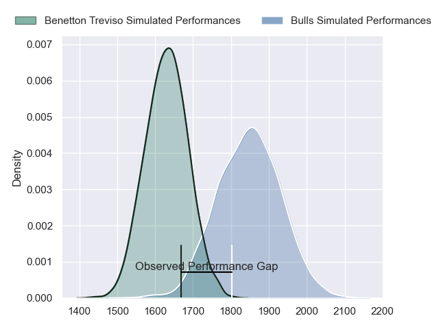
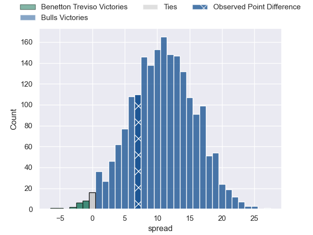
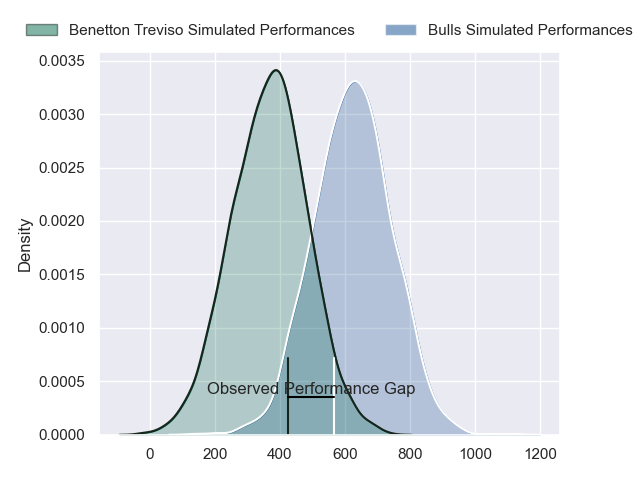
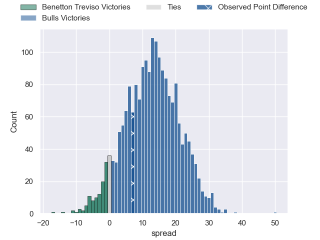

---  
layout: page  
title: Benetton Treviso at Bulls; 23-30  
date: 2024-06-08 18:00:00 -0500  
categories: "United Rugby Championship 2023" match review  
---
# Benetton Treviso at Bulls; 23-30

# Club Level Predictions

The first set of predictions treats a club as the smallest object, as the club develops its members, organizes a gameplan, and deploys its players as needed for each match. This club model has a prediction of 0.772, which translates to predicting Bulls to win by 10.8.

Our Over/Under is 78.5 - and combined with the spread above, we have a predicted scoreline of 34 to 44

Each club has a rating and a rating deviation (similar to a Glicko rating), and expected performances can be generated. This allows for simulated matches and spreads like the ones below.
## Projected Performances - Club Model

## Projected Spreads - Club Model

## Projected Results - Club Model

# Player Level Predictions

Treating teams instead as an entity made up of the currently active players, I have ratings for each player in an altogether different system. These can be combined to form team ratings once teamsheets are announced, weighting starters a bit higher than the reserves. After the match is played, players can be weighted by their minutes on the field, allowing for an accurate measure of the team's composition. With these compiled team ratings, we can make predictions, measure inaccuracy, and update the individual player ratings.
## Prediction without Player Minutes: Bulls by 16.0

Bulls by 11.4 on a neutral pitch

## Projected Performances - Player Model

## Projected Spreads - Player Model

## Projected Results - Player Model

|   Away Minutes | Away Player         |   Away Percentile |   Number |   Home Percentile | Home Player         |   Home Minutes |
|---------------:|:--------------------|------------------:|---------:|------------------:|:--------------------|---------------:|
|             51 | Thomas Gallo        |             91.71 |        1 |             93.58 | Gerhard Steenekamp  |             68 |
|             53 | Bautista Bernasconi |             51.85 |        2 |             95.99 | Johan Grobbelaar    |             53 |
|             63 | Simone Ferrari      |             97.32 |        3 |             99.27 | Wilco Louw          |             68 |
|             45 | Edoardo Iachizzi    |             76.74 |        4 |             11.53 | Ruan Vermaak        |             68 |
|             53 | Federico Ruzza      |             96.52 |        5 |             88.67 | Ruan Nortje         |             80 |
|             80 | Alessandro Izekor   |             74.56 |        6 |             93.23 | Nizaam Carr         |             80 |
|             80 | Michele Lamaro      |             98.16 |        7 |             91.59 | Elrigh Louw         |             80 |
|             51 | Toa Halafihi        |             75.83 |        8 |             66.46 | Cameron Hanekom     |             61 |
|             45 | Andy Uren           |             28.25 |        9 |             94.69 | Embrose Papier      |             80 |
|             80 | Tomas Albornoz      |             85.48 |       10 |             84.05 | Johan Goosen        |             80 |
|             69 | Onisi Ratave        |             57.38 |       11 |             98.66 | Kurt-Lee Arendse    |             30 |
|             74 | Malakai Fekitoa     |             81.25 |       12 |             96.15 | Harold Vorster      |             80 |
|             80 | Juan Ignacio Brex   |             96.46 |       13 |             94.48 | David Kriel         |             80 |
|             80 | Tommaso Menoncello  |             93.58 |       14 |             94.73 | Sebastian de Klerk  |             80 |
|             80 | Rhyno Smith         |             93.37 |       15 |             97.1  | Willie le Roux      |             80 |
|             27 | Gianmarco Lucchesi  |             87    |       16 |             99.36 | Akker van der Merwe |             27 |
|             29 | Mirco Spagnolo      |             77.66 |       17 |             79.69 | Simphiwe Matanzima  |             12 |
|             17 | Giosue Zilocchi     |             72.87 |       18 |            nan    | Francois Klopper    |             12 |
|             27 | Eli Snyman          |             87.67 |       19 |             80.91 | Reinhardt Ludwig    |             12 |
|             35 | Niccolo Cannone     |             75.35 |       20 |            nan    | Jannes Kirsten      |             19 |
|             29 | Lorenzo Cannone     |             92.08 |       21 |            nan    | Keagan Johannes     |              0 |
|             41 | Alessandro Garbisi  |             71.23 |       22 |             30.67 | Chris William Smith |              0 |
|             11 | Jacob Umaga         |             73.71 |       23 |            nan    | Sergeal Petersen    |             50 |

