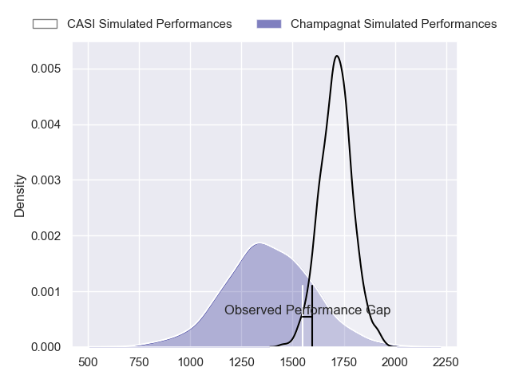
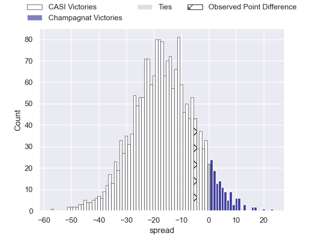
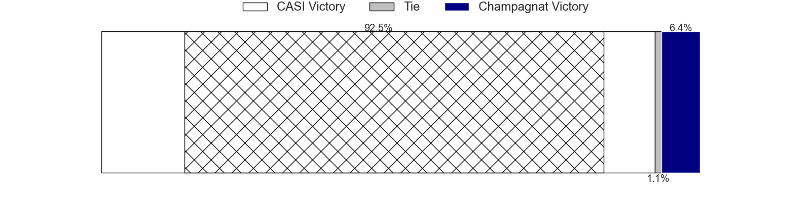
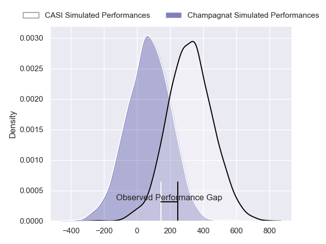
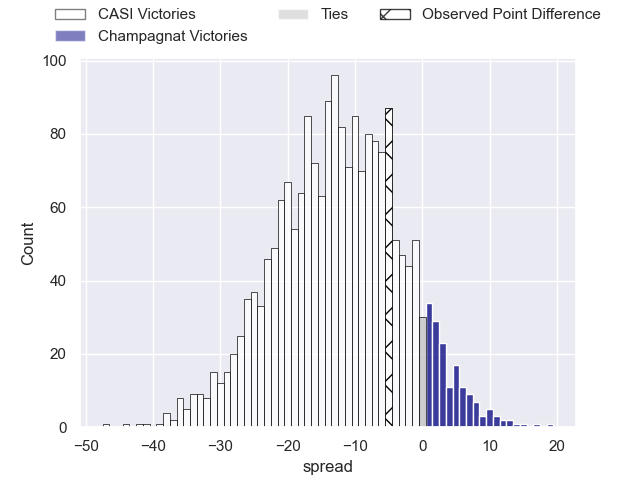
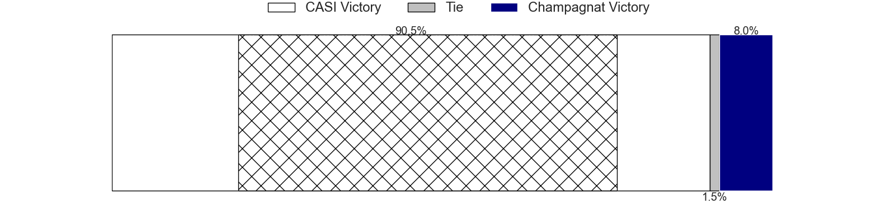

---  
layout: page  
title: CASI at Champagnat; 28-23  
date: 2024-06-08 18:00:00 -0500  
categories: "URBA Top 12 2024" match review  
---
# CASI at Champagnat; 28-23

# Club Level Predictions

The first set of predictions treats a club as the smallest object, as the club develops its members, organizes a gameplan, and deploys its players as needed for each match. This club model has a prediction of 0.134, which translates to predicting CASI to win by 16.7.

Our Over/Under is 54.5 - and combined with the spread above, we have a predicted scoreline of 36 to 19

Each club has a rating and a rating deviation (similar to a Glicko rating), and expected performances can be generated. This allows for simulated matches and spreads like the ones below.
## Projected Performances - Club Model

## Projected Spreads - Club Model

## Projected Results - Club Model

# Player Level Predictions

Treating teams instead as an entity made up of the currently active players, I have ratings for each player in an altogether different system. These can be combined to form team ratings once teamsheets are announced, weighting starters a bit higher than the reserves. After the match is played, players can be weighted by their minutes on the field, allowing for an accurate measure of the team's composition. With these compiled team ratings, we can make predictions, measure inaccuracy, and update the individual player ratings.
## Prediction without Player Minutes: CASI by 11.2

CASI by 13.8 on a neutral pitch

## Projected Performances - Player Model

## Projected Spreads - Player Model

## Projected Results - Player Model

|   Away Minutes | Away Player                |   Away Percentile |   Number |   Home Percentile | Home Player                   |   Home Minutes |
|---------------:|:---------------------------|------------------:|---------:|------------------:|:------------------------------|---------------:|
|             80 | Joaquin Britto             |             82.45 |        1 |             22.42 | Tomas Distel                  |             80 |
|             80 | Juan Torres Obeid          |             87.64 |        2 |             23.6  | Fernando Rodriguez Pascarella |             80 |
|             80 | Juan Ignacio Nieto Sanchez |             86.76 |        3 |             50.37 | Marcos Magaro                 |             80 |
|             80 | Ignacio Torrado            |             46.92 |        4 |             52.68 | Tobias Rivas Orozco           |             80 |
|             80 | Leo Mazzini                |             84.19 |        5 |             27.83 | Santiago Escuti               |             80 |
|             80 | Eugenio Sartori            |             81.14 |        6 |             28.43 | Matias Alonso Boto            |             80 |
|             80 | Joaquin Saenz de Miera     |             84.43 |        7 |             47.87 | Lucas Moresco                 |             80 |
|             80 | Luis Briatore              |             71.88 |        8 |             24.58 | Matias Muniagurria            |             80 |
|             80 | Luca Canzani               |             81.85 |        9 |             24.66 | Martin Graciarena             |             80 |
|             80 | Felipe Hileman             |             79.75 |       10 |             27.2  | Santos Panela                 |             80 |
|             80 | Felipe Probaos             |             48.56 |       11 |             27.3  | Tomas Baca Castex             |             80 |
|             80 | Bruno Devoto               |             80.16 |       12 |             23.96 | Tobias Imbrosciano            |             80 |
|             80 | Jeronimo Solveyra          |             80.16 |       13 |             23.85 | Tomas Cotter                  |             80 |
|             80 | Santiago David             |             83.91 |       14 |             43.97 | Facundo Rufino                |             80 |
|             80 | Juan Akemeier              |             80.75 |       15 |             25.05 | Geronimo Tomasella            |             80 |
|              0 | Facundo Andreotti          |            nan    |       16 |            nan    | Joaquin Guerra                |              0 |
|              0 | Felix Paolucci             |            nan    |       17 |            nan    | Manuel Mauvecin               |              0 |
|              0 | Juan Ignacio Rizzutti      |            nan    |       18 |            nan    | Tomas Yanzon Rodriguez        |              0 |
|              0 | Agustin Posleman           |             67.99 |       19 |             22.17 | Inaki Ustariz                 |              0 |
|              0 | Alejo Montes de Oca        |            nan    |       20 |             34.43 | Tomas Alonso Boto             |              0 |
|              0 | Tomas Phelan               |            nan    |       21 |            nan    | Pedro Del Piano               |              0 |
|              0 | Benjamin Rocca Rivarola    |             63.33 |       22 |            nan    | Gonzalo Costaguta             |              0 |
|              0 | Nicolas Cotella            |            nan    |       23 |            nan    | Marcos Lafuente               |              0 |

