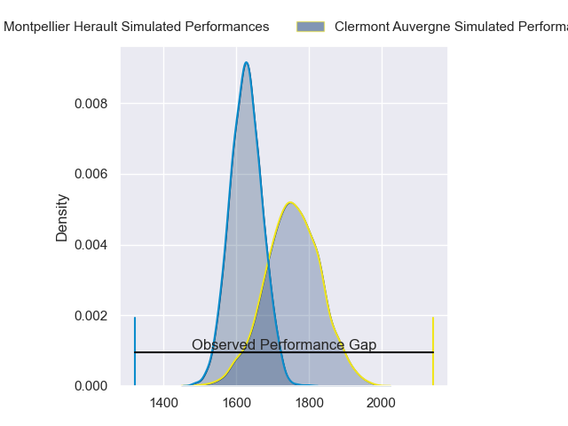
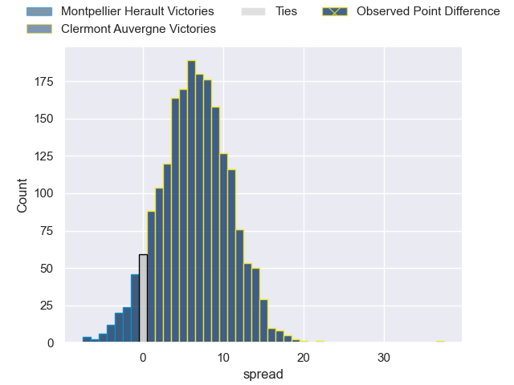
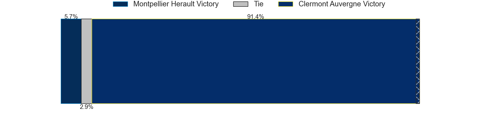
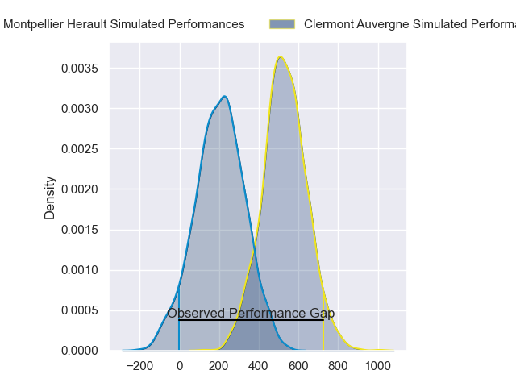
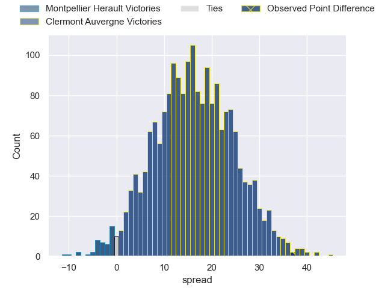
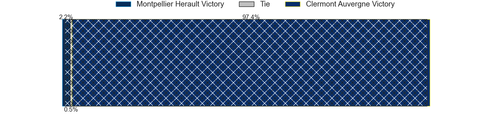

---  
layout: page  
title: Montpellier Herault at Clermont Auvergne; 15-52  
date: 2024-06-08 18:00:00 -0500  
categories: "Top 14 Orange 2023" match review  
---
# Montpellier Herault at Clermont Auvergne; 15-52

# Club Level Predictions

The first set of predictions treats a club as the smallest object, as the club develops its members, organizes a gameplan, and deploys its players as needed for each match. This club model has a prediction of 0.678, which translates to predicting Clermont Auvergne to win by 6.5.

Our Over/Under is 67.5 - and combined with the spread above, we have a predicted scoreline of 31 to 37

Each club has a rating and a rating deviation (similar to a Glicko rating), and expected performances can be generated. This allows for simulated matches and spreads like the ones below.
## Projected Performances - Club Model

## Projected Spreads - Club Model

## Projected Results - Club Model

# Player Level Predictions

Treating teams instead as an entity made up of the currently active players, I have ratings for each player in an altogether different system. These can be combined to form team ratings once teamsheets are announced, weighting starters a bit higher than the reserves. After the match is played, players can be weighted by their minutes on the field, allowing for an accurate measure of the team's composition. With these compiled team ratings, we can make predictions, measure inaccuracy, and update the individual player ratings.
## Prediction without Player Minutes: Clermont Auvergne by 15.9

Clermont Auvergne by 8.3 on a neutral pitch

## Projected Performances - Player Model

## Projected Spreads - Player Model

## Projected Results - Player Model

|   Away Minutes | Away Player              |   Away Percentile |   Number |   Home Percentile | Home Player          |   Home Minutes |
|---------------:|:-------------------------|------------------:|---------:|------------------:|:---------------------|---------------:|
|             52 | Enzo Forletta            |             75.79 |        1 |             73.44 | Giorgi Beria         |             54 |
|             58 | Christopher Tolofua      |             91.49 |        2 |             58.91 | Yohan Beheregaray    |             49 |
|             22 | Harry Williams           |             94.07 |        3 |             90.41 | Rabah Slimani        |             63 |
|             69 | Mael Perrin              |             45.63 |        4 |             19.88 | Paul Jedrasiak       |             56 |
|             58 | Bastien Chalureau        |             81.31 |        5 |             94.73 | Rob Simmons          |             47 |
|             74 | Cantin Foguet            |             36.07 |        6 |             94.1  | Pita Gus Sowakula    |             80 |
|             41 | Clement Doumenc          |             59.48 |        7 |             89.94 | Marcos Kremer        |             80 |
|             80 | Masivesi Dakuwaqa        |             62.71 |        8 |             92.92 | Fritz Lee            |             80 |
|             54 | Aubin Eymeri             |             19.86 |        9 |             72.09 | Baptiste Jauneau     |             49 |
|             80 | Thomas Darmon            |             13.29 |       10 |             96.11 | Anthony Belleau      |             49 |
|             80 | Pierre Lucas             |             39.46 |       11 |             12.07 | Alivereti Raka       |             80 |
|             55 | Arthur Vincent           |             52.81 |       12 |             94.17 | George Moala         |             69 |
|             47 | Geoffrey Doumayrou       |             98.02 |       13 |             83.23 | Leon Darricarrere    |             80 |
|             80 | George Bridge            |             92.72 |       14 |             92.05 | Bautista Delguy      |             80 |
|             80 | Alexandre de Nardi       |             30.23 |       15 |             88.82 | Alex Newsome         |             80 |
|             22 | Lyam Akrab               |            nan    |       16 |             93.58 | Folau Fainga'a       |             31 |
|             28 | Gregory Fichten          |             13.16 |       17 |             86.6  | Etienne Falgoux      |             26 |
|             39 | Florian Verhaeghe        |             54.08 |       18 |             69.44 | Anthime Hemery       |             24 |
|             33 | Tyler Duguid             |             58.45 |       19 |             51.55 | Peceli Yato          |             33 |
|             31 | Jules Veyrier            |            nan    |       20 |             86.47 | Sebastien Bezy       |             31 |
|             26 | Aurelien Barreau         |            nan    |       21 |             85.28 | Benjamin Urdapilleta |             31 |
|             33 | Louis Foursans-Bourdette |             11.45 |       22 |            nan    | Mathys Belaubre      |             11 |
|             58 | Lasha Macharashvili      |             51.02 |       23 |             75.71 | Cristian Ojovan      |             17 |

