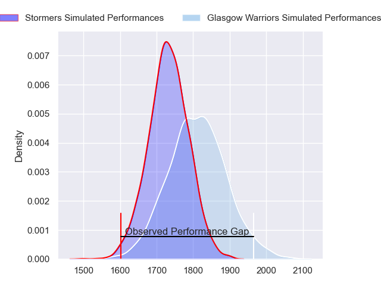
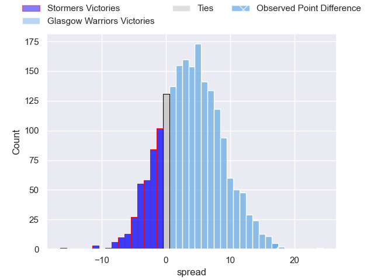
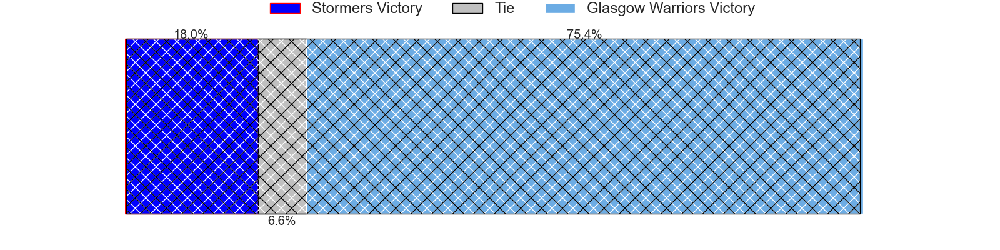
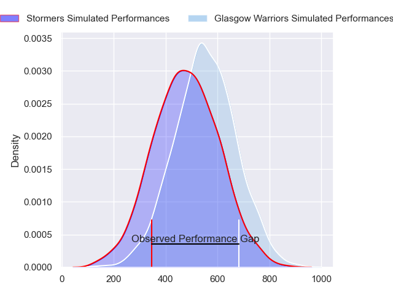
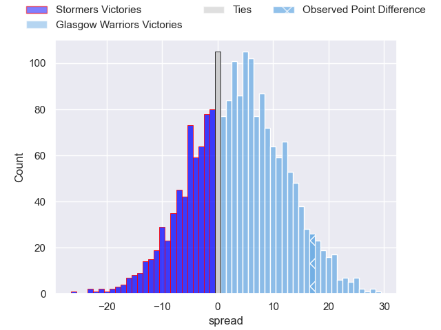
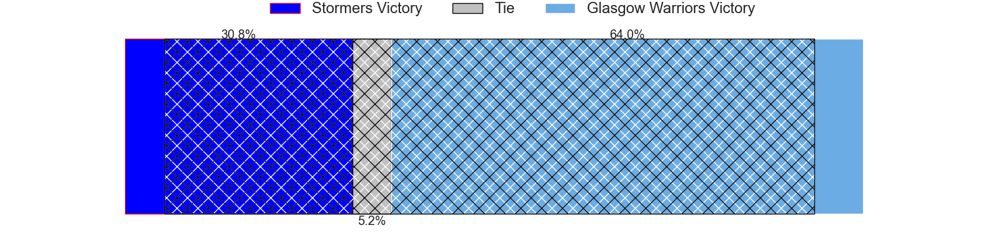

---  
layout: page  
title: Stormers at Glasgow Warriors; 10-27  
date: 2024-06-08 18:00:00 -0500  
categories: "United Rugby Championship 2023" match review  
---
# Stormers at Glasgow Warriors; 10-27

# Club Level Predictions

The first set of predictions treats a club as the smallest object, as the club develops its members, organizes a gameplan, and deploys its players as needed for each match. This club model has a prediction of 0.609, which translates to predicting Glasgow Warriors to win by 3.9.

Our Over/Under is 62.5 - and combined with the spread above, we have a predicted scoreline of 29 to 33

Each club has a rating and a rating deviation (similar to a Glicko rating), and expected performances can be generated. This allows for simulated matches and spreads like the ones below.
## Projected Performances - Club Model

## Projected Spreads - Club Model

## Projected Results - Club Model

# Player Level Predictions

Treating teams instead as an entity made up of the currently active players, I have ratings for each player in an altogether different system. These can be combined to form team ratings once teamsheets are announced, weighting starters a bit higher than the reserves. After the match is played, players can be weighted by their minutes on the field, allowing for an accurate measure of the team's composition. With these compiled team ratings, we can make predictions, measure inaccuracy, and update the individual player ratings.
## Prediction without Player Minutes: Glasgow Warriors by 4.2

Stormers by 2.3 on a neutral pitch

## Projected Performances - Player Model

## Projected Spreads - Player Model

## Projected Results - Player Model

|   Away Minutes | Away Player          |   Away Percentile |   Number |   Home Percentile | Home Player           |   Home Minutes |
|---------------:|:---------------------|------------------:|---------:|------------------:|:----------------------|---------------:|
|             64 | Brok Harris          |             99.92 |        1 |             94.31 | Jamie Bhatti          |             63 |
|             48 | Joseph Dweba         |             71.27 |        2 |             16.53 | Johnny Matthews       |             52 |
|             50 | Frans Malherbe       |             87.73 |        3 |             99.43 | Zander Fagerson       |             81 |
|             77 | Salmaan Moerat       |             77.34 |        4 |             97.81 | Scott Cummings        |             81 |
|             67 | Ruben van Heerden    |             85.98 |        5 |             77.04 | Richie Gray           |             66 |
|             50 | Willie Engelbrecht   |             80.66 |        6 |             95.55 | Matt Fagerson         |             81 |
|             81 | Ben-Jason Dixon      |             68.38 |        7 |             80.56 | Rory Darge            |             66 |
|             81 | Hacjivah Dayimani    |             92.5  |        8 |             31.67 | Jack Dempsey          |             78 |
|             62 | Herschel Jantjies    |             92.98 |        9 |             99.14 | George Horne          |             81 |
|             81 | Manie Libbok         |             85.07 |       10 |             45.19 | Tom Jordan            |             81 |
|             81 | Ben Loader           |             88.51 |       11 |             96.55 | Kyle Steyn            |             81 |
|             62 | Sacha Mngomezulu     |             74.06 |       12 |             55.31 | Sione Tuipulotu       |             81 |
|             81 | Daniel du Plessis    |             91.35 |       13 |             40.42 | Huw Jones             |             79 |
|             81 | Suleiman Hartzenberg |             77.3  |       14 |             99.43 | Sebastian Cancelliere |             79 |
|             81 | Warrick Gelant       |             98.76 |       15 |             57.97 | Josh McKay            |             81 |
|             33 | Andre-Hugo Venter    |             80.58 |       16 |             99.68 | George Turner         |             29 |
|             17 | Sti Sithole          |             73.27 |       17 |             48.98 | Nathan McBeth         |              3 |
|             31 | Neethling Fouche     |             87.25 |       18 |             96.59 | Oli Kebble            |             15 |
|             14 | Adre Smith           |             81.51 |       19 |             36.88 | Max Williamson        |             15 |
|             31 | Marcel Theunissen    |             42.07 |       20 |             44.1  | Euan Ferrie           |              3 |
|              4 | Connor Evans         |            nan    |       21 |             95    | Henco Venter          |             15 |
|             19 | Paul de Wet          |             86.64 |       22 |             72.77 | Jamie Dobie           |              2 |
|             19 | Jean-Luc du Plessis  |             71.25 |       23 |             67.28 | Ross Thompson         |              2 |

