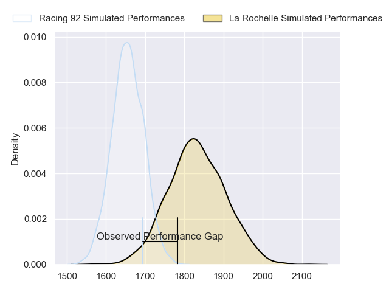
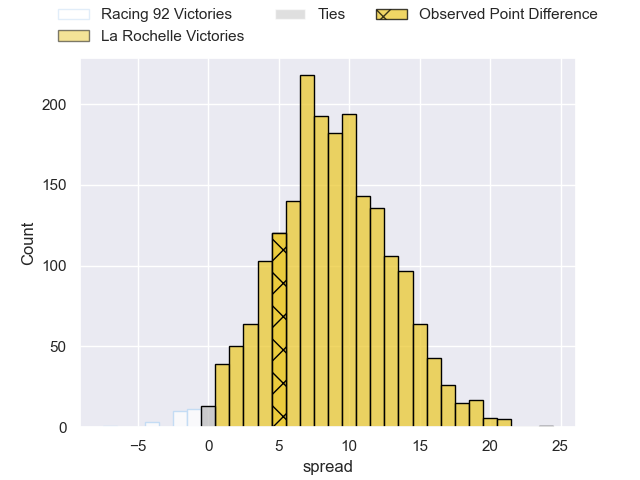
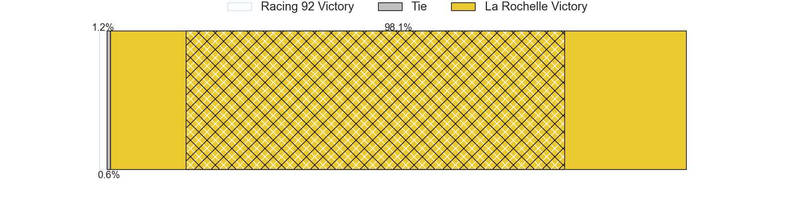
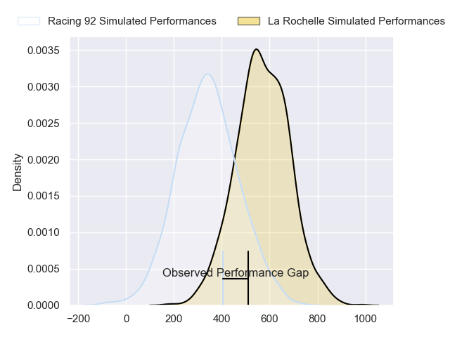
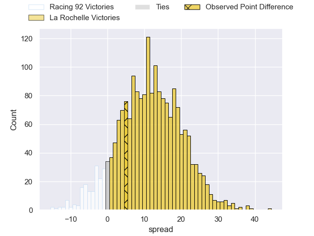
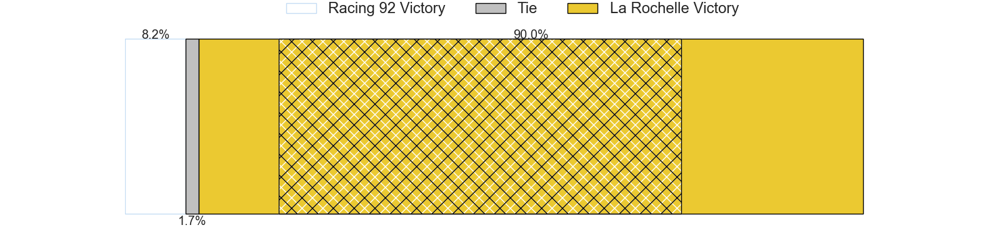

---  
layout: page  
title: Racing 92 at La Rochelle; 19-24  
date: 2024-06-08 18:00:00 -0500  
categories: "Top 14 Orange 2023" match review  
---
# Racing 92 at La Rochelle; 19-24

# Club Level Predictions

The first set of predictions treats a club as the smallest object, as the club develops its members, organizes a gameplan, and deploys its players as needed for each match. This club model has a prediction of 0.733, which translates to predicting La Rochelle to win by 8.9.

Our Over/Under is 55.5 - and combined with the spread above, we have a predicted scoreline of 23 to 32

Each club has a rating and a rating deviation (similar to a Glicko rating), and expected performances can be generated. This allows for simulated matches and spreads like the ones below.
## Projected Performances - Club Model

## Projected Spreads - Club Model

## Projected Results - Club Model

# Player Level Predictions

Treating teams instead as an entity made up of the currently active players, I have ratings for each player in an altogether different system. These can be combined to form team ratings once teamsheets are announced, weighting starters a bit higher than the reserves. After the match is played, players can be weighted by their minutes on the field, allowing for an accurate measure of the team's composition. With these compiled team ratings, we can make predictions, measure inaccuracy, and update the individual player ratings.
## Prediction without Player Minutes: La Rochelle by 15.0

La Rochelle by 7.8 on a neutral pitch

## Projected Performances - Player Model

## Projected Spreads - Player Model

## Projected Results - Player Model

|   Away Minutes | Away Player         |   Away Percentile |   Number |   Home Percentile | Home Player           |   Home Minutes |
|---------------:|:--------------------|------------------:|---------:|------------------:|:----------------------|---------------:|
|             63 | Hassane Kolingar    |             18.93 |        1 |             95.61 | Reda Wardi            |             63 |
|             61 | Camille Chat        |             93.42 |        2 |             88.44 | Tolu Latu             |             54 |
|             63 | Trevor Nyakane      |             79.53 |        3 |             99.51 | Uini Atonio           |             47 |
|             80 | Cameron Woki        |             92.35 |        4 |             47.22 | Remi Picquette        |             70 |
|             80 | Will Rowlands       |             38.67 |        5 |             98.21 | Will Skelton          |             71 |
|             61 | Ibrahim Diallo      |             19.63 |        6 |             18.28 | Judicael Cancoriet    |             80 |
|             80 | Siya Kolisi         |             87.62 |        7 |             21.18 | Oscar Jegou           |             72 |
|             71 | Jordan Joseph       |             76.46 |        8 |             97.08 | Gregory Alldritt      |             79 |
|             71 | Clovis Le Bail      |             26.54 |        9 |             97.26 | Tawera Kerr-Barlow    |             59 |
|             80 | Antoine Gibert      |             91.62 |       10 |             52.97 | Antoine Hastoy        |             80 |
|             80 | Vinaya Habosi       |             38.31 |       11 |             98.56 | Dillyn Leyds          |             80 |
|             80 | Henry Chavancy      |             98.96 |       12 |             78.44 | Jules Favre           |             72 |
|             80 | Gael Fickou         |             97.4  |       13 |             59.69 | Ulupano Seuteni       |             62 |
|             75 | Josua Tuisova       |             95.79 |       14 |             96.65 | Jack Nowell           |             80 |
|             80 | Tristan Tedder      |             67.91 |       15 |             99.59 | Brice Dulin           |             54 |
|             19 | Peniami Narisia     |             84.75 |       16 |             74    | Quentin Lespiaucq     |             26 |
|             17 | Guram Gogichashvili |             52.32 |       17 |             26.65 | Louis Penverne        |             17 |
|             19 | Boris Palu          |             77.93 |       18 |             34.19 | Thomas Ployet         |              9 |
|              9 | Maxime Baudonne     |             57.16 |       19 |             73.54 | Yoan Tanga            |             19 |
|              9 | Max Spring          |             18.43 |       20 |             82.19 | Thomas Berjon         |             21 |
|              5 | Christian Wade      |             95.69 |       21 |             35.79 | Ihaia West            |             26 |
|              0 | Juan Imhoff         |             99.71 |       22 |             92.08 | Jonathan Danty        |             26 |
|             17 | Cedate Gomes Sa     |             77.25 |       23 |              3.74 | Georges-Henri Colombe |             33 |

