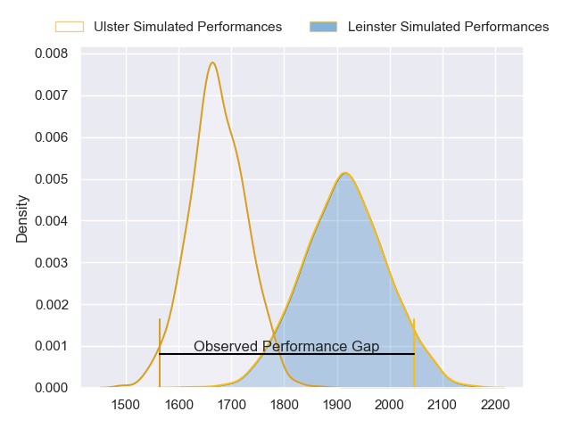
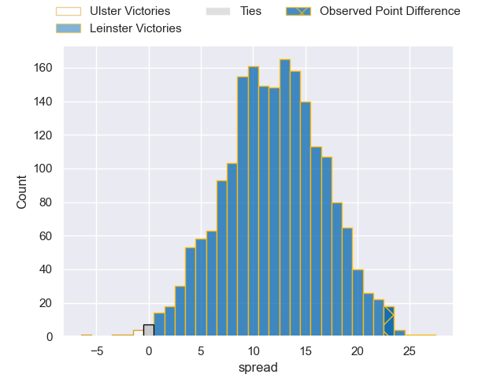
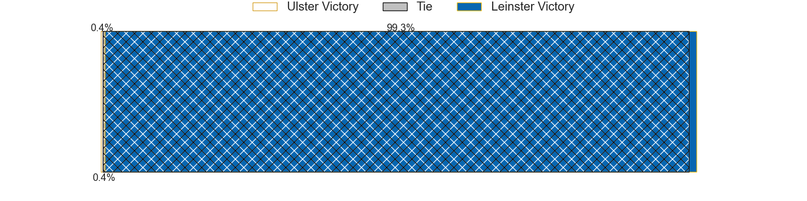
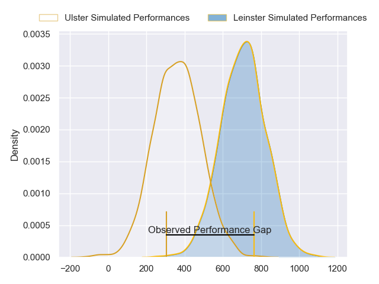
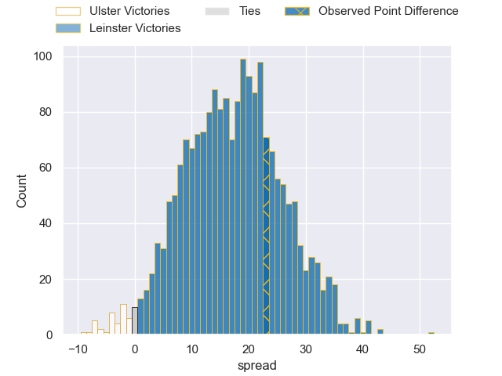

---  
layout: page  
title: Ulster at Leinster; 20-43  
date: 2024-06-08 18:00:00 -0500  
categories: "United Rugby Championship 2023" match review  
---
# Ulster at Leinster; 20-43

# Club Level Predictions

The first set of predictions treats a club as the smallest object, as the club develops its members, organizes a gameplan, and deploys its players as needed for each match. This club model has a prediction of 0.796, which translates to predicting Leinster to win by 12.0.

Our Over/Under is 55.5 - and combined with the spread above, we have a predicted scoreline of 22 to 34

Each club has a rating and a rating deviation (similar to a Glicko rating), and expected performances can be generated. This allows for simulated matches and spreads like the ones below.
## Projected Performances - Club Model

## Projected Spreads - Club Model

## Projected Results - Club Model

# Player Level Predictions

Treating teams instead as an entity made up of the currently active players, I have ratings for each player in an altogether different system. These can be combined to form team ratings once teamsheets are announced, weighting starters a bit higher than the reserves. After the match is played, players can be weighted by their minutes on the field, allowing for an accurate measure of the team's composition. With these compiled team ratings, we can make predictions, measure inaccuracy, and update the individual player ratings.
## Prediction without Player Minutes: Leinster by 21.0

Leinster by 14.7 on a neutral pitch

## Projected Performances - Player Model

## Projected Spreads - Player Model

## Projected Results - Player Model

|   Away Minutes | Away Player        |   Away Percentile |   Number |   Home Percentile | Home Player         |   Home Minutes |
|---------------:|:-------------------|------------------:|---------:|------------------:|:--------------------|---------------:|
|             51 | Eric O'Sullivan    |             88.87 |        1 |             91.15 | Andrew Porter       |             66 |
|             69 | Rob Herring        |             96.63 |        2 |             73.35 | Dan Sheehan         |             55 |
|             69 | Tom O'Toole        |             80.1  |        3 |             97.08 | Tadhg Furlong       |             43 |
|             81 | Harry Sheridan     |             88.97 |        4 |             80.82 | Joe McCarthy        |             81 |
|             18 | Cormac Izuchukwu   |             74.75 |        5 |             95.03 | James Ryan          |             64 |
|             64 | Matty Rea          |             73.89 |        6 |             88.97 | Ryan Baird          |             81 |
|             81 | David McCann       |             83.95 |        7 |             98.84 | Josh van der Flier  |             81 |
|             81 | Nick Timoney       |             90.62 |        8 |             94.17 | Caelan Doris        |             71 |
|             81 | John Cooney        |             94.52 |        9 |             96.58 | Jamison Gibson-Park |             64 |
|             57 | Billy Burns        |             74.03 |       10 |             95.3  | Ross Byrne          |             69 |
|             48 | Jacob Stockdale    |             70.79 |       11 |            100    | James Lowe          |             64 |
|             81 | Stuart McCloskey   |             85    |       12 |             90.73 | Jamie Osborne       |             81 |
|             64 | Will Addison       |             92.92 |       13 |             90    | Robbie Henshaw      |             81 |
|             81 | Mike Lowry         |             70.98 |       14 |             90.71 | Jordan Larmour      |             81 |
|             81 | Stewart Moore      |             91.93 |       15 |             92.55 | Jimmy O'Brien       |             81 |
|             12 | Tom Stewart        |              3.85 |       16 |             93.26 | Ronan Kelleher      |             26 |
|             30 | Andrew Warwick     |             10.97 |       17 |             93.34 | Cian Healy          |             15 |
|             12 | Scott Wilson       |             49.23 |       18 |             94.8  | Michael Ala'alatoa  |             38 |
|             63 | Greg Jones         |            nan    |       19 |             95.23 | Ross Molony         |             17 |
|             17 | Dave Ewers         |             93.81 |       20 |             90.91 | Max Deegan          |             10 |
|             24 | Nathan Doak        |             26.03 |       21 |             98.97 | Luke McGrath        |             17 |
|             33 | Ethan McIlroy      |             79.3  |       22 |             16.36 | Sam Prendergast     |             12 |
|             17 | Jude Postlethwaite |             69.06 |       23 |             58.85 | Ciaran Frawley      |             17 |

