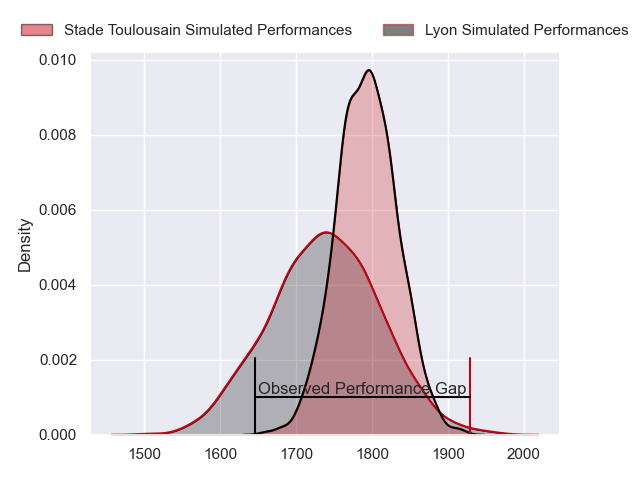
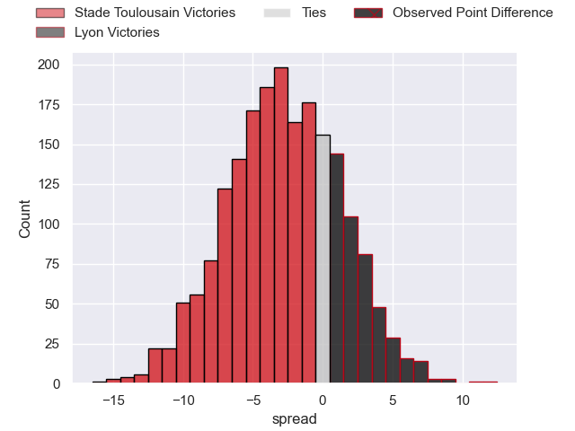
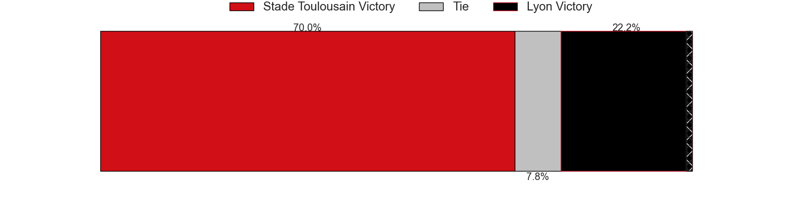
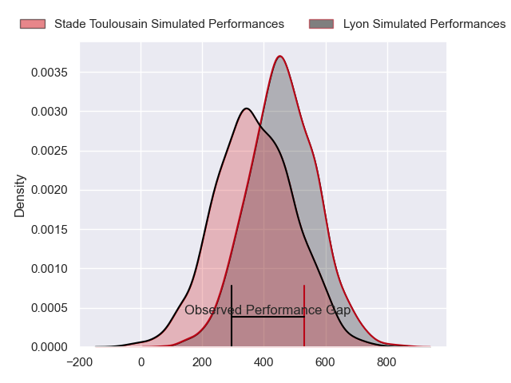
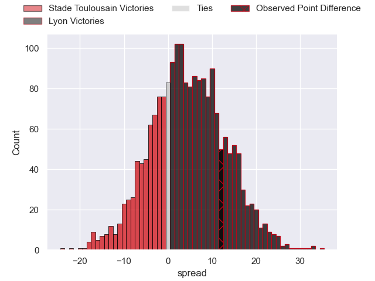
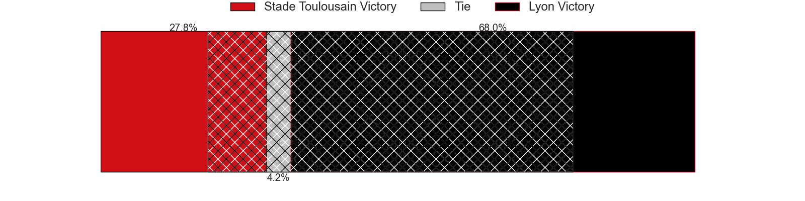

---  
layout: page  
title: Stade Toulousain at Lyon; 28-40  
date: 2024-06-08 18:00:00 -0500  
categories: "Top 14 Orange 2023" match review  
---
# Stade Toulousain at Lyon; 28-40

# Club Level Predictions

The first set of predictions treats a club as the smallest object, as the club develops its members, organizes a gameplan, and deploys its players as needed for each match. This club model has a prediction of 0.421, which translates to predicting Stade Toulousain to win by 2.8.

Our Over/Under is 45.5 - and combined with the spread above, we have a predicted scoreline of 24 to 21

Each club has a rating and a rating deviation (similar to a Glicko rating), and expected performances can be generated. This allows for simulated matches and spreads like the ones below.
## Projected Performances - Club Model

## Projected Spreads - Club Model

## Projected Results - Club Model

# Player Level Predictions

Treating teams instead as an entity made up of the currently active players, I have ratings for each player in an altogether different system. These can be combined to form team ratings once teamsheets are announced, weighting starters a bit higher than the reserves. After the match is played, players can be weighted by their minutes on the field, allowing for an accurate measure of the team's composition. With these compiled team ratings, we can make predictions, measure inaccuracy, and update the individual player ratings.
## Prediction without Player Minutes: Lyon by 5.9

Stade Toulousain by 1.8 on a neutral pitch

## Projected Performances - Player Model

## Projected Spreads - Player Model

## Projected Results - Player Model

|   Away Minutes | Away Player         |   Away Percentile |   Number |   Home Percentile | Home Player          |   Home Minutes |
|---------------:|:--------------------|------------------:|---------:|------------------:|:---------------------|---------------:|
|             70 | Marco Trauth        |             38.83 |        1 |             30.38 | Jerome Rey           |             57 |
|             52 | Guillaume Cramont   |             79.29 |        2 |             88.12 | Liam Coltman         |             57 |
|             51 | Joel Merkler        |             84.32 |        3 |             93.18 | Demba Bamba          |             57 |
|             80 | Clement Verge       |             68.19 |        4 |             85.79 | Felix Lambey         |             53 |
|             63 | Piula Fa'asalele    |             72.47 |        5 |             57.46 | Romain Taofifenua    |             60 |
|             54 | Mathis Castro       |             73.02 |        6 |             71.76 | Joel Kpoku           |             80 |
|             73 | Joshua Brennan      |             81.91 |        7 |             74.66 | Liam Allen           |             80 |
|             80 | Theo Ntamack        |             48.75 |        8 |             70.62 | Mickael Guillard     |             67 |
|             80 | Arthur Retiere      |             95.03 |        9 |             93.66 | Baptiste Couilloud   |             67 |
|             80 | Baptiste Germain    |             11.04 |       10 |             78.53 | Leo Berdeu           |             47 |
|             80 | Lucas Tauzin        |             75.67 |       11 |             98.85 | Monty Ioane          |             80 |
|             77 | Sofiane Guitoune    |             96.35 |       12 |             99.69 | Semi Radradra        |             58 |
|             56 | Dimitri Delibes     |             76.46 |       13 |             74.27 | Alfred Parisien      |             80 |
|             80 | Setareki Bituniyata |             75    |       14 |             73.85 | Xavier Mignot        |             80 |
|             80 | Ange Capuozzo       |             94.41 |       15 |             67.08 | Alexandre Tchaptchet |             80 |
|             28 | Ian Boubila         |             15.57 |       16 |             19.42 | Guillaume Marchand   |             23 |
|              0 | Rodrigue Neti       |             64.09 |       17 |             17.71 | Sebastien Taofifenua |             23 |
|             17 | Petero Mailulu      |            nan    |       18 |             50.7  | Loann Goujon         |             27 |
|             33 | Alban Placines      |             72.24 |       19 |             36.46 | Maxime Gouzou        |             33 |
|              0 | Juan Cruz Mallia    |             99.14 |       20 |             78.77 | Martin Page-Relo     |             13 |
|              0 | Matthis Lebel       |             98.95 |       21 |             82.82 | Paddy Jackson        |             33 |
|             27 | Paul Costes         |             70.31 |       22 |             11.04 | Josiah Maraku        |             22 |
|             39 | David Ainu'u        |             93.74 |       23 |             43.46 | Paulo Tafili         |             23 |

