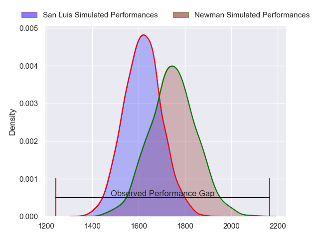
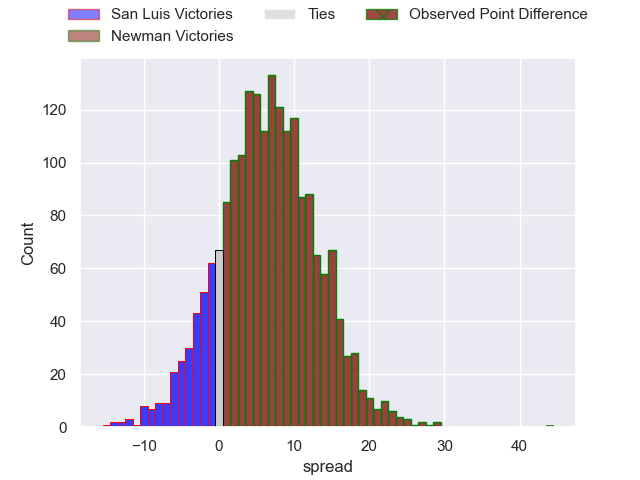
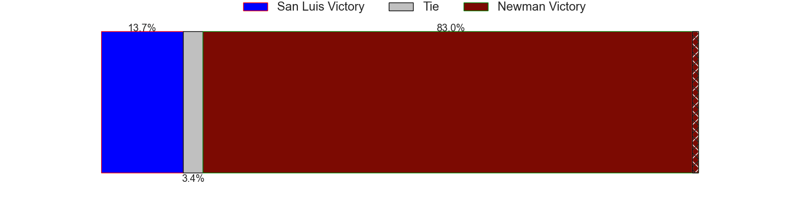
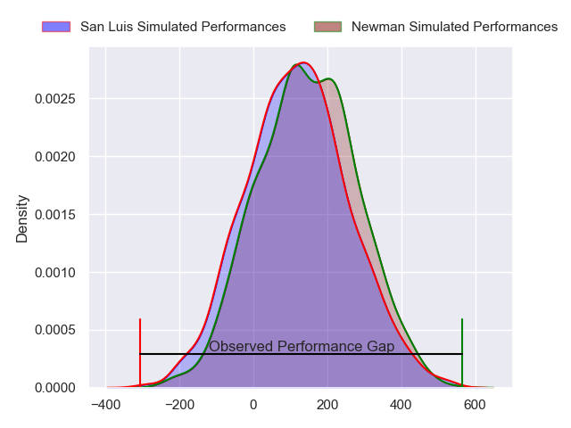
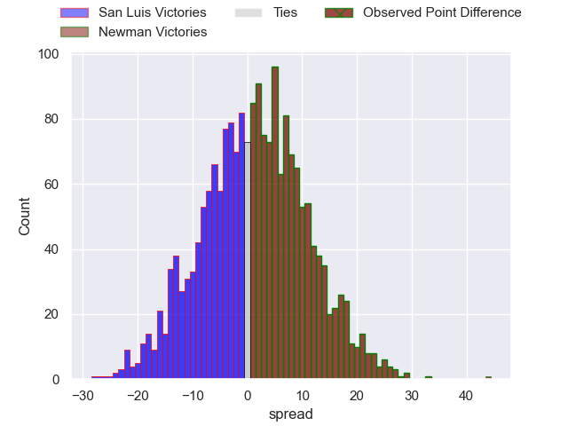

---  
layout: page  
title: San Luis at Newman; 15-59  
date: 2024-06-08 18:00:00 -0500  
categories: "URBA Top 12 2024" match review  
---
# San Luis at Newman; 15-59

# Club Level Predictions

The first set of predictions treats a club as the smallest object, as the club develops its members, organizes a gameplan, and deploys its players as needed for each match. This club model has a prediction of 0.673, which translates to predicting Newman to win by 6.5.

Our Over/Under is 45.5 - and combined with the spread above, we have a predicted scoreline of 19 to 26

Each club has a rating and a rating deviation (similar to a Glicko rating), and expected performances can be generated. This allows for simulated matches and spreads like the ones below.
## Projected Performances - Club Model

## Projected Spreads - Club Model

## Projected Results - Club Model

# Player Level Predictions

Treating teams instead as an entity made up of the currently active players, I have ratings for each player in an altogether different system. These can be combined to form team ratings once teamsheets are announced, weighting starters a bit higher than the reserves. After the match is played, players can be weighted by their minutes on the field, allowing for an accurate measure of the team's composition. With these compiled team ratings, we can make predictions, measure inaccuracy, and update the individual player ratings.
## Prediction without Player Minutes: Newman by 1.3

San Luis by 2.8 on a neutral pitch

## Projected Performances - Player Model

## Projected Spreads - Player Model

## Projected Results - Player Model

|   Away Minutes | Away Player                |   Away Percentile |   Number |   Home Percentile | Home Player               |   Home Minutes |
|---------------:|:---------------------------|------------------:|---------:|------------------:|:--------------------------|---------------:|
|             80 | Santiago Bonavento         |             26.97 |        1 |             64.34 | Miguel Prince             |             80 |
|             80 | Agustin Fitzsimons Herrera |             24.08 |        2 |             69.34 | Marcelo Brandi            |             80 |
|             80 | Facundo Suarez             |             45.82 |        3 |             80.26 | Bautista Bosch            |             80 |
|             80 | Ramiro Bruni               |             36.48 |        4 |             89.26 | Pablo Cardinal            |             80 |
|             80 | Santiago Canal             |             38.27 |        5 |             66    | Jeronimo Ureta            |             80 |
|             80 | Nahuel Curti               |             22.92 |        6 |             53.87 | Mateo Montoya             |             80 |
|             80 | Facundo Alvarez Amado      |             23.79 |        7 |             72.44 | Joaquin de la Vega        |             80 |
|             80 | Agustin Torello            |             30    |        8 |             79.38 | Rodrigo Diaz de Vivar     |             80 |
|             80 | Martin Aereboe             |             25.51 |        9 |             78.08 | Lucas Marguery            |             80 |
|             80 | Felipe Campodonico         |             41.51 |       10 |             68.51 | Gonzalo Guiterrez Taboada |             80 |
|             80 | Wilmer Ramirez             |             42.24 |       11 |             87.74 | Justo Ortiz Basualdo      |             80 |
|             80 | Segundo Fresco             |             49.27 |       12 |             67.29 | Tomas Keena               |             80 |
|             80 | Benjamin Marban            |             32.71 |       13 |             33.54 | Benjamin Lanfranco        |             80 |
|             80 | Eduardo Ruesta             |             38.03 |       14 |             70.4  | Leandro Leivas            |             80 |
|             80 | Valentino Quattrocchi      |             18.84 |       15 |             68.32 | Santiago Marolda          |             80 |
|              0 | Mateo Caffaro              |            nan    |       16 |            nan    | James Wright              |              0 |
|              0 | Martin Etchanchu           |            nan    |       17 |            nan    | Isidro Bosch              |              0 |
|              0 | Alexis Uvieda              |             64.66 |       18 |            nan    | Manuel Lozano             |              0 |
|              0 | Mateo Calistro             |             36.64 |       19 |             14.81 | Tomas Ureta               |              0 |
|              0 | Santiago Gibert            |            nan    |       20 |            nan    | Faustino Santarelli       |              0 |
|              0 | Joaquin Vaca               |            nan    |       21 |            nan    | Pablo Tezanos Pinto       |              0 |
|              0 | Felipe Crispo              |             53.21 |       22 |            nan    | Carlos Mendez Beherty     |              0 |
|              0 | Lautaro Grys Arana         |            nan    |       23 |             57.71 | Silvestre Casa            |              0 |

