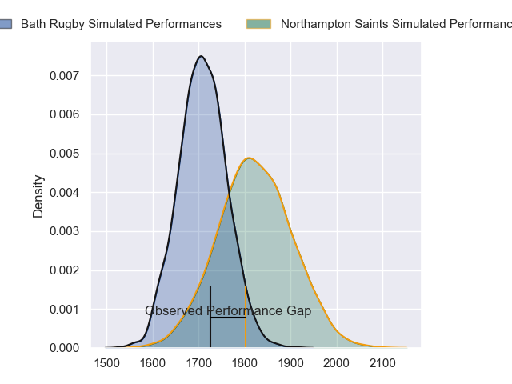
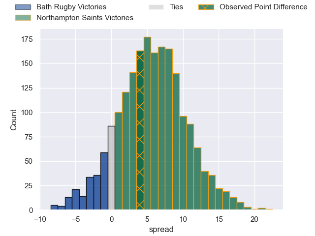
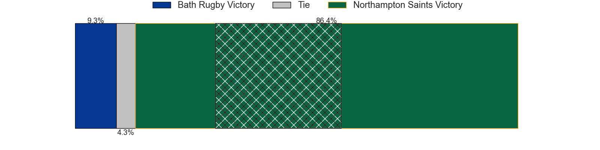
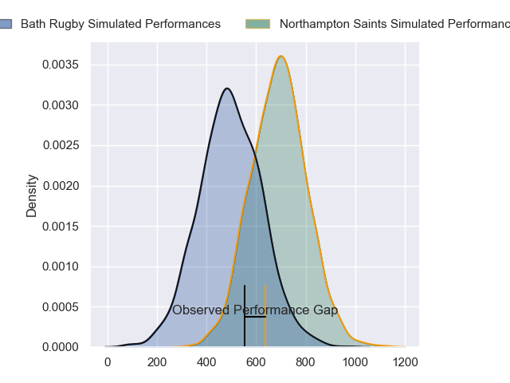
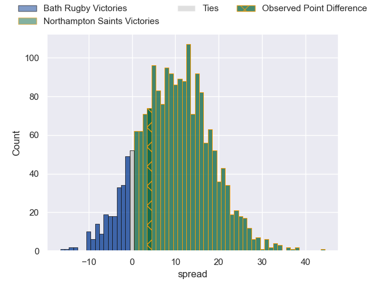
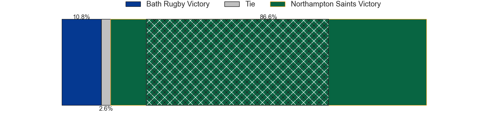

---  
layout: page  
title: Bath Rugby at Northampton Saints; 21-25  
date: 2024-06-08 18:00:00 -0500  
categories: "Gallagher Premiership 2023" match review  
---
# Bath Rugby at Northampton Saints; 21-25

# Club Level Predictions

The first set of predictions treats a club as the smallest object, as the club develops its members, organizes a gameplan, and deploys its players as needed for each match. This club model has a prediction of 0.655, which translates to predicting Northampton Saints to win by 5.6.

Our Over/Under is 59.5 - and combined with the spread above, we have a predicted scoreline of 27 to 33

Each club has a rating and a rating deviation (similar to a Glicko rating), and expected performances can be generated. This allows for simulated matches and spreads like the ones below.
## Projected Performances - Club Model

## Projected Spreads - Club Model

## Projected Results - Club Model

# Player Level Predictions

Treating teams instead as an entity made up of the currently active players, I have ratings for each player in an altogether different system. These can be combined to form team ratings once teamsheets are announced, weighting starters a bit higher than the reserves. After the match is played, players can be weighted by their minutes on the field, allowing for an accurate measure of the team's composition. With these compiled team ratings, we can make predictions, measure inaccuracy, and update the individual player ratings.
## Prediction without Player Minutes: Northampton Saints by 12.3

Northampton Saints by 4.0 on a neutral pitch

## Projected Performances - Player Model

## Projected Spreads - Player Model

## Projected Results - Player Model

|   Away Minutes | Away Player     |   Away Percentile |   Number |   Home Percentile | Home Player         |   Home Minutes |
|---------------:|:----------------|------------------:|---------:|------------------:|:--------------------|---------------:|
|             80 | Beno Obano      |             92.04 |        1 |             98.13 | Alex Waller         |             53 |
|             53 | Tom Dunn        |             98.39 |        2 |             94.06 | Curtis Langdon      |             58 |
|             80 | Thomas du Toit  |             96.34 |        3 |              3.41 | Trevor Davison      |             58 |
|             67 | Quinn Roux      |             95.53 |        4 |             97.71 | Alex Moon           |             71 |
|             80 | Charlie Ewels   |             75.94 |        5 |             26.84 | Alex Coles          |             80 |
|             67 | Ted Hill        |             90.23 |        6 |             98.55 | Courtney Lawes      |             80 |
|             70 | Sam Underhill   |             94.2  |        7 |             96.42 | Tom Pearson         |             61 |
|             22 | Alfie Barbeary  |             77.92 |        8 |             73.33 | Juarno Augustus     |             67 |
|             80 | Ben Spencer     |             85.79 |        9 |             96.06 | Alex Mitchell       |             80 |
|             80 | Finn Russell    |             99.39 |       10 |             85.89 | Fin Smith           |             71 |
|             80 | Will Muir       |             22.41 |       11 |             95.98 | Ollie Sleightholme  |             80 |
|             79 | Cameron Redpath |             60    |       12 |             92.19 | Fraser Dingwall     |             80 |
|             80 | Ollie Lawrence  |             87.92 |       13 |             83.02 | Burger Odendaal     |             45 |
|             78 | Joe Cokanasiga  |             95.5  |       14 |             98.08 | Tommy Freeman       |             80 |
|             80 | Matt Gallagher  |             97.72 |       15 |             96.69 | George Furbank      |             80 |
|             27 | Niall Annett    |             58.11 |       16 |             84.59 | Sam Matavesi        |             22 |
|             31 | Juan Schoeman   |             55.24 |       17 |             52.4  | Emmanuel Iyogun     |             27 |
|             27 | Will Stuart     |             34.52 |       18 |             89.2  | Elliot Millar-Mills |             22 |
|             13 | Elliott Stooke  |             87.48 |       19 |             90.76 | Temo Mayanavanua    |              9 |
|             13 | Josh Bayliss    |             18.12 |       20 |             97.5  | Sam Graham          |             13 |
|              0 | Louis Schreuder |             77.74 |       21 |             68.09 | Lewis Ludlam        |             19 |
|              1 | Orlando Bailey  |             40.08 |       22 |             23.12 | Tom James           |              9 |
|             12 | Miles Reid      |             97.29 |       23 |             90.9  | George Hendy        |             35 |

