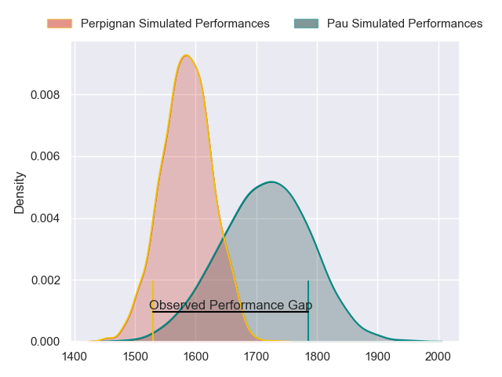
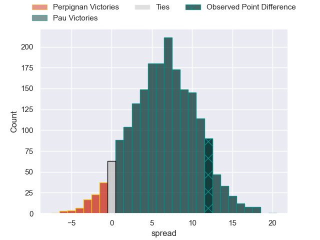
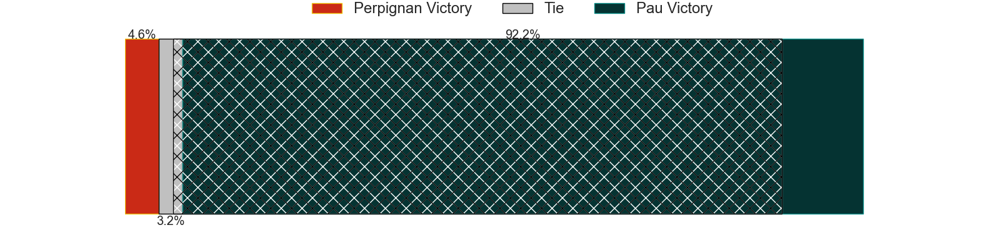
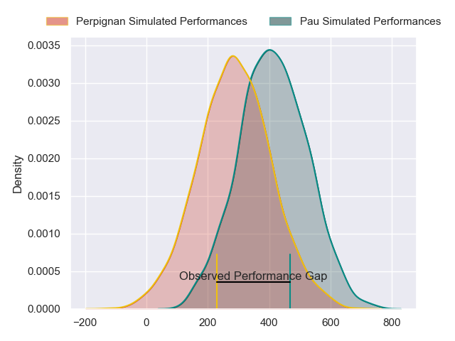
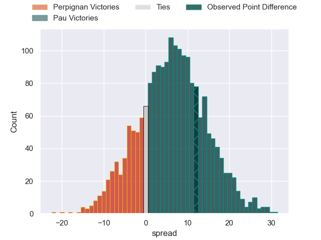

---  
layout: page  
title: Perpignan at Pau; 24-36  
date: 2024-06-08 18:00:00 -0500  
categories: "Top 14 Orange 2023" match review  
---
# Perpignan at Pau; 24-36

# Club Level Predictions

The first set of predictions treats a club as the smallest object, as the club develops its members, organizes a gameplan, and deploys its players as needed for each match. This club model has a prediction of 0.674, which translates to predicting Pau to win by 6.4.

Our Over/Under is 61.5 - and combined with the spread above, we have a predicted scoreline of 27 to 34

Each club has a rating and a rating deviation (similar to a Glicko rating), and expected performances can be generated. This allows for simulated matches and spreads like the ones below.
## Projected Performances - Club Model

## Projected Spreads - Club Model

## Projected Results - Club Model

# Player Level Predictions

Treating teams instead as an entity made up of the currently active players, I have ratings for each player in an altogether different system. These can be combined to form team ratings once teamsheets are announced, weighting starters a bit higher than the reserves. After the match is played, players can be weighted by their minutes on the field, allowing for an accurate measure of the team's composition. With these compiled team ratings, we can make predictions, measure inaccuracy, and update the individual player ratings.
## Prediction without Player Minutes: Pau by 7.3

Perpignan by 0.8 on a neutral pitch

## Projected Performances - Player Model

## Projected Spreads - Player Model

## Projected Results - Player Model

|   Away Minutes | Away Player             |   Away Percentile |   Number |   Home Percentile | Home Player       |   Home Minutes |
|---------------:|:------------------------|------------------:|---------:|------------------:|:------------------|---------------:|
|             61 | Sacha Lotrian           |             58.25 |        1 |             51.18 | Hugo Parrou       |             40 |
|             58 | Ignacio Ruiz            |             88.92 |        2 |             15.41 | Lucas Rey         |             54 |
|             70 | Pietro Ceccarelli       |             72.06 |        3 |             16.33 | Nicolas Corato    |             81 |
|             81 | Marvin Orie             |             91.75 |        4 |             27.24 | Guillaume Ducat   |             54 |
|             68 | Posolo Tuilagi          |             20.87 |        5 |             99.4  | Samuel Whitelock  |             81 |
|             50 | Lucas Bachelier         |             74.76 |        6 |             36.36 | Sacha Zegueur     |             54 |
|             72 | Alan Brazo              |             76.89 |        7 |             82.98 | Reece Hewat       |             72 |
|             58 | Joaquin Oviedo          |             84.79 |        8 |             78.75 | Beka Gorgadze     |             81 |
|             61 | Tom Ecochard            |             89.04 |        9 |             93.15 | Thibault Daubagna |             54 |
|             81 | Jake McIntyre           |             92.43 |       10 |             87.12 | Joe Simmonds      |             81 |
|             70 | Lucas Dubois            |             82.95 |       11 |             80.94 | Thomas Carol      |             24 |
|             70 | Afusipa Taumoepeau      |             57.19 |       12 |             77.6  | Nathan Decron     |             54 |
|             81 | Alivereti Duguivalu     |             20.62 |       13 |             74.17 | Emilien Gailleton |             81 |
|             71 | Tavite Veredamu         |             82.28 |       14 |             28.83 | Theo Attissogbe   |             81 |
|             81 | Louis Dupichot          |             62.73 |       15 |             87.16 | Jack Maddocks     |             81 |
|             23 | Seilala Lam             |             89.25 |       16 |             57.3  | Youri Delhommel   |             27 |
|             31 | Lorencio Boyer Gallardo |            nan    |       17 |            nan    | Ignacio Calles    |             47 |
|             13 | Mathieu Tanguy          |             70.58 |       18 |             76.02 | Martin Puech      |             24 |
|             23 | So'otala Fa'aso'o       |             93.75 |       19 |             37.23 | Thibaut Hamonou   |             27 |
|             40 | Patrick Sobela          |             95.26 |       20 |             97.95 | Dan Robson        |             27 |
|             21 | Job Poulet              |            nan    |       21 |              0.52 | Jale Vatubua      |             27 |
|             20 | Matteo Rodor            |             10.63 |       22 |             78.05 | Axel Desperes     |             57 |
|             11 | Nemo Roelofse           |             75.55 |       23 |             86.03 | Siate Tokolahi    |              6 |

