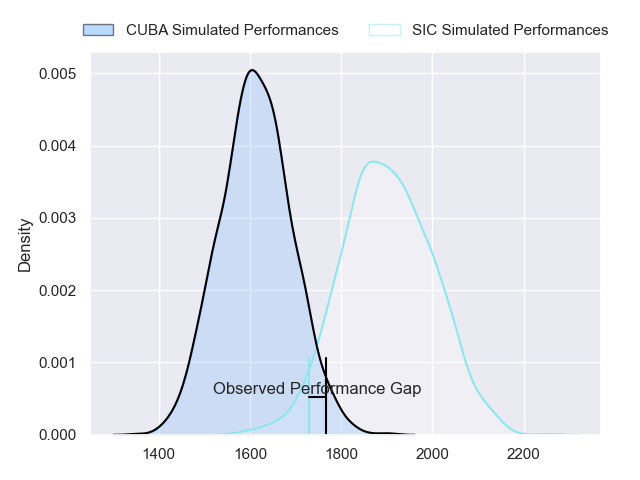
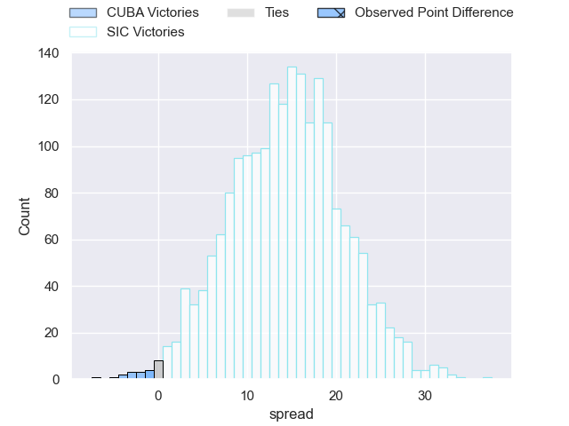
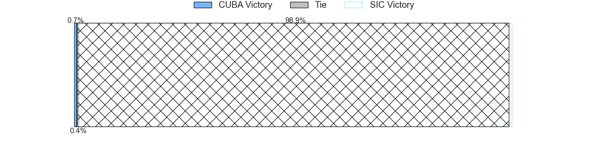
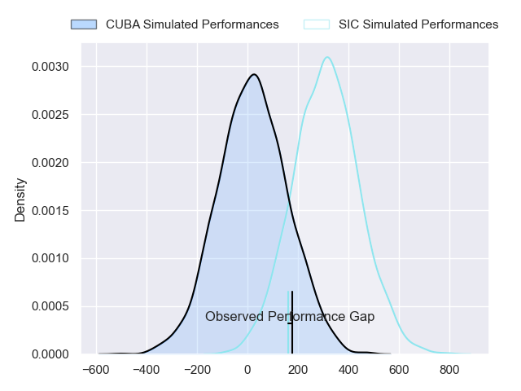
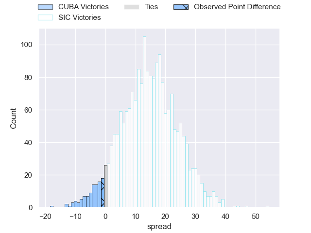
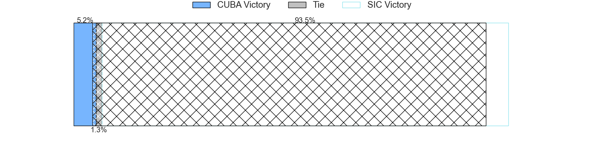

---  
layout: page  
title: CUBA at SIC; 31-30  
date: 2024-06-08 18:00:00 -0500  
categories: "URBA Top 12 2024" match review  
---
# CUBA at SIC; 31-30

# Club Level Predictions

The first set of predictions treats a club as the smallest object, as the club develops its members, organizes a gameplan, and deploys its players as needed for each match. This club model has a prediction of 0.834, which translates to predicting SIC to win by 14.5.

Our Over/Under is 50.5 - and combined with the spread above, we have a predicted scoreline of 18 to 33

Each club has a rating and a rating deviation (similar to a Glicko rating), and expected performances can be generated. This allows for simulated matches and spreads like the ones below.
## Projected Performances - Club Model

## Projected Spreads - Club Model

## Projected Results - Club Model

# Player Level Predictions

Treating teams instead as an entity made up of the currently active players, I have ratings for each player in an altogether different system. These can be combined to form team ratings once teamsheets are announced, weighting starters a bit higher than the reserves. After the match is played, players can be weighted by their minutes on the field, allowing for an accurate measure of the team's composition. With these compiled team ratings, we can make predictions, measure inaccuracy, and update the individual player ratings.
## Prediction without Player Minutes: SIC by 14.7

SIC by 10.8 on a neutral pitch

## Projected Performances - Player Model

## Projected Spreads - Player Model

## Projected Results - Player Model

|   Away Minutes | Away Player           |   Away Percentile |   Number |   Home Percentile | Home Player             |   Home Minutes |
|---------------:|:----------------------|------------------:|---------:|------------------:|:------------------------|---------------:|
|             81 | Francisco Garoby      |             79.45 |        1 |             73.84 | Marcos Piccinini        |             81 |
|             81 | Enrique Devoto        |             76.24 |        2 |             77.69 | Lucas Rocha             |             81 |
|             81 | Facundo Aguirre       |             65.64 |        3 |             67.75 | Benjamin Chiappe        |             81 |
|             81 | Santiago Uriarte      |             64.21 |        4 |             69.38 | Bautista Viero          |             81 |
|             81 | Santiago Landau       |             63.92 |        5 |             29.03 | Marcos Borghi           |             81 |
|             81 | Francisco Sied        |             63.54 |        6 |             34.33 | Alejo Daireaux          |             81 |
|             81 | Segundo Pisani        |             58.41 |        7 |             60.35 | Andrea Panzarini        |             81 |
|             81 | Benito Ortiz de Rozas |             70    |        8 |             58.54 | Tomas Meyrelles         |             81 |
|             81 | Facundo Fontan Gotta  |             74.66 |        9 |             67.47 | Felipe Sascaro          |             81 |
|             81 | Valentin Mastroizi    |             69.12 |       10 |             63.6  | Santiago Pavlovsky      |             81 |
|             81 | Francisco Patrono     |             66.76 |       11 |             25.38 | Lucas Albanese          |             81 |
|             81 | Felipe de la Vega     |             53.12 |       12 |             62.6  | Santos Rubio            |             81 |
|             81 | Felipe Perdomo        |             53.96 |       13 |             49.69 | Carlos Piran            |             81 |
|             81 | Bautista Casaurang    |             76.72 |       14 |             52.78 | Nicanor Acosta          |             81 |
|             81 | Marcos Moroni         |             61.28 |       15 |             62.11 | Franco Moneta           |             81 |
|              0 | Esteban Iribarne      |            nan    |       16 |            nan    | Segundo Rubio           |              0 |
|              0 | Joaquin Yaquiche      |             22.5  |       17 |            nan    | Jaime Gilligan          |              0 |
|              0 | Pedro Mesones         |             45.59 |       18 |            nan    | Ignacio Noel            |              0 |
|              0 | Tomas Anderlic        |             22.95 |       19 |            nan    | Pedro Georgalo          |              0 |
|              0 | Lucas Campion         |             25.44 |       20 |            nan    | Facundo Madero          |              0 |
|              0 | Rafael Iriarte        |            nan    |       21 |            nan    | Home Team 21            |              0 |
|              0 | Mateo Mengelle        |            nan    |       22 |            nan    | Ramon Martinez Tomietto |              0 |
|              0 | Away Team 23          |            nan    |       23 |            nan    | Felipe Rubio            |              0 |

