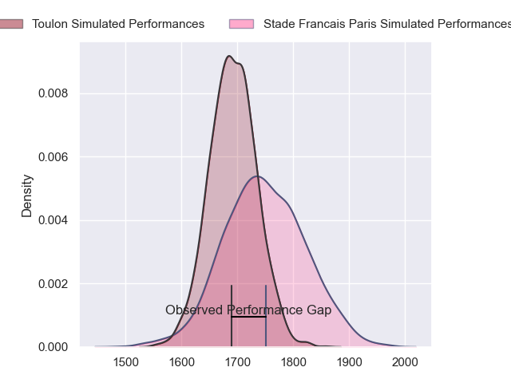
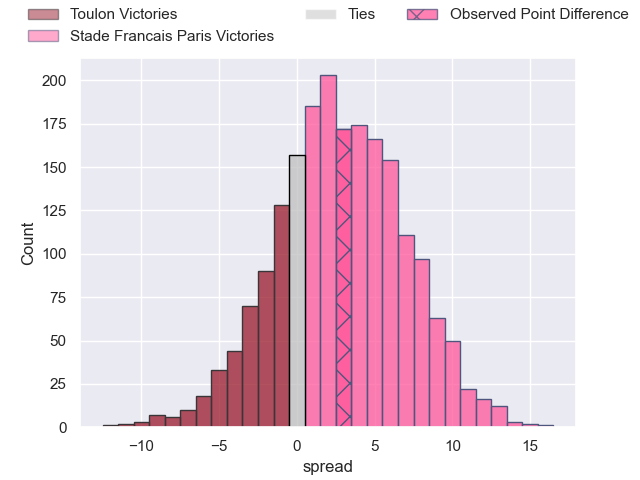
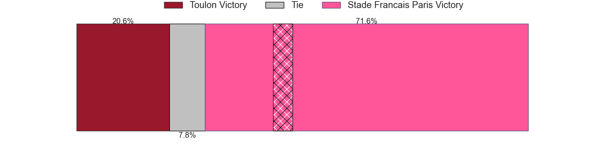
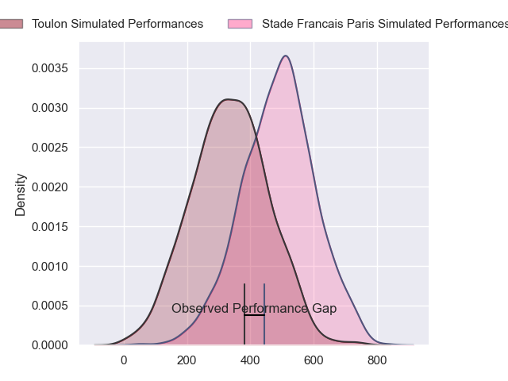
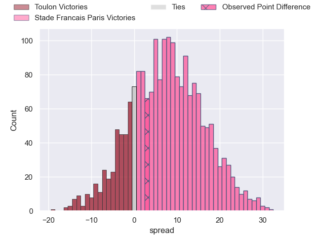

---  
layout: page  
title: Toulon at Stade Francais Paris; 20-23  
date: 2024-06-08 18:00:00 -0500  
categories: "Top 14 Orange 2023" match review  
---
# Toulon at Stade Francais Paris; 20-23

# Club Level Predictions

The first set of predictions treats a club as the smallest object, as the club develops its members, organizes a gameplan, and deploys its players as needed for each match. This club model has a prediction of 0.577, which translates to predicting Stade Francais Paris to win by 2.7.

Our Over/Under is 45.5 - and combined with the spread above, we have a predicted scoreline of 21 to 24

Each club has a rating and a rating deviation (similar to a Glicko rating), and expected performances can be generated. This allows for simulated matches and spreads like the ones below.
## Projected Performances - Club Model

## Projected Spreads - Club Model

## Projected Results - Club Model

# Player Level Predictions

Treating teams instead as an entity made up of the currently active players, I have ratings for each player in an altogether different system. These can be combined to form team ratings once teamsheets are announced, weighting starters a bit higher than the reserves. After the match is played, players can be weighted by their minutes on the field, allowing for an accurate measure of the team's composition. With these compiled team ratings, we can make predictions, measure inaccuracy, and update the individual player ratings.
## Prediction without Player Minutes: Stade Francais Paris by 10.3

Stade Francais Paris by 2.1 on a neutral pitch

## Projected Performances - Player Model

## Projected Spreads - Player Model

## Projected Results - Player Model

|   Away Minutes | Away Player            |   Away Percentile |   Number |   Home Percentile | Home Player             |   Home Minutes |
|---------------:|:-----------------------|------------------:|---------:|------------------:|:------------------------|---------------:|
|             59 | Jean-Baptiste Gros     |             97.73 |        1 |             72.22 | Sergo Abramishvili      |             59 |
|             41 | Jack Singleton         |             93.9  |        2 |             94.7  | Mickael Ivaldi          |             49 |
|             59 | Kieran Brookes         |             30.79 |        3 |             90.01 | Paul Alo-Emile          |             59 |
|             40 | Matthias Halagahu      |             42.84 |        4 |             31.21 | Paul Gabrillagues       |             72 |
|             80 | Swan Rebbadj           |             79.82 |        5 |             76.94 | Baptiste Pesenti        |             72 |
|             68 | Selevasio Tolofua      |             86.75 |        6 |             95.94 | Sekou Macalou           |             61 |
|             80 | Jules Coulon           |             64.12 |        7 |             52.61 | Romain Briatte          |             80 |
|             77 | Facundo Isa            |             86.67 |        8 |             89.17 | Giovanni Habel-Kueffner |             59 |
|             72 | Baptiste Serin         |             97.6  |        9 |             98.63 | Rory Kockott            |             61 |
|             49 | Enzo Herve             |             80.98 |       10 |             79.14 | Joris Segonds           |             80 |
|             80 | Gael Drean             |             20.4  |       11 |             87.07 | Lester Etien            |             80 |
|             49 | Duncan Paia'aua        |             79.27 |       12 |             82.08 | Jeremy Ward             |             80 |
|             80 | Maelan Rabut           |             33.75 |       13 |             86.77 | Joe Marchant            |             80 |
|             80 | Jiuta Wainiqolo        |             92.91 |       14 |             46.17 | Peniasi Dakuwaqa        |             73 |
|             80 | Melvyn Jaminet         |             91.51 |       15 |             65.01 | Leo Barre               |             80 |
|             39 | Teddy Baubigny         |             72.87 |       16 |             19.1  | Lucas Peyresblanques    |             31 |
|             21 | Bruce Devaux           |             11.62 |       17 |             73.11 | Moses Alo-Emile         |             21 |
|             40 | Brian Alainu'uese      |             92.84 |       18 |             75.05 | Pierre-Henri Azagoh     |             16 |
|             15 | Yannick Youyoutte      |             66.83 |       19 |             13.06 | Tanginoa Halaifonua     |             21 |
|             31 | Paolo Garbisi          |             88.14 |       20 |             97.09 | Brad Weber              |             19 |
|              8 | Jules Danglot          |             66.44 |       21 |              3.19 | Mathieu Hirigoyen       |             19 |
|             31 | Leicester Fainga'anuku |             93.33 |       22 |             60.25 | Kylan Hamdaoui          |              7 |
|             21 | Emerick Setiano        |             93.26 |       23 |             92.77 | Giorgi Melikidze        |             21 |

