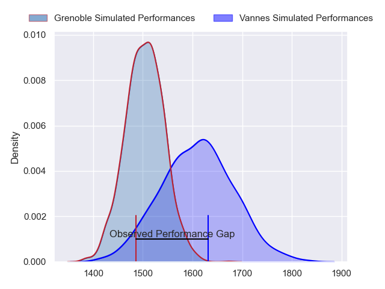
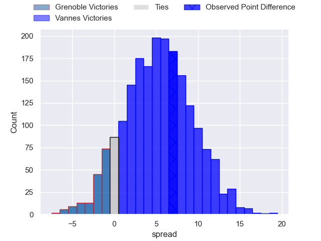
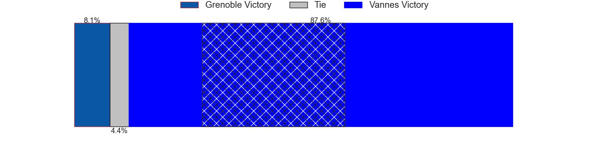
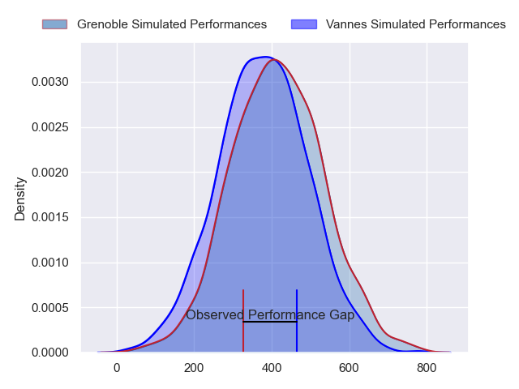
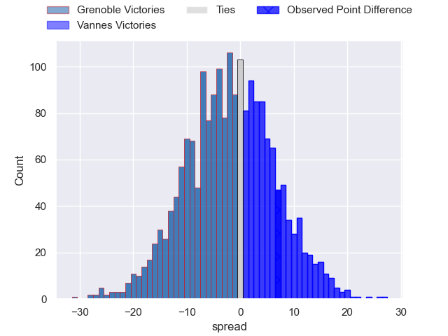
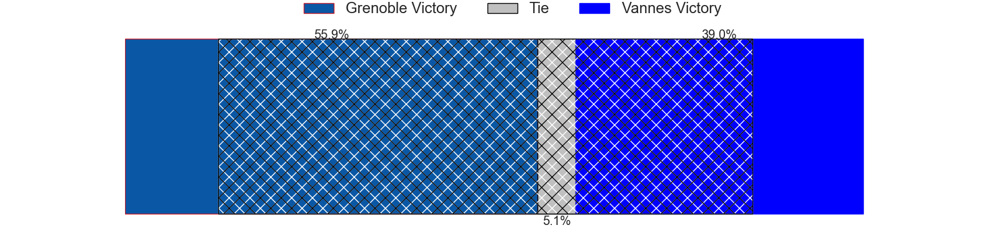

---  
layout: page  
title: Grenoble at Vannes; 9-16  
date: 2024-06-08 18:00:00 -0500  
categories: "Pro D2 2023" match review  
---
# Grenoble at Vannes; 9-16

# Club Level Predictions

The first set of predictions treats a club as the smallest object, as the club develops its members, organizes a gameplan, and deploys its players as needed for each match. This club model has a prediction of 0.643, which translates to predicting Vannes to win by 5.1.

Our Over/Under is 56.5 - and combined with the spread above, we have a predicted scoreline of 26 to 31

Each club has a rating and a rating deviation (similar to a Glicko rating), and expected performances can be generated. This allows for simulated matches and spreads like the ones below.
## Projected Performances - Club Model

## Projected Spreads - Club Model

## Projected Results - Club Model

# Player Level Predictions

Treating teams instead as an entity made up of the currently active players, I have ratings for each player in an altogether different system. These can be combined to form team ratings once teamsheets are announced, weighting starters a bit higher than the reserves. After the match is played, players can be weighted by their minutes on the field, allowing for an accurate measure of the team's composition. With these compiled team ratings, we can make predictions, measure inaccuracy, and update the individual player ratings.
## Prediction without Player Minutes: Grenoble by 1.8

Grenoble by 5.8 on a neutral pitch

## Projected Performances - Player Model

## Projected Spreads - Player Model

## Projected Results - Player Model

|   Away Minutes | Away Player         |   Away Percentile |   Number |   Home Percentile | Home Player             |   Home Minutes |
|---------------:|:--------------------|------------------:|---------:|------------------:|:------------------------|---------------:|
|             59 | Luka Goginava       |             74.25 |        1 |             90.74 | Andy Bordelai           |             72 |
|             59 | Barnabé Massa       |             85.55 |        2 |             87.8  | Pat Leafa               |             41 |
|             59 | Regis Montagne      |             87.16 |        3 |             94.72 | Paga Tafili             |             57 |
|             80 | Thomas Lainault     |             65.51 |        4 |             94.53 | Joe Edwards             |             80 |
|             56 | Georgi Javakhia     |             88.37 |        5 |             15.51 | Mattéo Desjeux          |             41 |
|             80 | Jose Madeira        |             92.17 |        6 |             29.59 | Juan Bautista Pedemonte |             57 |
|             80 | Steeve Blanc-Mappaz |             85.4  |        7 |             99.03 | Francisco Gorrissen     |             80 |
|             59 | Pio Muarua          |             77.5  |        8 |             60    | Sione Kalamafoni        |             80 |
|             59 | Eric Escande        |             93.49 |        9 |             94.18 | Michael Ruru            |             80 |
|             80 | Sam Davies          |             88.96 |       10 |             95.09 | Maxime Lafage           |             80 |
|             67 | Nathan Farissier    |             23.47 |       11 |             80.27 | Romaric Camou           |             80 |
|             80 | Bautista Ezcurra    |             97.08 |       12 |              9.06 | Alex Arrate             |             72 |
|             80 | Romain Fusier       |             55.73 |       13 |             12.19 | Andres Vilaseca         |             80 |
|             80 | Geoffrey Cros       |             77.97 |       14 |             76.15 | Théo Bastardie          |             80 |
|             80 | Julien Farnoux      |             97.93 |       15 |             62.32 | Thibault Debaes         |             41 |
|             24 | Pierce Phillips     |             82.8  |       16 |             66.61 | Théo Beziat             |             39 |
|             21 | Irakli Aptsiauri    |             83.92 |       17 |             83.4  | Darren O'Shea           |             39 |
|             21 | Barnabe Couilloud   |             10.62 |       18 |             99.17 | Gwenaël Duplenne        |             39 |
|             21 | Thibaut Martel      |             70.41 |       19 |             82.86 | Phil Kite               |             23 |
|             21 | Zack Gauthier       |             83.27 |       20 |             24.85 | Léon Boulier            |             23 |
|             21 | Mathis Sarragallet  |             52.01 |       21 |             29.57 | Charles-Henri Berguet   |              8 |
|             13 | Wilfried Hulleu     |             88.79 |       22 |             38.18 | Jules Le Bail           |              8 |

