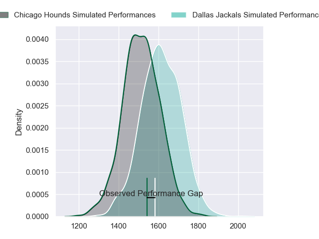
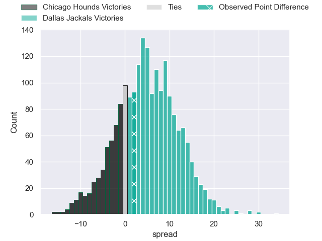
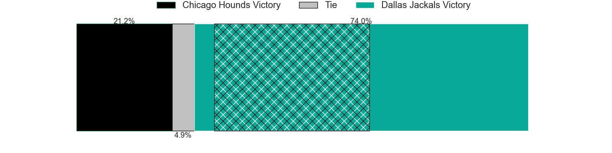
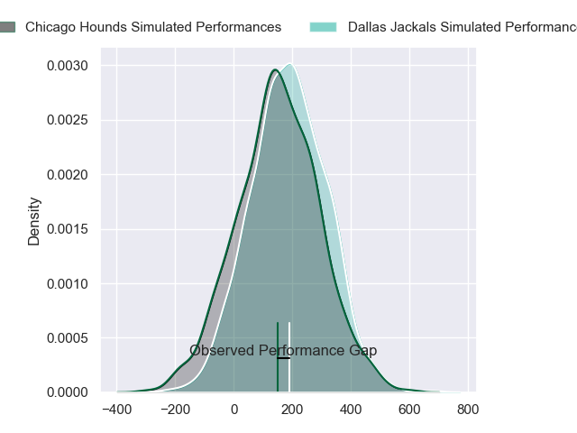
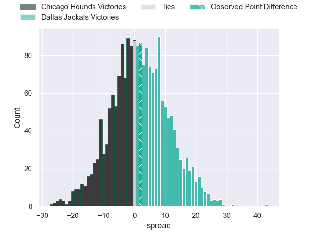

---  
layout: page  
title: Chicago Hounds at Dallas Jackals; 20-22  
date: 2024-06-09 18:00:00 -0500  
categories: "Major League Rugby 2024" match review  
---
# Chicago Hounds at Dallas Jackals; 20-22

# Club Level Predictions

The first set of predictions treats a club as the smallest object, as the club develops its members, organizes a gameplan, and deploys its players as needed for each match. This club model has a prediction of 0.631, which translates to predicting Dallas Jackals to win by 4.8.

Our Over/Under is 52.5 - and combined with the spread above, we have a predicted scoreline of 24 to 29

Each club has a rating and a rating deviation (similar to a Glicko rating), and expected performances can be generated. This allows for simulated matches and spreads like the ones below.
## Projected Performances - Club Model

## Projected Spreads - Club Model

## Projected Results - Club Model

# Player Level Predictions

Treating teams instead as an entity made up of the currently active players, I have ratings for each player in an altogether different system. These can be combined to form team ratings once teamsheets are announced, weighting starters a bit higher than the reserves. After the match is played, players can be weighted by their minutes on the field, allowing for an accurate measure of the team's composition. With these compiled team ratings, we can make predictions, measure inaccuracy, and update the individual player ratings.
## Prediction without Player Minutes: Dallas Jackals by 2.0

Chicago Hounds by 0.4 on a neutral pitch

## Projected Performances - Player Model

## Projected Spreads - Player Model

## Projected Results - Player Model

|   Away Minutes | Away Player     |   Away Percentile |   Number |   Home Percentile | Home Player         |   Home Minutes |
|---------------:|:----------------|------------------:|---------:|------------------:|:--------------------|---------------:|
|             80 | Charlie Abel    |             18.44 |        1 |             67.02 | Joaquín Horcada     |             80 |
|             80 | Dylan Fawsitt   |             98.72 |        2 |             49.76 | Dewald Kotze        |             80 |
|             80 | Paddy Ryan      |             17.79 |        3 |             48.01 | Juan Pablo Zeiss    |             80 |
|             80 | George Merrick  |             33    |        4 |             56.66 | Jero Gomez Vara     |             80 |
|             80 | James Scott     |             57.85 |        5 |             60.54 | Lucas Bur           |             80 |
|             80 | Mason Flesch    |              3.77 |        6 |             60.54 | Ronan Foley         |             80 |
|             80 | Maclean Jones   |             20.7  |        7 |             51.64 | Makeen Alikhan      |             80 |
|             80 | Conall Boomer   |             46.88 |        8 |             51.04 | Sam Tuifua          |             80 |
|             80 | Nick McCarthy   |             63.01 |        9 |             56.68 | Juan-Dee Oliver     |             80 |
|             80 | Adriaan Carelse |             21.06 |       10 |             52.35 | Martin Elias        |             80 |
|             80 | Nate Augspurger |             99.23 |       11 |             60.54 | Nic Benn            |             80 |
|             80 | Bill Meakes     |             34.06 |       12 |             36.25 | Tomás Cubilla       |             80 |
|             80 | Bryce Campbell  |             22.71 |       13 |             57.92 | Mitchell Richardson |             80 |
|             80 | Noah Brown      |             59.39 |       14 |             62.74 | Jason Tidwell       |             80 |
|             80 | Kian Meadon     |             39.96 |       15 |             50.1  | Tomy Malanos        |             80 |
|              0 | Janus Venter    |            nan    |       16 |              0.08 | Liam Murray         |              0 |
|              0 | Fred Apulu      |            nan    |       17 |            nan    | Tomás Bekerman      |              0 |
|              0 | Ignacio Peculo  |             90.66 |       18 |             54.35 | Kyle Steeves        |              0 |
|              0 | Brad Tucker     |            nan    |       19 |            nan    | Kyle Breytenbach    |              0 |
|              0 | Luke White      |              8.12 |       20 |             36.18 | Daemon Torres       |              0 |
|              0 | Lucas Rumball   |              3    |       21 |            nan    | Brock Gallagher     |              0 |
|              0 | Jason Higgins   |             55.14 |       22 |            nan    | Marques Fuala'Au    |              0 |
|              0 | Cassh Maluia    |             29.17 |       23 |            nan    | Kieran Farmer       |              0 |

