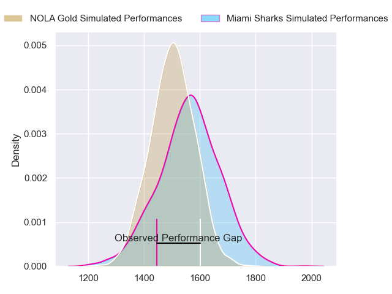
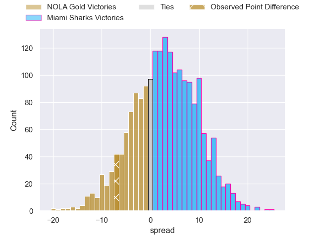
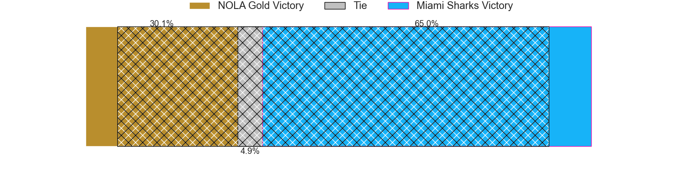
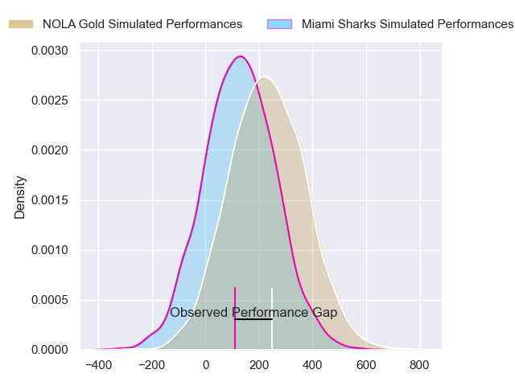
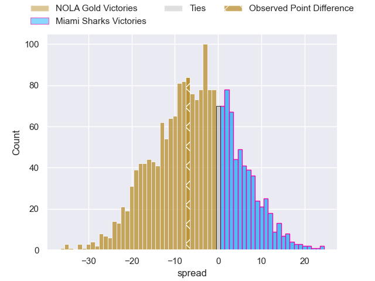

---  
layout: page  
title: NOLA Gold at Miami Sharks; 20-13  
date: 2024-06-09 18:00:00 -0500  
categories: "Major League Rugby 2024" match review  
---
# NOLA Gold at Miami Sharks; 20-13

# Club Level Predictions

The first set of predictions treats a club as the smallest object, as the club develops its members, organizes a gameplan, and deploys its players as needed for each match. This club model has a prediction of 0.587, which translates to predicting Miami Sharks to win by 3.2.

Our Over/Under is 46.5 - and combined with the spread above, we have a predicted scoreline of 22 to 25

Each club has a rating and a rating deviation (similar to a Glicko rating), and expected performances can be generated. This allows for simulated matches and spreads like the ones below.
## Projected Performances - Club Model

## Projected Spreads - Club Model

## Projected Results - Club Model

# Player Level Predictions

Treating teams instead as an entity made up of the currently active players, I have ratings for each player in an altogether different system. These can be combined to form team ratings once teamsheets are announced, weighting starters a bit higher than the reserves. After the match is played, players can be weighted by their minutes on the field, allowing for an accurate measure of the team's composition. With these compiled team ratings, we can make predictions, measure inaccuracy, and update the individual player ratings.
## Prediction without Player Minutes: NOLA Gold by 4.4

NOLA Gold by 6.7 on a neutral pitch

## Projected Performances - Player Model

## Projected Spreads - Player Model

## Projected Results - Player Model

|   Away Minutes | Away Player         |   Away Percentile |   Number |   Home Percentile | Home Player         |   Home Minutes |
|---------------:|:--------------------|------------------:|---------:|------------------:|:--------------------|---------------:|
|             80 | Jarred Adams        |             82.05 |        1 |             28.92 | Jonas Petrakopoulos |             80 |
|             80 | Augusto Bohme       |             69.82 |        2 |             41.57 | Sean Mcnulty        |             80 |
|             80 | Sean Paranihi       |             54.43 |        3 |             70.19 | Tau Koloamatangi    |             80 |
|             80 | Callum Botchar      |             73.96 |        4 |             39.66 | Rick Rose           |             80 |
|             80 | William Waguespack  |             63.42 |        5 |             43.14 | Stan Van Den Hoven  |             80 |
|             80 | Malcolm May         |             79.55 |        6 |             23.11 | Dan Pryor           |             80 |
|             80 | Moni Tonga'Uiha     |             79.55 |        7 |             37.33 | Roelof Smit         |             80 |
|             80 | Cam Dolan           |             58.33 |        8 |             43.12 | Benjamin Bonasso    |             80 |
|             80 | Luke Campbell       |             75.34 |        9 |             13.36 | Tomas Cubelli       |             80 |
|             80 | Dorian Jones        |             60.74 |       10 |             15.95 | Santiago Videla     |             80 |
|             80 | Taniela Filimone    |             80.65 |       11 |             23.37 | Marcos Young        |             80 |
|             80 | Jp Du Plessis       |             62.19 |       12 |             11.35 | Matias Orlando      |             80 |
|             80 | Ross Depperschmidt  |             65    |       13 |             33.12 | Tomas Inciarte      |             80 |
|             80 | Harley Wheeler      |             50.48 |       14 |             54.6  | Avery Oitomen       |             80 |
|             80 | Jordan Jackson-Hope |             61.49 |       15 |             35.4  | Matías Freyre       |             80 |
|              0 | Ale Lopeti          |            nan    |       16 |            nan    | Kirby Myhill        |              0 |
|              0 | Matt Harmon         |             60.03 |       17 |             54.1  | Alec Mcdonnell      |              0 |
|              0 | Isaac Salmon        |             69.29 |       18 |            nan    | Setu Vole           |              0 |
|              0 | Fintan Coleman      |            nan    |       19 |             46.02 | Michael Etete       |              0 |
|              0 | Osaiasi Tonga'Uiha  |            nan    |       20 |             25.42 | Guiseppe Du Toit    |              0 |
|              0 | Damian Stevens      |              4.28 |       21 |            nan    | Damian Morley       |              0 |
|              0 | Reece Botha         |             64.62 |       22 |             49.14 | Michael Hand        |              0 |
|              0 | Julian Roberts      |             53.83 |       23 |            nan    | Eric Naposki        |              0 |

