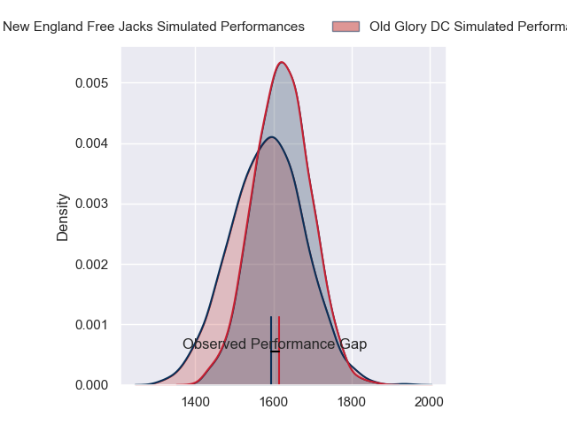
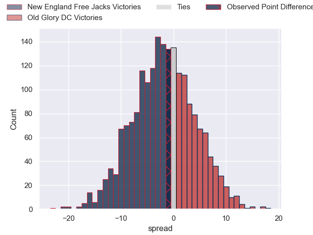
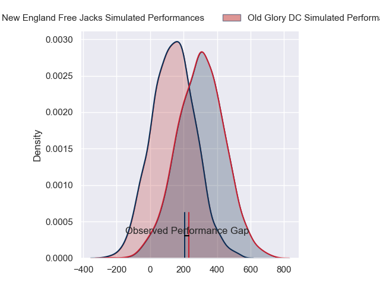
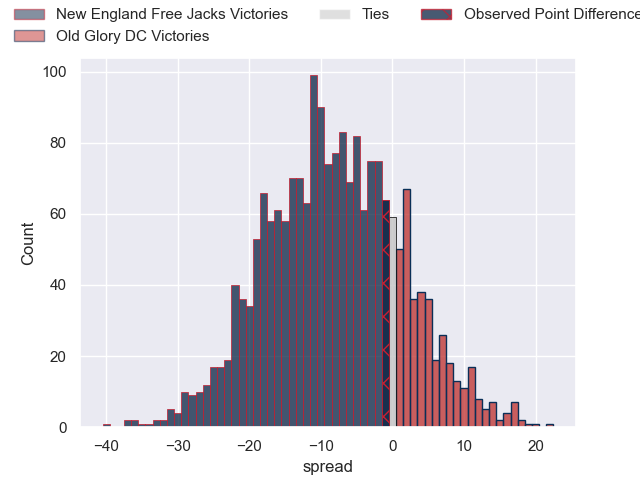

---  
layout: page  
title: New England Free Jacks at Old Glory DC; 31-30  
date: 2024-06-09 18:00:00 -0500  
categories: "Major League Rugby 2024" match review  
---
# New England Free Jacks at Old Glory DC; 31-30

# Club Level Predictions

The first set of predictions treats a club as the smallest object, as the club develops its members, organizes a gameplan, and deploys its players as needed for each match. This club model has a prediction of 0.444, which translates to predicting New England Free Jacks to win by 2.0.

Our Over/Under is 53.5 - and combined with the spread above, we have a predicted scoreline of 28 to 26

Each club has a rating and a rating deviation (similar to a Glicko rating), and expected performances can be generated. This allows for simulated matches and spreads like the ones below.
## Projected Performances - Club Model

## Projected Spreads - Club Model

## Projected Results - Club Model

# Player Level Predictions

Treating teams instead as an entity made up of the currently active players, I have ratings for each player in an altogether different system. These can be combined to form team ratings once teamsheets are announced, weighting starters a bit higher than the reserves. After the match is played, players can be weighted by their minutes on the field, allowing for an accurate measure of the team's composition. With these compiled team ratings, we can make predictions, measure inaccuracy, and update the individual player ratings.
## Prediction without Player Minutes: New England Free Jacks by 8.3

New England Free Jacks by 10.9 on a neutral pitch

## Projected Performances - Player Model

## Projected Spreads - Player Model

## Projected Results - Player Model

|   Away Minutes | Away Player        |   Away Percentile |   Number |   Home Percentile | Home Player              |   Home Minutes |
|---------------:|:-------------------|------------------:|---------:|------------------:|:-------------------------|---------------:|
|             80 | Malakai Hala       |             55.48 |        1 |             25.18 | Jack Iscaro              |             80 |
|             80 | AJ Quattrin        |             45.59 |        2 |             65.17 | Facundo Gattas           |             80 |
|             80 | John Roy Jenkinson |             72.14 |        3 |             88.46 | Steven Longwell          |             80 |
|             80 | Kyle Baillie       |             48.91 |        4 |             18.09 | Tevita Naqali            |             80 |
|             80 | Conor Keys         |             68.99 |        5 |             72.86 | Bill Whiteside           |             80 |
|             80 | Ethan Fryer        |             20.5  |        6 |             41.88 | Jamason Fa'anana Schultz |             80 |
|             80 | Jed Melvin         |             76.5  |        7 |             27.76 | Cory Gilliland-Daniel    |             80 |
|             80 | Martin Sigren      |             59.79 |        8 |             96.25 | Lautaro Ezequiel Bavaro  |             80 |
|             80 | Holden Yungert     |             46.06 |        9 |             67.64 | Connor Buckley           |             80 |
|             80 | Jayson Potroz      |             92.23 |       10 |              1.02 | Jason Robertson          |             80 |
|             80 | Paula Balekana     |              3.45 |       11 |             89.46 | Axel Muller              |             80 |
|             80 | Le Roux Malan      |             86.98 |       12 |              3.65 | Tommaso Boni             |             80 |
|             80 | Wayne van der Bank |             63.65 |       13 |             39.58 | William Talataina-Mu     |             80 |
|             80 | Mitch Wilson       |             94.92 |       14 |             56.32 | Ishmail Shabazz          |             80 |
|             80 | Reece MacDonald    |             78.88 |       15 |             37.68 | Perry Humphreys          |             80 |

