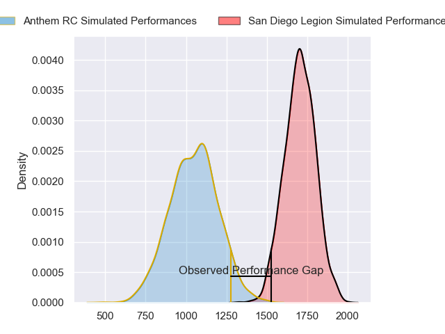
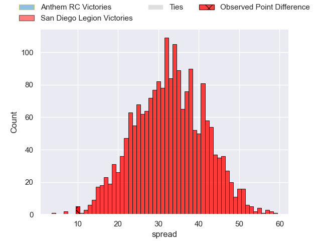
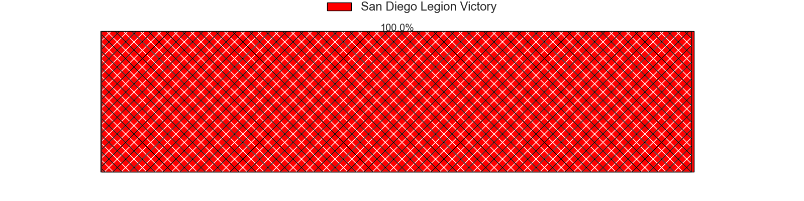
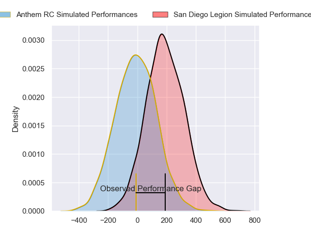
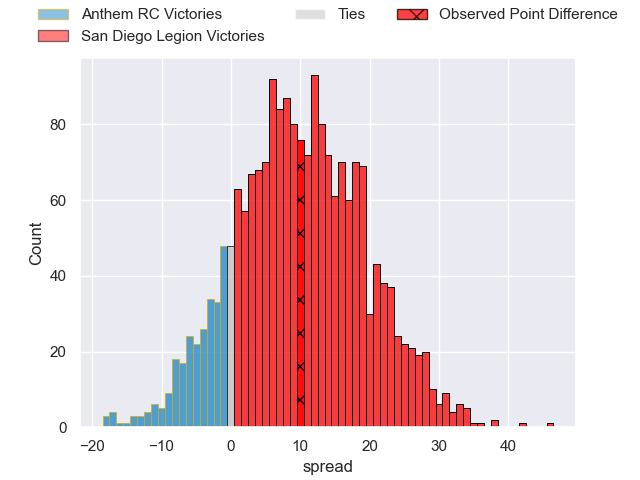
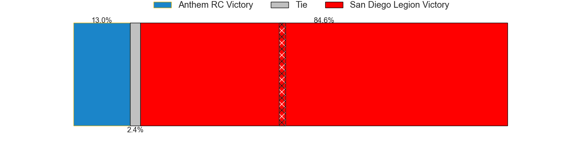

---  
layout: page  
title: Anthem RC at San Diego Legion; 24-34  
date: 2024-06-09 18:00:00 -0500  
categories: "Major League Rugby 2024" match review  
---
# Anthem RC at San Diego Legion; 24-34

# Club Level Predictions

The first set of predictions treats a club as the smallest object, as the club develops its members, organizes a gameplan, and deploys its players as needed for each match. This club model has a prediction of 0.967, which translates to predicting San Diego Legion to win by 32.4.

Our Over/Under is 68.5 - and combined with the spread above, we have a predicted scoreline of 18 to 51

Each club has a rating and a rating deviation (similar to a Glicko rating), and expected performances can be generated. This allows for simulated matches and spreads like the ones below.
## Projected Performances - Club Model

## Projected Spreads - Club Model

## Projected Results - Club Model

# Player Level Predictions

Treating teams instead as an entity made up of the currently active players, I have ratings for each player in an altogether different system. These can be combined to form team ratings once teamsheets are announced, weighting starters a bit higher than the reserves. After the match is played, players can be weighted by their minutes on the field, allowing for an accurate measure of the team's composition. With these compiled team ratings, we can make predictions, measure inaccuracy, and update the individual player ratings.
## Prediction without Player Minutes: San Diego Legion by 10.3

San Diego Legion by 7.6 on a neutral pitch

## Projected Performances - Player Model

## Projected Spreads - Player Model

## Projected Results - Player Model

|   Away Minutes | Away Player           |   Away Percentile |   Number |   Home Percentile | Home Player          |   Home Minutes |
|---------------:|:----------------------|------------------:|---------:|------------------:|:---------------------|---------------:|
|             80 | Dan Hanson            |             16.98 |        1 |             52.72 | Nathan Sylvia        |             80 |
|             80 | Jack Manzo            |             40.77 |        2 |             53.93 | Hugh Roach           |             80 |
|             80 | Joe Apikotoa          |              7.15 |        3 |             57.51 | Darcy Breen          |             80 |
|             80 | Logan Weidner         |             40.06 |        4 |             46.62 | Isaac Ross           |             80 |
|             80 | Reagan Leslie         |             15.41 |        5 |             16.9  | Greg Peterson        |             80 |
|             80 | Shneil Singh          |             13.44 |        6 |             66.63 | Vili Helu            |             80 |
|             80 | Sione Latu            |             41.78 |        7 |             92.26 | Paddy Ryan           |             80 |
|             80 | Michael Ma'Afu        |             21.67 |        8 |             56.25 | Tupou Ma'Afu-Afungia |             80 |
|             80 | Sean Yacoubian        |             40.75 |        9 |             47.6  | Danny Christensen    |             80 |
|             80 | Cliven Loubser        |             16.56 |       10 |             51.94 | Lincoln Mcclutchie   |             80 |
|             80 | Te Rangatira Waitokia |             10.44 |       11 |             47.75 | James Vaifale        |             80 |
|             80 | Junior Gafa           |              8.02 |       12 |             41.15 | Tiaan Loots          |             80 |
|             80 | Sebastian Zaridze     |             39.38 |       13 |             36.56 | Ethan Grayson        |             80 |
|             80 | Cael Hodgson          |             14.85 |       14 |             47.75 | Filimoni Waqainabete |             80 |
|             80 | Steffan Crimp         |             38.72 |       15 |             40.58 | Mikey Te'O           |             80 |
|              0 | Connor Robinson       |              7.06 |       16 |             57.95 | Cyrille Cama         |              0 |
|              0 | Ivan Pula             |            nan    |       17 |             41.43 | Djustice Sears-Duru  |              0 |
|              0 | Stephan Bernal-Wendt  |            nan    |       18 |            nan    | Oliver Kane          |              0 |
|              0 | Lucas Gramlick        |             14.71 |       19 |            nan    | Brandon Harvey       |              0 |
|              0 | Joe Basser            |             16.44 |       20 |            nan    | Aminae Amiatu-Tanoi  |              0 |
|              0 | Siaosi Nai            |             19.35 |       21 |            nan    | Finn Kearns          |              0 |
|              0 | Oscar Koller          |             29.24 |       22 |            nan    | Nick Boyer           |              0 |
|              0 | Tomasi Alosio         |              9.73 |       23 |            nan    | Josh Henderson       |              0 |

