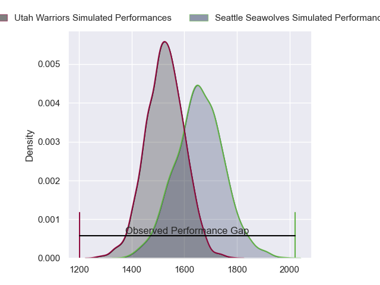
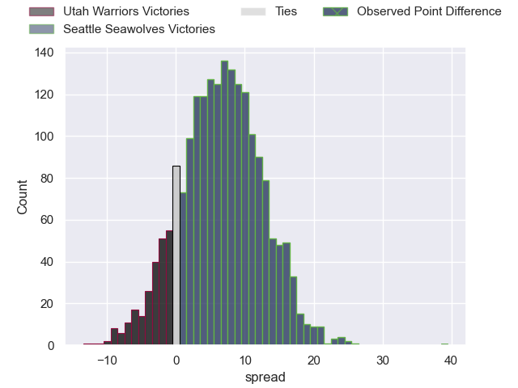
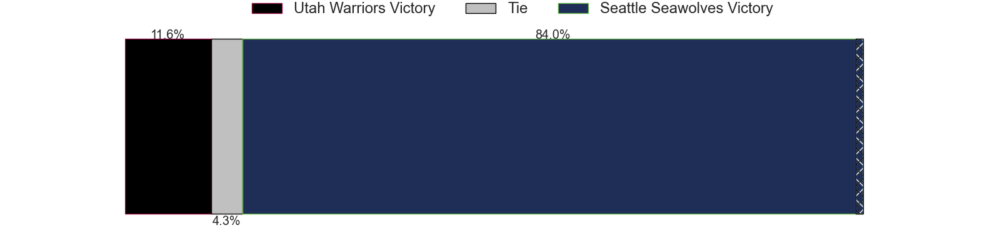
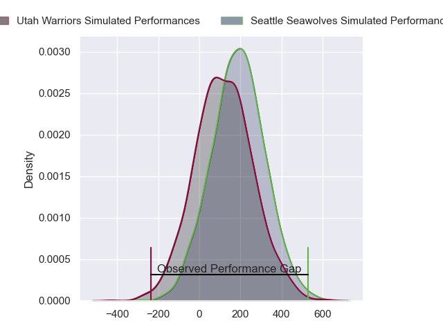
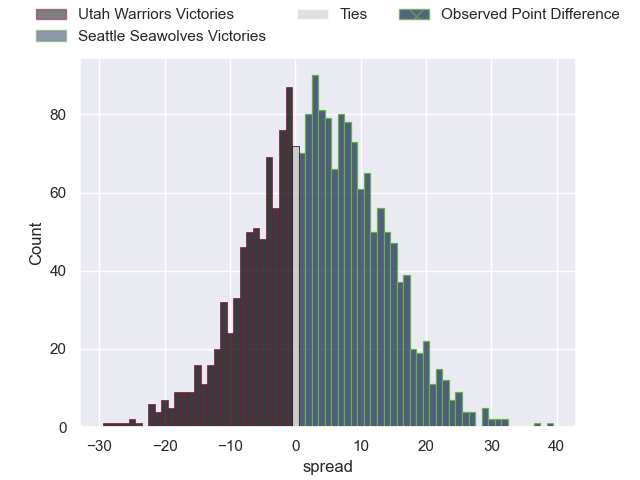
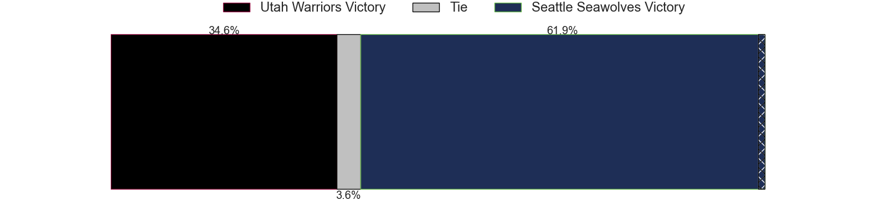

---  
layout: page  
title: Utah Warriors at Seattle Seawolves; 29-68  
date: 2024-06-09 18:00:00 -0500  
categories: "Major League Rugby 2024" match review  
---
# Utah Warriors at Seattle Seawolves; 29-68

# Club Level Predictions

The first set of predictions treats a club as the smallest object, as the club develops its members, organizes a gameplan, and deploys its players as needed for each match. This club model has a prediction of 0.68, which translates to predicting Seattle Seawolves to win by 6.7.

Our Over/Under is 52.5 - and combined with the spread above, we have a predicted scoreline of 23 to 29

Each club has a rating and a rating deviation (similar to a Glicko rating), and expected performances can be generated. This allows for simulated matches and spreads like the ones below.
## Projected Performances - Club Model

## Projected Spreads - Club Model

## Projected Results - Club Model

# Player Level Predictions

Treating teams instead as an entity made up of the currently active players, I have ratings for each player in an altogether different system. These can be combined to form team ratings once teamsheets are announced, weighting starters a bit higher than the reserves. After the match is played, players can be weighted by their minutes on the field, allowing for an accurate measure of the team's composition. With these compiled team ratings, we can make predictions, measure inaccuracy, and update the individual player ratings.
## Prediction without Player Minutes: Seattle Seawolves by 4.0

Seattle Seawolves by 1.2 on a neutral pitch

## Projected Performances - Player Model

## Projected Spreads - Player Model

## Projected Results - Player Model

|   Away Minutes | Away Player        |   Away Percentile |   Number |   Home Percentile | Home Player       |   Home Minutes |
|---------------:|:-------------------|------------------:|---------:|------------------:|:------------------|---------------:|
|             80 | Fatongia Paea      |             22.26 |        1 |             74.9  | Cameron Orr       |             80 |
|             80 | Ratu Vere Vugakoto |             23.92 |        2 |             65.81 | Joe Taufete'E     |             80 |
|             80 | Paul Mullen        |             47.2  |        3 |             66.04 | Sam Matenga       |             80 |
|             80 | Frank Lochore      |             19.48 |        4 |             67.5  | Rhyno Herbst      |             80 |
|             80 | Louis Conradie     |             28.13 |        5 |             67    | Jean Droste       |             80 |
|             80 | Bailey Wilson      |             27.56 |        6 |             61.7  | Devin Short       |             80 |
|             80 | John Dupree        |             23.69 |        7 |             62.28 | Monate Akuei      |             80 |
|             80 | Thomas Tu'avao     |             35.83 |        8 |             64.79 | Huw Taylor        |             80 |
|             80 | Zion Going         |             24.49 |        9 |             67.29 | Jp Smith          |             80 |
|             80 | Robbie Povey       |             69.53 |       10 |             63.19 | Mack Mason        |             80 |
|             80 | Jesse Hamilton     |             28.11 |       11 |             66.95 | Toni Pulu         |             80 |
|             80 | Joel Hodgson       |             18.12 |       12 |             60.31 | Dan Kriel         |             80 |
|             80 | Lopeti Aisea       |             18.44 |       13 |             91.67 | Tavite Lopeti     |             80 |
|             80 | Noah Bain          |             28.11 |       14 |             71.93 | Jade Stighling    |             80 |
|             80 | Michael Manson     |             17.39 |       15 |             23.19 | Divan Rossouw     |             80 |
|              0 | Nic Souchon        |             34.51 |       16 |             55.06 | Daquan Perry      |              0 |
|              0 | Emerson Prior      |             35.26 |       17 |            nan    | Kellen Gordon     |              0 |
|              0 | Angus Maclellan    |            nan    |       18 |            nan    | Chance Wenglewski |              0 |
|              0 | Jonah Dietenberger |            nan    |       19 |             51.49 | Taylor Krumrei    |              0 |
|              0 | Kalisi Moli        |            nan    |       20 |             42.29 | Pago Haini        |              0 |
|              0 | Kieran Mcclea      |             33.05 |       21 |             50.86 | Ryan Rees         |              0 |
|              0 | Tyler Wong         |            nan    |       22 |             50.31 | Sam Windsor       |              0 |
|              0 | Sam Reimer         |            nan    |       23 |             54.98 | Lauina Futi       |              0 |

