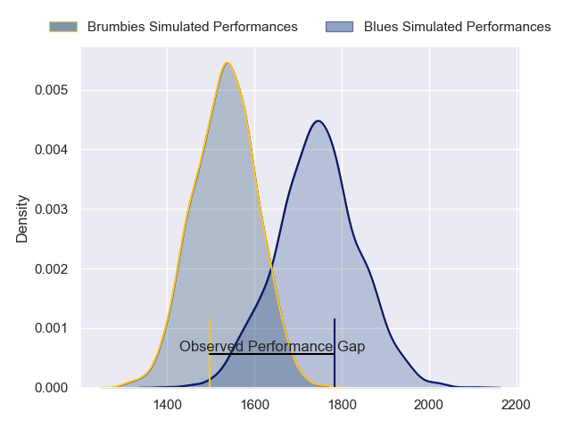
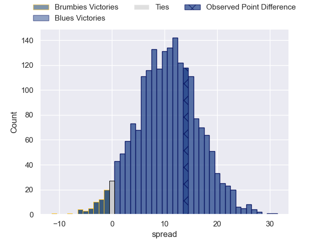
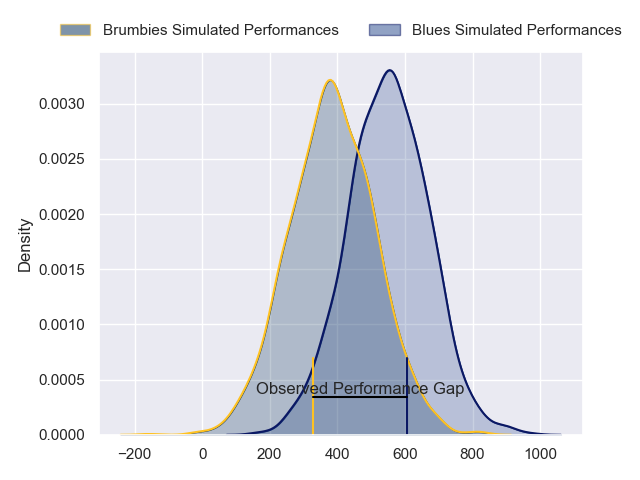
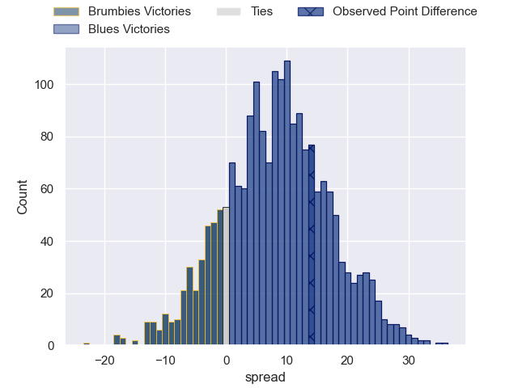
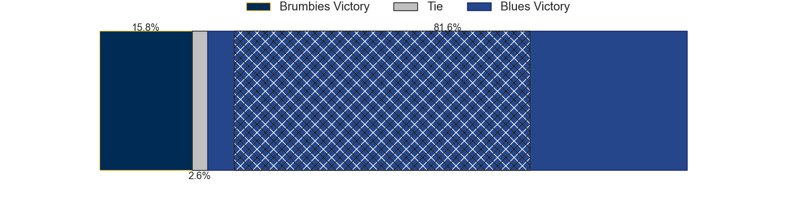

---  
layout: page  
title: Brumbies at Blues; 20-34  
date: 2024-06-14 18:00:00 -0500  
categories: "Super Rugby Pacific 2024" match review  
---
# Brumbies at Blues; 20-34

# Club Level Predictions

The first set of predictions treats a club as the smallest object, as the club develops its members, organizes a gameplan, and deploys its players as needed for each match. This club model has a prediction of 0.762, which translates to predicting Blues to win by 10.4.

Our Over/Under is 41.5 - and combined with the spread above, we have a predicted scoreline of 16 to 26

Each club has a rating and a rating deviation (similar to a Glicko rating), and expected performances can be generated. This allows for simulated matches and spreads like the ones below.
## Projected Performances - Club Model

## Projected Spreads - Club Model

## Projected Results - Club Model

# Player Level Predictions

Treating teams instead as an entity made up of the currently active players, I have ratings for each player in an altogether different system. These can be combined to form team ratings once teamsheets are announced, weighting starters a bit higher than the reserves. After the match is played, players can be weighted by their minutes on the field, allowing for an accurate measure of the team's composition. With these compiled team ratings, we can make predictions, measure inaccuracy, and update the individual player ratings.
## Prediction without Player Minutes: Blues by 12.2

Blues by 7.6 on a neutral pitch

## Projected Performances - Player Model

## Projected Spreads - Player Model

## Projected Results - Player Model

|   Away Minutes | Away Player      |   Away Percentile |   Number |   Home Percentile | Home Player      |   Home Minutes |
|---------------:|:-----------------|------------------:|---------:|------------------:|:-----------------|---------------:|
|             80 | James Slipper    |             94.38 |        1 |             99.27 | Ofa Tu'ungafasi  |             58 |
|             63 | Billy Pollard    |             83.41 |        2 |             90.18 | Ricky Riccitelli |             61 |
|             63 | Allan Alaalatoa  |             97.23 |        3 |             83.96 | Marcel Renata    |             61 |
|             78 | Darcy Swain      |             81.88 |        4 |             84.18 | Josh Beehre      |             80 |
|             80 | Tom Hooper       |             81.28 |        5 |             47.85 | Sam Darry        |             80 |
|             80 | Rob Valetini     |             97.88 |        6 |             98.55 | Akira Ioane      |             55 |
|             55 | Rory Scott       |             68.63 |        7 |             99.61 | Dalton Papalii   |             67 |
|             53 | Charlie Cale     |             57.66 |        8 |             95.53 | Hoskins Sotutu   |             80 |
|             67 | Ryan Lonergan    |             90.29 |        9 |             74    | Finlay Christie  |             55 |
|             80 | Noah Lolesio     |             88.5  |       10 |             94.05 | Harry Plummer    |             80 |
|             80 | Corey Toole      |             71.14 |       11 |             74.11 | Caleb Clarke     |             80 |
|             61 | Tamati Tua       |             69.04 |       12 |             82.01 | AJ Lam           |             80 |
|             80 | Len Ikitau       |             74.69 |       13 |             90.06 | Rieko Ioane      |             80 |
|             80 | Andy Muirhead    |             94.53 |       14 |             82.45 | Mark Tele'a      |             80 |
|             80 | Tom Wright       |             83.72 |       15 |             98.54 | Stephen Perofeta |             80 |
|             17 | Liam Bowron      |            nan    |       16 |             91.95 | Kurt Eklund      |             19 |
|             27 | Harry Vella      |             66.69 |       17 |             48.7  | Josh Fusitu'a    |             22 |
|             17 | Sefo Kautai      |             30.54 |       18 |             96.91 | Angus Ta'avao    |             19 |
|             31 | Nick Frost       |             53.75 |       19 |            nan    | James Thompson   |             13 |
|             27 | Jahrome Brown    |             86.87 |       20 |             66.41 | Adrian Choat     |             25 |
|             25 | Luke Reimer      |             56.56 |       21 |             23.92 | Taufa Funaki     |             25 |
|             13 | Harrison Goddard |             22.36 |       22 |             78.14 | Corey Evans      |              0 |
|             19 | Ollie Sapsford   |             90.7  |       23 |             77.45 | Cole Forbes      |              0 |

