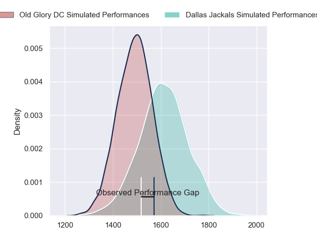
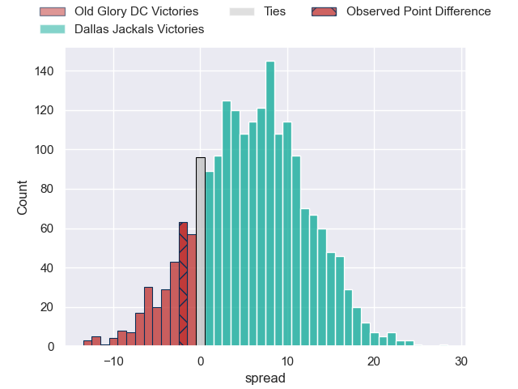
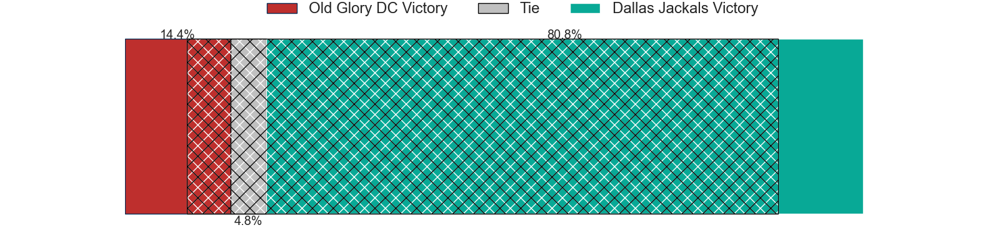
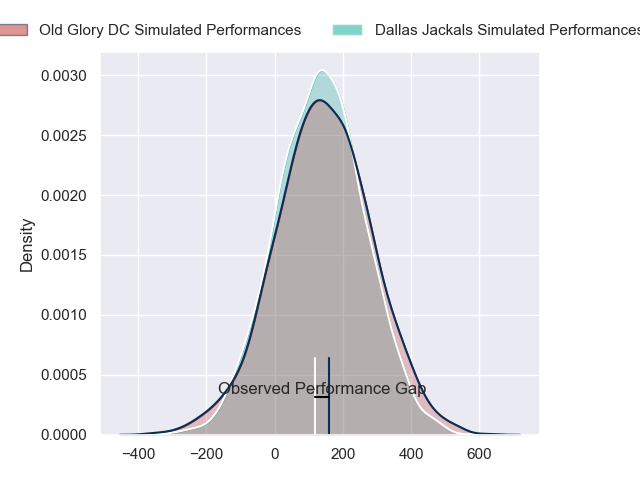
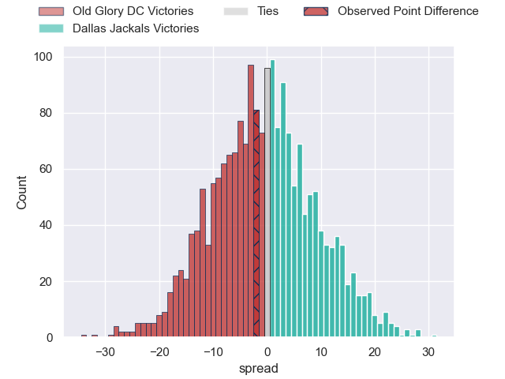

---  
layout: page  
title: Old Glory DC at Dallas Jackals; 36-34  
date: 2024-06-14 18:00:00 -0500  
categories: "Major League Rugby 2024" match review  
---
# Old Glory DC at Dallas Jackals; 36-34

# Club Level Predictions

The first set of predictions treats a club as the smallest object, as the club develops its members, organizes a gameplan, and deploys its players as needed for each match. This club model has a prediction of 0.659, which translates to predicting Dallas Jackals to win by 5.9.

Our Over/Under is 41.5 - and combined with the spread above, we have a predicted scoreline of 18 to 24

Each club has a rating and a rating deviation (similar to a Glicko rating), and expected performances can be generated. This allows for simulated matches and spreads like the ones below.
## Projected Performances - Club Model

## Projected Spreads - Club Model

## Projected Results - Club Model

# Player Level Predictions

Treating teams instead as an entity made up of the currently active players, I have ratings for each player in an altogether different system. These can be combined to form team ratings once teamsheets are announced, weighting starters a bit higher than the reserves. After the match is played, players can be weighted by their minutes on the field, allowing for an accurate measure of the team's composition. With these compiled team ratings, we can make predictions, measure inaccuracy, and update the individual player ratings.
## Prediction without Player Minutes: Dallas Jackals by 0.2

Old Glory DC by 2.2 on a neutral pitch

## Projected Performances - Player Model

## Projected Spreads - Player Model

## Projected Results - Player Model

|   Away Minutes | Away Player              |   Away Percentile |   Number |   Home Percentile | Home Player           |   Home Minutes |
|---------------:|:-------------------------|------------------:|---------:|------------------:|:----------------------|---------------:|
|             80 | Jack Iscaro              |             29.45 |        1 |              0.08 | Liam Murray           |             80 |
|             80 | Facundo Gattas           |             64.09 |        2 |             49.92 | Tomás Bekerman        |             80 |
|             80 | Stevie Longwell          |             78.96 |        3 |             46.66 | Juan Pablo Zeiss      |             80 |
|             80 | Rob Harley               |             62.93 |        4 |             58.92 | Lucas Bur             |             80 |
|             80 | Tevita Naqali            |             63.93 |        5 |             43.59 | Kyle Breytenbach      |             80 |
|             80 | Jamason Fa'Anana-Schultz |             61.86 |        6 |             53.15 | Jero Gomez Vara       |             80 |
|             80 | Cory Gilliland-Daniel    |             60.6  |        7 |             59.44 | Ronan Foley           |             80 |
|             80 | Lautaro Bavaro           |             55.96 |        8 |             50    | Sam Tuifua            |             80 |
|             80 | Connor Buckley           |             50    |        9 |             54.86 | Juan-Dee Oliver       |             80 |
|             80 | Jason Robertson          |             46.61 |       10 |             51.95 | Martin Elias          |             80 |
|             80 | John Rizzo               |             49.9  |       11 |             58.56 | Nic Benn              |             80 |
|             80 | Willie Talataina-Mu      |             44.82 |       12 |             35.92 | Tomás Cubilla         |             80 |
|             80 | John Powers              |             56.13 |       13 |             57.38 | Mitchell Richardson   |             80 |
|             80 | Ishmail Shabazz          |             49.04 |       14 |             60.77 | Jason Tidwell         |             80 |
|             80 | Damien Hoyland           |             52.61 |       15 |             48.43 | Tomy Malanos          |             80 |
|              0 | Koikoi Nelligan          |            nan    |       16 |            nan    | Connor Grindal        |              0 |
|              0 | Cali Martinez            |            nan    |       17 |             66.88 | Joaquín Horcada       |              0 |
|              0 | Tyler Rowland            |            nan    |       18 |             54.32 | Kyle Steeves          |              0 |
|              0 | Ignacio Dotti Uria       |             14.33 |       19 |            nan    | Javon Camp-Villalovos |              0 |
|              0 | Collin Grosse            |             43.22 |       20 |             36.27 | Daemon Torres         |              0 |
|              0 | Ethan Mcveigh            |             58.33 |       21 |            nan    | Brock Gallagher       |              0 |
|              0 | Gradyn Bowd              |             56.26 |       22 |             85.07 | Sam Golla             |              0 |
|              0 | Palema Roberts           |            nan    |       23 |            nan    | Kieran Farmer         |              0 |

