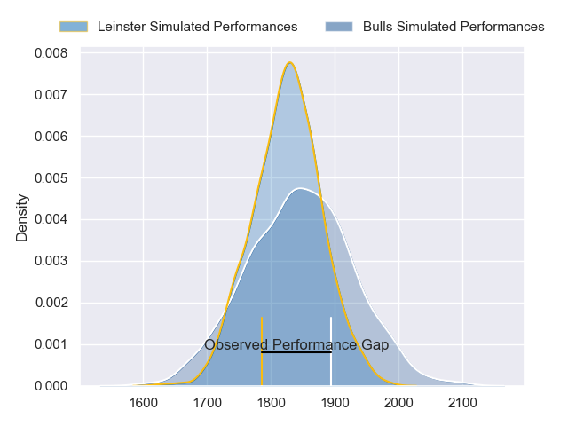
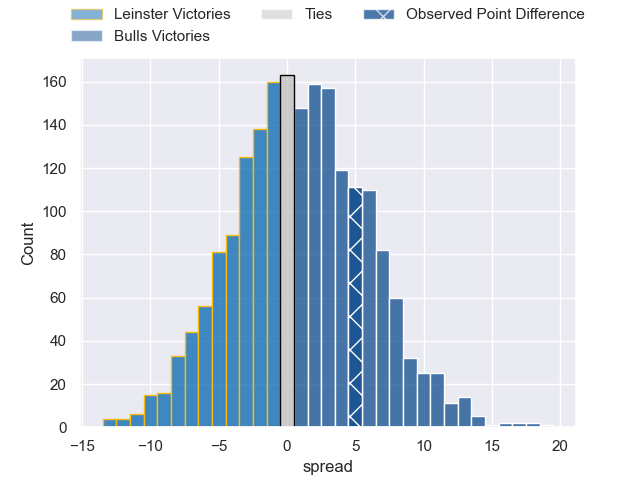
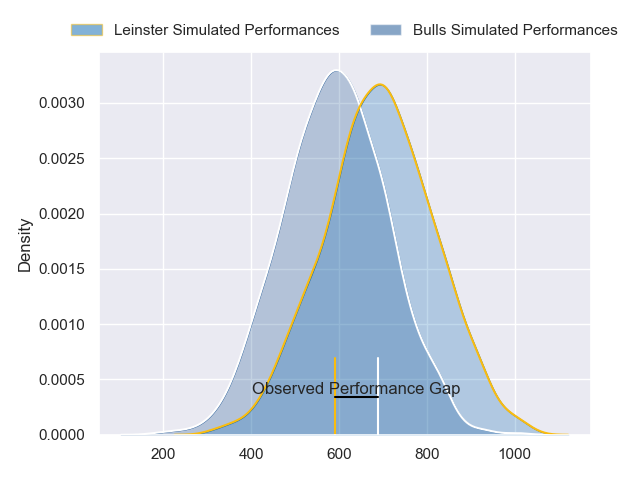
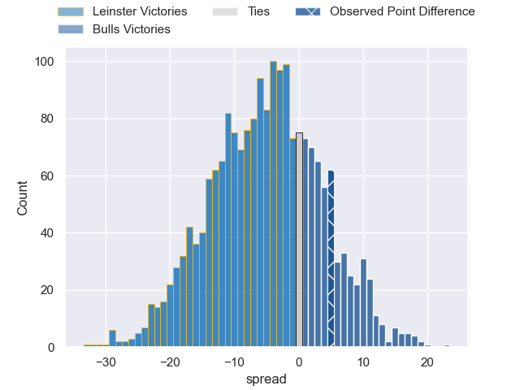
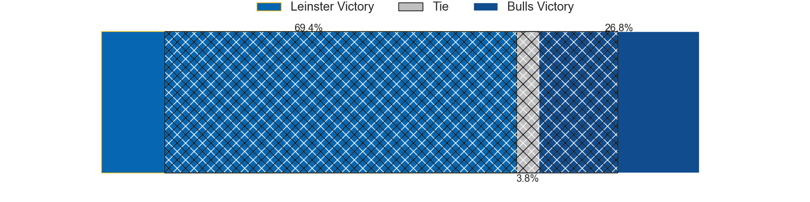

---  
layout: page  
title: Leinster at Bulls; 20-25  
date: 2024-06-15 18:00:00 -0500  
categories: "United Rugby Championship 2023" match review  
---
# Leinster at Bulls; 20-25

# Club Level Predictions

The first set of predictions treats a club as the smallest object, as the club develops its members, organizes a gameplan, and deploys its players as needed for each match. This club model has a prediction of 0.531, which translates to predicting Bulls to win by 1.1.

Our Over/Under is 52.5 - and combined with the spread above, we have a predicted scoreline of 25 to 27

Each club has a rating and a rating deviation (similar to a Glicko rating), and expected performances can be generated. This allows for simulated matches and spreads like the ones below.
## Projected Performances - Club Model

## Projected Spreads - Club Model

## Projected Results - Club Model

# Player Level Predictions

Treating teams instead as an entity made up of the currently active players, I have ratings for each player in an altogether different system. These can be combined to form team ratings once teamsheets are announced, weighting starters a bit higher than the reserves. After the match is played, players can be weighted by their minutes on the field, allowing for an accurate measure of the team's composition. With these compiled team ratings, we can make predictions, measure inaccuracy, and update the individual player ratings.
## Prediction without Player Minutes: Leinster by 2.8

Leinster by 7.4 on a neutral pitch

## Projected Performances - Player Model

## Projected Spreads - Player Model

## Projected Results - Player Model

|   Away Minutes | Away Player         |   Away Percentile |   Number |   Home Percentile | Home Player         |   Home Minutes |
|---------------:|:--------------------|------------------:|---------:|------------------:|:--------------------|---------------:|
|             73 | Andrew Porter       |             89.72 |        1 |             94.05 | Gerhard Steenekamp  |             60 |
|             52 | Dan Sheehan         |             69.4  |        2 |             96.62 | Johan Grobbelaar    |             41 |
|             52 | Tadhg Furlong       |             96.82 |        3 |             99.35 | Wilco Louw          |             60 |
|             80 | Joe McCarthy        |             77.15 |        4 |             14.53 | Ruan Vermaak        |             65 |
|             69 | James Ryan          |             94.39 |        5 |             90.38 | Ruan Nortje         |             80 |
|             80 | Ryan Baird          |             87.61 |        6 |             93.22 | Marco van Staden    |             61 |
|             61 | Josh van der Flier  |             98.64 |        7 |             92.74 | Elrigh Louw         |             80 |
|             80 | Caelan Doris        |             93.62 |        8 |             72.13 | Cameron Hanekom     |             80 |
|             56 | Jamison Gibson-Park |             96.53 |        9 |             95.31 | Embrose Papier      |             80 |
|             80 | Ross Byrne          |             94.46 |       10 |             86.24 | Johan Goosen        |             80 |
|             80 | James Lowe          |            100    |       11 |             88.56 | Devon Williams      |             80 |
|             80 | Robbie Henshaw      |             88.8  |       12 |             96.75 | Harold Vorster      |             80 |
|             69 | Garry Ringrose      |             97.7  |       13 |             95.08 | David Kriel         |             80 |
|             80 | Jordan Larmour      |             89.33 |       14 |             94.33 | Sergeal Petersen    |             80 |
|             52 | Jimmy O'Brien       |             91.86 |       15 |             97.7  | Willie le Roux      |             56 |
|             28 | Ronan Kelleher      |             93.4  |       16 |             99.36 | Akker van der Merwe |             39 |
|              7 | Cian Healy          |             93.31 |       17 |             79.53 | Simphiwe Matanzima  |             20 |
|             28 | Michael Ala'alatoa  |             94.86 |       18 |            nan    | Francois Klopper    |             20 |
|             11 | Ross Molony         |             95.19 |       19 |             80.96 | Reinhardt Ludwig    |             15 |
|             19 | Jack Conan          |             97.23 |       20 |             93.03 | Nizaam Carr         |             19 |
|             24 | Luke McGrath        |             98.96 |       21 |            nan    | Keagan Johannes     |              0 |
|             28 | Ciaran Frawley      |             58.95 |       22 |             31.21 | Chris William Smith |              0 |
|             11 | Jamie Osborne       |             90.89 |       23 |            nan    | Cornel Smit         |             24 |

