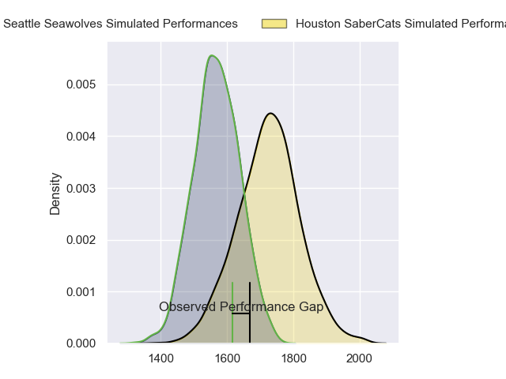
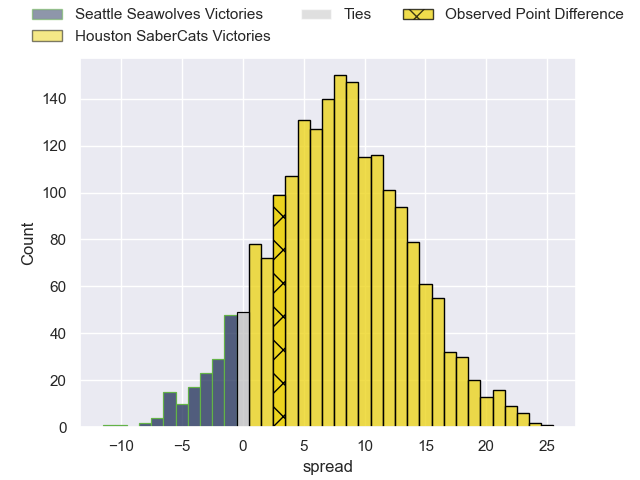
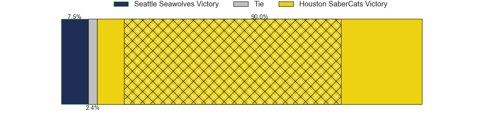
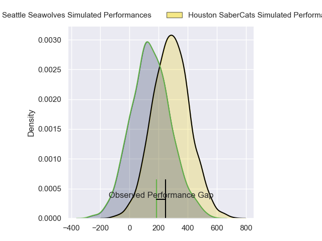
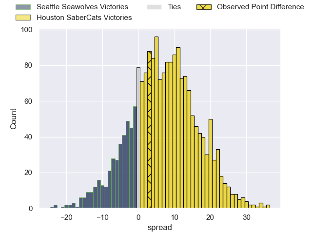
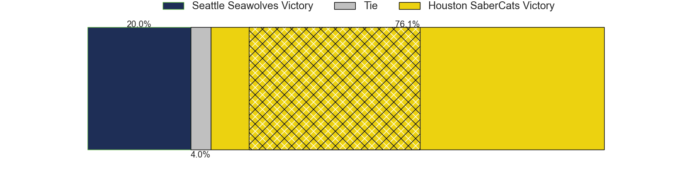

---  
layout: page  
title: Seattle Seawolves at Houston SaberCats; 25-28  
date: 2024-06-15 18:00:00 -0500  
categories: "Major League Rugby 2024" match review  
---
# Seattle Seawolves at Houston SaberCats; 25-28

# Club Level Predictions

The first set of predictions treats a club as the smallest object, as the club develops its members, organizes a gameplan, and deploys its players as needed for each match. This club model has a prediction of 0.707, which translates to predicting Houston SaberCats to win by 7.8.

Our Over/Under is 59.5 - and combined with the spread above, we have a predicted scoreline of 26 to 34

Each club has a rating and a rating deviation (similar to a Glicko rating), and expected performances can be generated. This allows for simulated matches and spreads like the ones below.
## Projected Performances - Club Model

## Projected Spreads - Club Model

## Projected Results - Club Model

# Player Level Predictions

Treating teams instead as an entity made up of the currently active players, I have ratings for each player in an altogether different system. These can be combined to form team ratings once teamsheets are announced, weighting starters a bit higher than the reserves. After the match is played, players can be weighted by their minutes on the field, allowing for an accurate measure of the team's composition. With these compiled team ratings, we can make predictions, measure inaccuracy, and update the individual player ratings.
## Prediction without Player Minutes: Houston SaberCats by 7.4

Houston SaberCats by 4.6 on a neutral pitch

## Projected Performances - Player Model

## Projected Spreads - Player Model

## Projected Results - Player Model

|   Away Minutes | Away Player       |   Away Percentile |   Number |   Home Percentile | Home Player            |   Home Minutes |
|---------------:|:------------------|------------------:|---------:|------------------:|:-----------------------|---------------:|
|             80 | Cameron Orr       |             77.69 |        1 |             71.42 | Rob Cobb               |             80 |
|             80 | Joe Taufete'E     |             69.73 |        2 |             47.67 | Pita Anae Ah-Sue       |             80 |
|             80 | Sam Matenga       |             71.09 |        3 |             44.63 | Pono Davis             |             80 |
|             80 | Rhyno Herbst      |             71.57 |        4 |             52.65 | Justin Basson          |             80 |
|             80 | Mahonri Ngakuru   |             60.66 |        5 |             73.47 | Nathan Den Hoedt       |             80 |
|             80 | Devin Short       |             65.54 |        6 |             72.39 | Ronan Murphy           |             80 |
|             80 | Monate Akuei      |             66.31 |        7 |             57.63 | Keni Nasoqeqe          |             80 |
|             80 | Huw Taylor        |             68.3  |        8 |             55.53 | Gideon Van Wyk         |             80 |
|             80 | Jp Smith          |             69.32 |        9 |             57.89 | André Riaan Warner     |             80 |
|             80 | Mack Mason        |             65.71 |       10 |             68.58 | Aj Alatimu             |             80 |
|             80 | Toni Pulu         |             69.51 |       11 |             66.92 | Seimou Smith           |             80 |
|             80 | Dan Kriel         |             64.44 |       12 |             55.44 | Louritz Van Der Schyff |             80 |
|             80 | Tavite Lopeti     |             93.41 |       13 |             44.56 | Tautalatasi Tasi       |             80 |
|             80 | Jade Stighling    |             74.5  |       14 |             96.74 | Christian Dyer         |             80 |
|             80 | Divan Rossouw     |             29.23 |       15 |             43.01 | David Coetzer          |             80 |
|              0 | Jackson Zabierek  |            nan    |       16 |             66.99 | Tiaan Erasmus          |              0 |
|              0 | Chance Wenglewski |            nan    |       17 |            nan    | Larome White           |              0 |
|              0 | Koby Baker        |            nan    |       18 |            nan    | Val Lee-Lo             |              0 |
|              0 | Taylor Krumrei    |             51.25 |       19 |             68.92 | Emmanuel Albert        |              0 |
|              0 | Pago Haini        |             42.55 |       20 |            nan    | Asa Carter             |              0 |
|              0 | Ryan Rees         |             50.43 |       21 |            nan    | Carlo De Nysschen      |              0 |
|              0 | Sam Windsor       |             50.92 |       22 |            nan    | Max Schumacher         |              0 |
|              0 | Lauina Futi       |             54.36 |       23 |             64.05 | Jeremy Misailegalu     |              0 |

