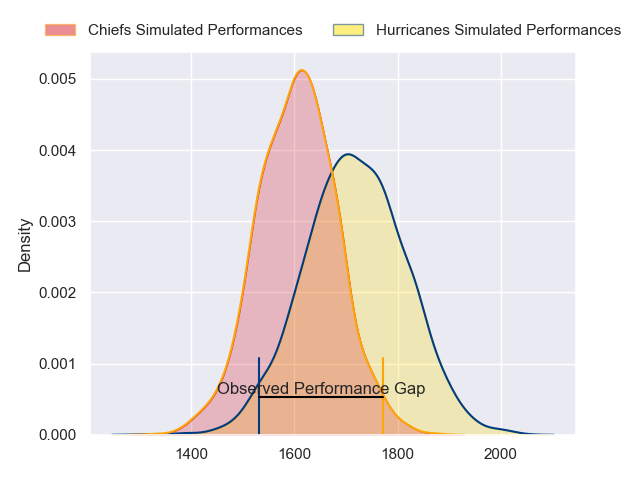
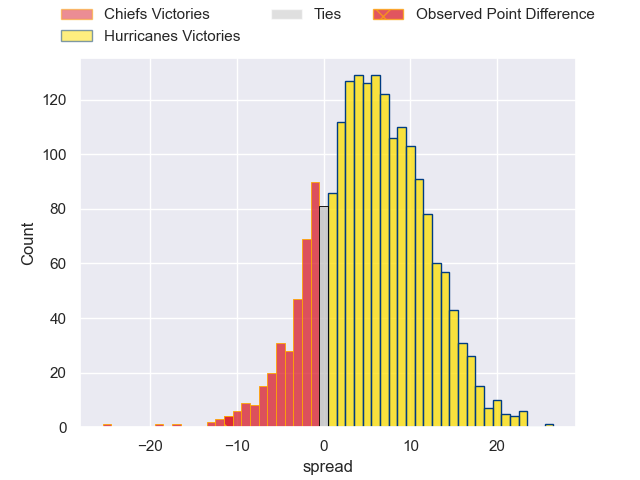
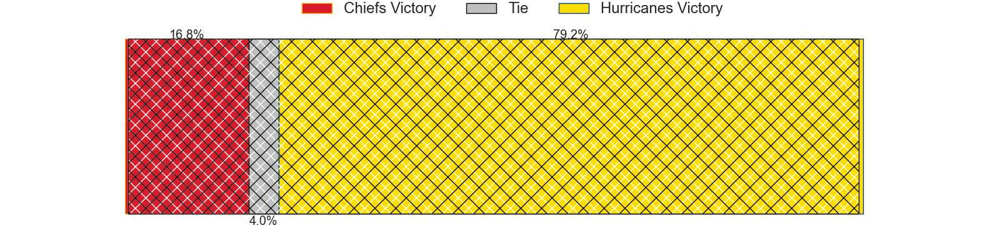
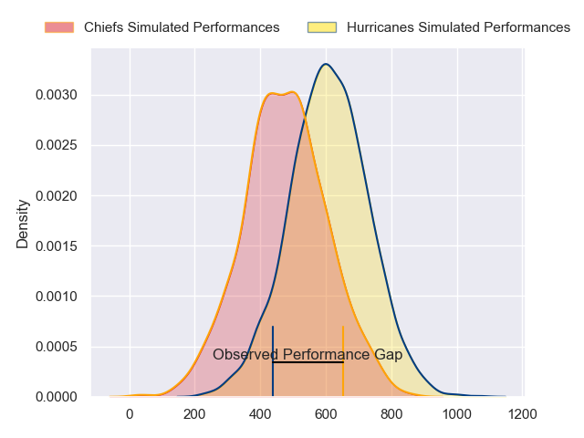
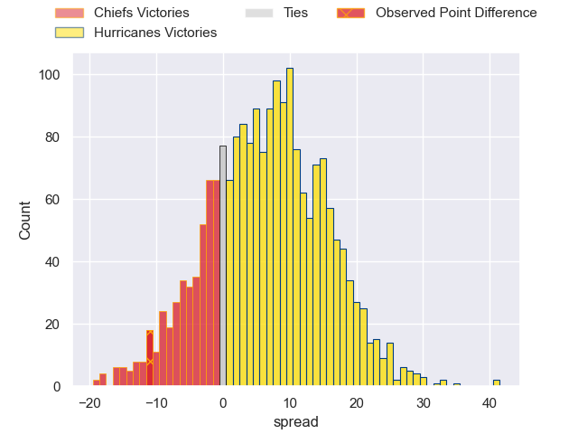
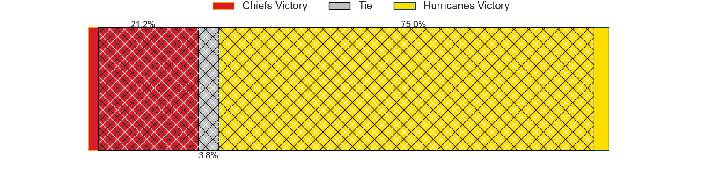

---  
layout: page  
title: Chiefs at Hurricanes; 30-19  
date: 2024-06-15 18:00:00 -0500  
categories: "Super Rugby Pacific 2024" match review  
---
# Chiefs at Hurricanes; 30-19

# Club Level Predictions

The first set of predictions treats a club as the smallest object, as the club develops its members, organizes a gameplan, and deploys its players as needed for each match. This club model has a prediction of 0.653, which translates to predicting Hurricanes to win by 5.7.

Our Over/Under is 54.5 - and combined with the spread above, we have a predicted scoreline of 24 to 30

Each club has a rating and a rating deviation (similar to a Glicko rating), and expected performances can be generated. This allows for simulated matches and spreads like the ones below.
## Projected Performances - Club Model

## Projected Spreads - Club Model

## Projected Results - Club Model

# Player Level Predictions

Treating teams instead as an entity made up of the currently active players, I have ratings for each player in an altogether different system. These can be combined to form team ratings once teamsheets are announced, weighting starters a bit higher than the reserves. After the match is played, players can be weighted by their minutes on the field, allowing for an accurate measure of the team's composition. With these compiled team ratings, we can make predictions, measure inaccuracy, and update the individual player ratings.
## Prediction without Player Minutes: Hurricanes by 8.4

Hurricanes by 3.9 on a neutral pitch

## Projected Performances - Player Model

## Projected Spreads - Player Model

## Projected Results - Player Model

|   Away Minutes | Away Player          |   Away Percentile |   Number |   Home Percentile | Home Player          |   Home Minutes |
|---------------:|:---------------------|------------------:|---------:|------------------:|:---------------------|---------------:|
|             57 | Aidan Ross           |             99.1  |        1 |             87.19 | Pouri Rakete-Stones  |             63 |
|             22 | Samisoni Taukei'aho  |             96.14 |        2 |             94.2  | Asafo Aumua          |             80 |
|             64 | George Dyer          |             90.62 |        3 |             93.8  | Tyrel Lomax          |             50 |
|             60 | Jimmy Tupou          |             60.02 |        4 |             74.35 | Justin Sangster      |             72 |
|             80 | Tupou Vaa'i          |             95.09 |        5 |             96.69 | Isaia Walker-Leawere |             80 |
|             80 | Samipeni Finau       |             97.68 |        6 |             90.42 | Brad Shields         |             44 |
|             80 | Luke Jacobson        |             96.22 |        7 |             94.87 | Peter Lakai          |             80 |
|             73 | Wallace Sititi       |             70.85 |        8 |              1.06 | Brayden Iose         |             56 |
|             69 | Cortez Ratima        |             83.16 |        9 |             97.57 | TJ Perenara          |             69 |
|             80 | Damian McKenzie      |             98.56 |       10 |             17.45 | Brett Cameron        |             80 |
|             80 | Daniel Rona          |             90    |       11 |             84.81 | Salesi Rayasi        |             66 |
|             80 | Rameka Poihipi       |             85.65 |       12 |             96.96 | Jordie Barrett       |             80 |
|             80 | Anton Lienert-Brown  |             96.54 |       13 |             95.18 | Billy Proctor        |             80 |
|             80 | Emoni Narawa         |             95.19 |       14 |             89.71 | Joshua Moorby        |             80 |
|             60 | Etene Nanai-Seturo   |             78.71 |       15 |             95.82 | Ruben Love           |             80 |
|             47 | Bradley Slater       |             84.22 |       16 |             34.62 | James O'Reilly       |              0 |
|             23 | Jared Proffit        |             27.32 |       17 |             89.97 | Tevita Mafileo       |             17 |
|             23 | Reuben O'Neill       |             42.74 |       18 |             50.49 | Pasilio Tosi         |             30 |
|             20 | Naitoa Ah Kuoi       |             95.89 |       19 |             90.78 | James Tucker         |              8 |
|             11 | Simon Parker         |             55.86 |       20 |             91.58 | Devan Flanders       |             36 |
|             11 | Xavier Roe           |             55.56 |       21 |             94.19 | Du'Plessis Kirifi    |             24 |
|             20 | Quinn Tupaea         |             93.51 |       22 |             95.83 | Richard Judd         |             11 |
|              0 | Liam Coombes-Fabling |             88.46 |       23 |             34.87 | Bailyn Sullivan      |             14 |

