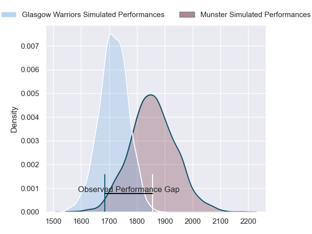
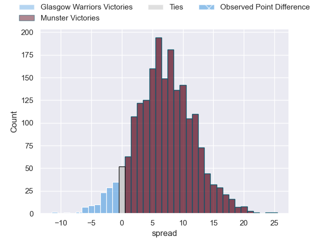
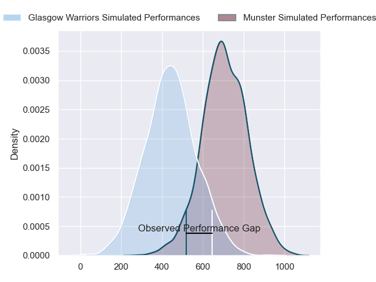
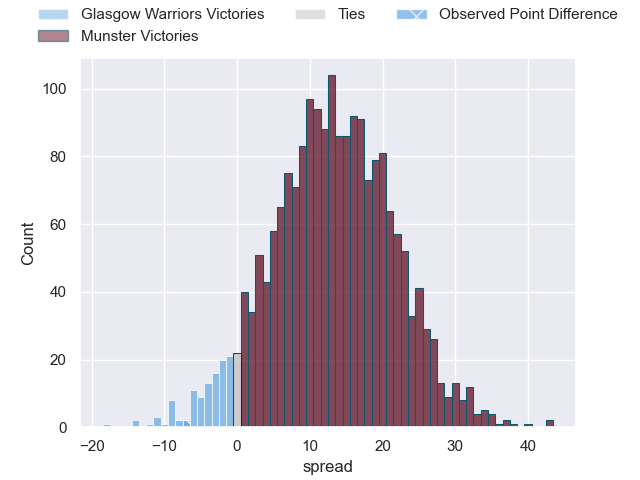
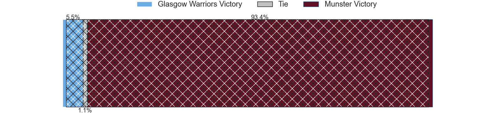

---  
layout: page  
title: Glasgow Warriors at Munster; 17-10  
date: 2024-06-15 18:00:00 -0500  
categories: "United Rugby Championship 2023" match review  
---
# Glasgow Warriors at Munster; 17-10

# Club Level Predictions

The first set of predictions treats a club as the smallest object, as the club develops its members, organizes a gameplan, and deploys its players as needed for each match. This club model has a prediction of 0.686, which translates to predicting Munster to win by 6.9.

Our Over/Under is 50.5 - and combined with the spread above, we have a predicted scoreline of 22 to 29

Each club has a rating and a rating deviation (similar to a Glicko rating), and expected performances can be generated. This allows for simulated matches and spreads like the ones below.
## Projected Performances - Club Model

## Projected Spreads - Club Model

## Projected Results - Club Model

# Player Level Predictions

Treating teams instead as an entity made up of the currently active players, I have ratings for each player in an altogether different system. These can be combined to form team ratings once teamsheets are announced, weighting starters a bit higher than the reserves. After the match is played, players can be weighted by their minutes on the field, allowing for an accurate measure of the team's composition. With these compiled team ratings, we can make predictions, measure inaccuracy, and update the individual player ratings.
## Prediction without Player Minutes: Munster by 16.2

Munster by 9.9 on a neutral pitch

## Projected Performances - Player Model

## Projected Spreads - Player Model

## Projected Results - Player Model

|   Away Minutes | Away Player           |   Away Percentile |   Number |   Home Percentile | Home Player      |   Home Minutes |
|---------------:|:----------------------|------------------:|---------:|------------------:|:-----------------|---------------:|
|             71 | Jamie Bhatti          |             96    |        1 |             95.51 | Jeremy Loughman  |             66 |
|             58 | Johnny Matthews       |             32.21 |        2 |             93.24 | Niall Scannell   |             46 |
|             80 | Zander Fagerson       |             99.76 |        3 |             98.21 | Stephen Archer   |             46 |
|             80 | Scott Cummings        |             98.1  |        4 |             18.84 | Fineen Wycherley |             46 |
|             58 | Richie Gray           |             85.17 |        5 |             98.7  | Tadhg Beirne     |             80 |
|             70 | Matt Fagerson         |             97.1  |        6 |             96.9  | Peter O'Mahony   |             80 |
|             58 | Rory Darge            |             85.48 |        7 |             43.66 | John Hodnett     |             73 |
|             80 | Jack Dempsey          |             53.62 |        8 |             81.7  | Jack O'Donoghue  |             55 |
|             80 | George Horne          |             99.65 |        9 |             79.51 | Craig Casey      |             58 |
|             80 | Tom Jordan            |             63.04 |       10 |             44.97 | Jack Crowley     |             80 |
|             80 | Kyle Steyn            |             98.27 |       11 |             94.62 | Simon Zebo       |             62 |
|             80 | Sione Tuipulotu       |             72.15 |       12 |             94.24 | Alex Nankivell   |             69 |
|             80 | Huw Jones             |             62.2  |       13 |             89.84 | Antoine Frisch   |             80 |
|             58 | Sebastian Cancelliere |             99.71 |       14 |             95.87 | Shane Daly       |             80 |
|             80 | Josh McKay            |             70.56 |       15 |             83.92 | Mike Haley       |             80 |
|             22 | George Turner         |             99.68 |       16 |             91.14 | Diarmuid Barron  |             34 |
|              9 | Oli Kebble            |             96.66 |       17 |             94.21 | John Ryan        |             14 |
|              0 | Murphy Walker         |             37.03 |       18 |             93.07 | Oli Jager        |             34 |
|             22 | Max Williamson        |             36.97 |       19 |             99.3  | RG Snyman        |             34 |
|             10 | Euan Ferrie           |             43.85 |       20 |             86.38 | Gavin Coombes    |             25 |
|             22 | Henco Venter          |             95.11 |       21 |             98.78 | Conor Murray     |             22 |
|             22 | Jamie Dobie           |             72.4  |       22 |             19.37 | Sean O'Brien     |             29 |
|              0 | Ross Thompson         |             66.94 |       23 |             85.29 | Alex Kendellen   |              7 |

