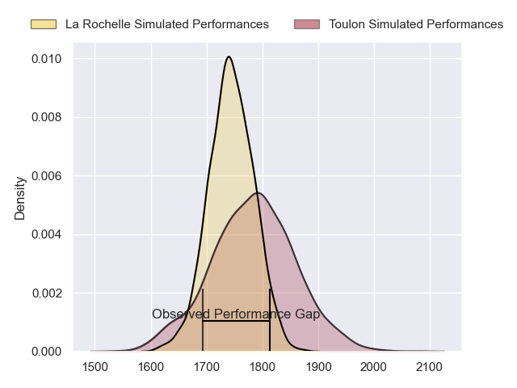
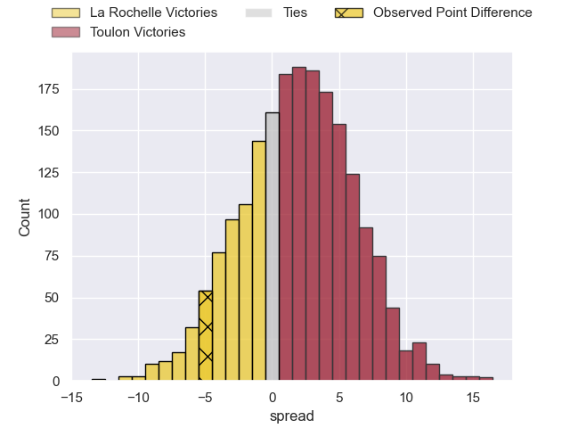
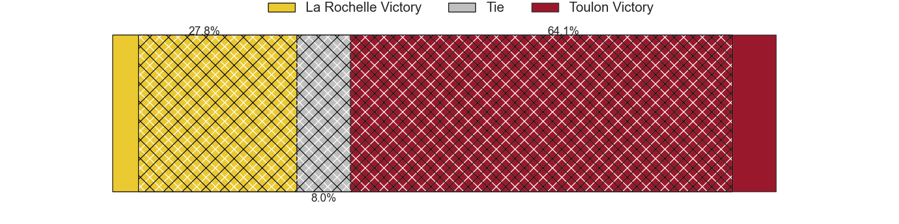
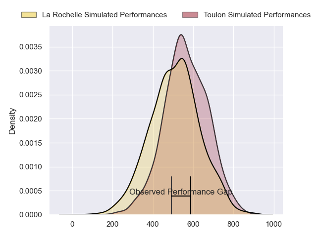
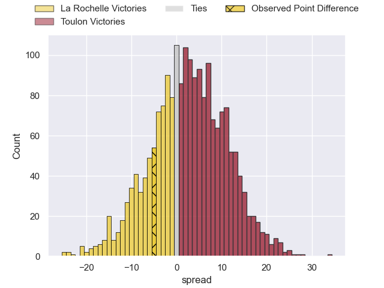
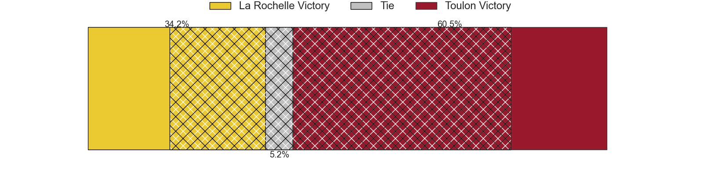

---  
layout: page  
title: La Rochelle at Toulon; 34-29  
date: 2024-06-15 18:00:00 -0500  
categories: "Top 14 Orange 2023" match review  
---
# La Rochelle at Toulon; 34-29

# Club Level Predictions

The first set of predictions treats a club as the smallest object, as the club develops its members, organizes a gameplan, and deploys its players as needed for each match. This club model has a prediction of 0.556, which translates to predicting Toulon to win by 2.0.

Our Over/Under is 45.5 - and combined with the spread above, we have a predicted scoreline of 22 to 23

Each club has a rating and a rating deviation (similar to a Glicko rating), and expected performances can be generated. This allows for simulated matches and spreads like the ones below.
## Projected Performances - Club Model

## Projected Spreads - Club Model

## Projected Results - Club Model

# Player Level Predictions

Treating teams instead as an entity made up of the currently active players, I have ratings for each player in an altogether different system. These can be combined to form team ratings once teamsheets are announced, weighting starters a bit higher than the reserves. After the match is played, players can be weighted by their minutes on the field, allowing for an accurate measure of the team's composition. With these compiled team ratings, we can make predictions, measure inaccuracy, and update the individual player ratings.
## Prediction without Player Minutes: Toulon by 5.0

La Rochelle by 2.0 on a neutral pitch

## Projected Performances - Player Model

## Projected Spreads - Player Model

## Projected Results - Player Model

|   Away Minutes | Away Player           |   Away Percentile |   Number |   Home Percentile | Home Player            |   Home Minutes |
|---------------:|:----------------------|------------------:|---------:|------------------:|:-----------------------|---------------:|
|             66 | Reda Wardi            |             96.34 |        1 |             97.31 | Jean-Baptiste Gros     |             56 |
|             56 | Tolu Latu             |             90.5  |        2 |             68.76 | Teddy Baubigny         |             63 |
|             56 | Uini Atonio           |             99.51 |        3 |             81.11 | Beka Gigashvili        |             56 |
|             81 | Remi Picquette        |             61.76 |        4 |             91.09 | David Ribbans          |             81 |
|             81 | Will Skelton          |             98.5  |        5 |             92.39 | Brian Alainu'uese      |             63 |
|             81 | Judicael Cancoriet    |             25.58 |        6 |             89.48 | Cornell du Preez       |             63 |
|             68 | Oscar Jegou           |             30.79 |        7 |             99.23 | Charles Ollivon        |             81 |
|             81 | Gregory Alldritt      |             98.3  |        8 |             85.74 | Facundo Isa            |             50 |
|             81 | Tawera Kerr-Barlow    |             97.92 |        9 |             96.71 | Baptiste Serin         |             56 |
|             81 | Antoine Hastoy        |             60.99 |       10 |             87.06 | Paolo Garbisi          |             81 |
|             81 | Dillyn Leyds          |             98.95 |       11 |             92.91 | Gabin Villiere         |             81 |
|             71 | Jules Favre           |             81.8  |       12 |             28.03 | Maelan Rabut           |             56 |
|             66 | Ulupano Seuteni       |             67.15 |       13 |             91.74 | Leicester Fainga'anuku |             81 |
|             81 | Jack Nowell           |             97.41 |       14 |             74.59 | Seta Tuicuvu           |             81 |
|             66 | Brice Dulin           |             99.79 |       15 |             90.19 | Melvyn Jaminet         |             81 |
|             25 | Quentin Lespiaucq     |             73.91 |       16 |             94.04 | Jack Singleton         |             18 |
|             15 | Joel Sclavi           |             88.03 |       17 |             11.64 | Bruce Devaux           |             25 |
|              0 | Thomas Ployet         |             34.23 |       18 |             79.98 | Swan Rebbadj           |             18 |
|             13 | Yoan Tanga            |             73.4  |       19 |             86.58 | Selevasio Tolofua      |             31 |
|              0 | Thomas Berjon         |             81.98 |       20 |             64    | Jules Coulon           |             18 |
|             15 | Ihaia West            |             36.34 |       21 |             86.14 | Ben White              |             25 |
|             25 | Jonathan Danty        |             92.26 |       22 |             98.15 | Dan Biggar             |             25 |
|             25 | Georges-Henri Colombe |              3.66 |       23 |             30.78 | Kieran Brookes         |             25 |

