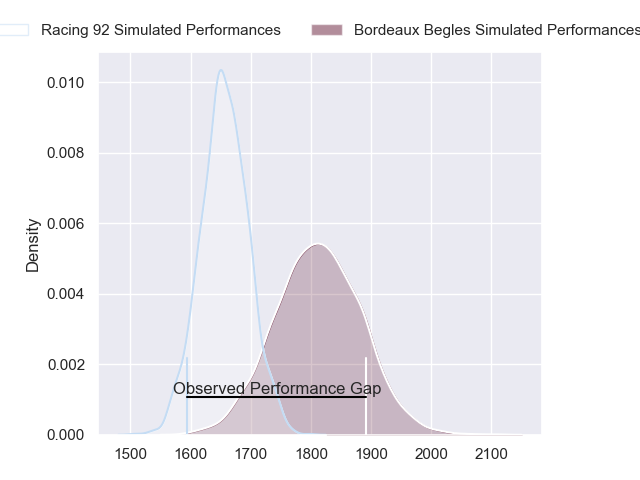
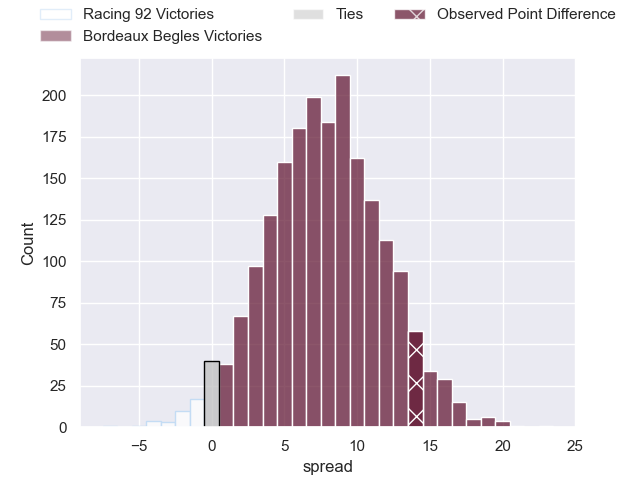
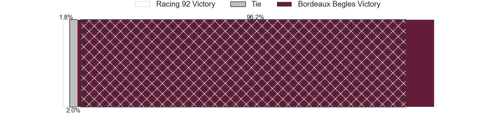
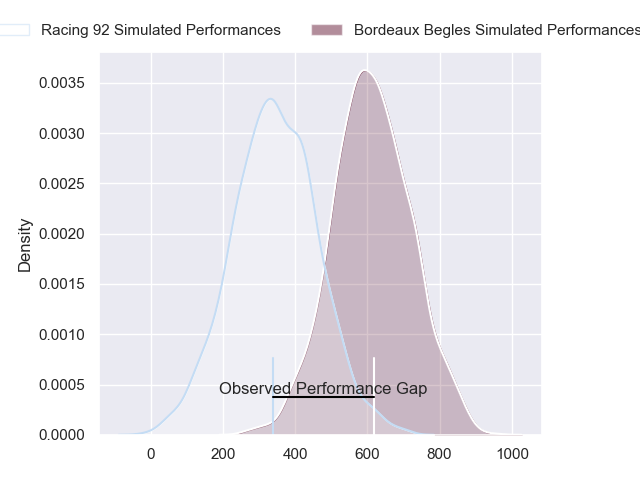
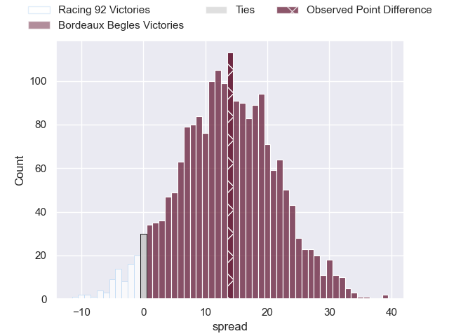
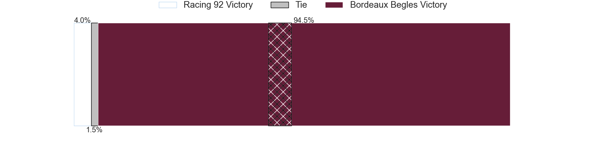

---  
layout: page  
title: Racing 92 at Bordeaux Begles; 17-31  
date: 2024-06-16 18:00:00 -0500  
categories: "Top 14 Orange 2023" match review  
---
# Racing 92 at Bordeaux Begles; 17-31

# Club Level Predictions

The first set of predictions treats a club as the smallest object, as the club develops its members, organizes a gameplan, and deploys its players as needed for each match. This club model has a prediction of 0.705, which translates to predicting Bordeaux Begles to win by 7.6.

Our Over/Under is 58.5 - and combined with the spread above, we have a predicted scoreline of 25 to 33

Each club has a rating and a rating deviation (similar to a Glicko rating), and expected performances can be generated. This allows for simulated matches and spreads like the ones below.
## Projected Performances - Club Model

## Projected Spreads - Club Model

## Projected Results - Club Model

# Player Level Predictions

Treating teams instead as an entity made up of the currently active players, I have ratings for each player in an altogether different system. These can be combined to form team ratings once teamsheets are announced, weighting starters a bit higher than the reserves. After the match is played, players can be weighted by their minutes on the field, allowing for an accurate measure of the team's composition. With these compiled team ratings, we can make predictions, measure inaccuracy, and update the individual player ratings.
## Prediction without Player Minutes: Bordeaux Begles by 17.0

Bordeaux Begles by 9.7 on a neutral pitch

## Projected Performances - Player Model

## Projected Spreads - Player Model

## Projected Results - Player Model

|   Away Minutes | Away Player         |   Away Percentile |   Number |   Home Percentile | Home Player               |   Home Minutes |
|---------------:|:--------------------|------------------:|---------:|------------------:|:--------------------------|---------------:|
|             51 | Hassane Kolingar    |             19.38 |        1 |             75.49 | Jefferson Poirot          |             58 |
|             51 | Camille Chat        |             93.72 |        2 |             68.44 | Maxime Lamothe            |             60 |
|             51 | Trevor Nyakane      |             79.8  |        3 |             97.8  | Ben Tameifuna             |             32 |
|             80 | Cameron Woki        |             92.29 |        4 |             92.69 | Cyril Cazeaux             |             80 |
|             62 | Will Rowlands       |             39.64 |        5 |             99    | Adam Coleman              |             62 |
|             59 | Ibrahim Diallo      |             19.5  |        6 |             81.47 | Bastien Vergnes Taillefer |             68 |
|             75 | Siya Kolisi         |             87.93 |        7 |             82.34 | Mahamadou Diaby           |             59 |
|             62 | Jordan Joseph       |             76.81 |        8 |             88.72 | Tevita Tatafu             |             80 |
|             60 | Clovis Le Bail      |             26.69 |        9 |             99.48 | Maxime Lucu               |             80 |
|             80 | Antoine Gibert      |             91.79 |       10 |             34.91 | Mateo Garcia              |             62 |
|             80 | Vinaya Habosi       |             39.12 |       11 |             93.67 | Madosh Tambwe             |             80 |
|             60 | Henry Chavancy      |             98.95 |       12 |             82.74 | Yoram Moefana             |             80 |
|             80 | Gael Fickou         |             97.49 |       13 |             86.51 | Nicolas Depoortere        |             62 |
|             80 | Josua Tuisova       |             96.16 |       14 |             97.22 | Damian Penaud             |             48 |
|             80 | Tristan Tedder      |             67.64 |       15 |             98.12 | Romain Buros              |             72 |
|             29 | Peniami Narisia     |             84.7  |       16 |             14.17 | Romain Latterrade         |             20 |
|             29 | Guram Gogichashvili |             52.28 |       17 |             92.26 | Ugo Boniface              |             25 |
|             26 | Boris Palu          |             78.08 |       18 |            nan    | Jandre Marais             |             18 |
|             18 | Fabien Sanconnie    |             33.73 |       19 |             87.07 | Pierre Bochaton           |             33 |
|             18 | Maxime Baudonne     |             57.05 |       20 |              2.6  | Paul Abadie               |             18 |
|             20 | Max Spring          |             18.37 |       21 |             56.8  | Ben Tapuai                |             18 |
|             20 | Christian Wade      |             95.69 |       22 |             80.38 | Louis Bielle-Biarrey      |             40 |
|             29 | Cedate Gomes Sa     |             77.2  |       23 |             89.33 | Lekso Kaulashvili         |             45 |

