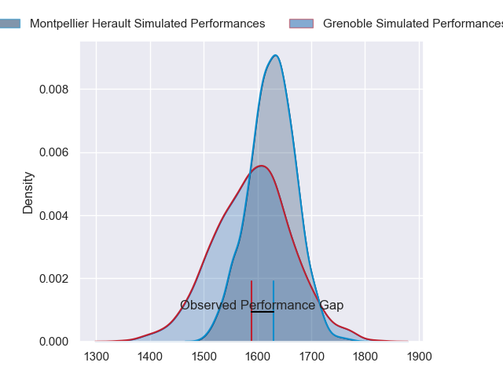
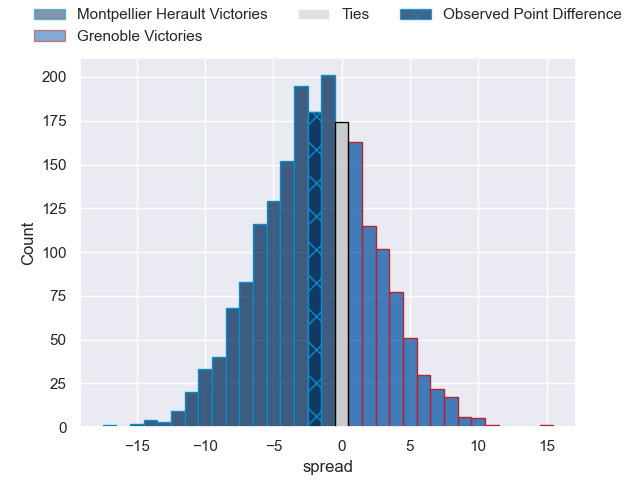
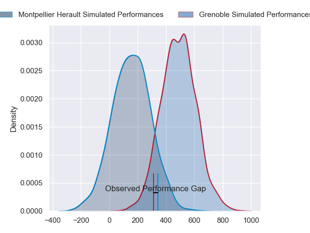
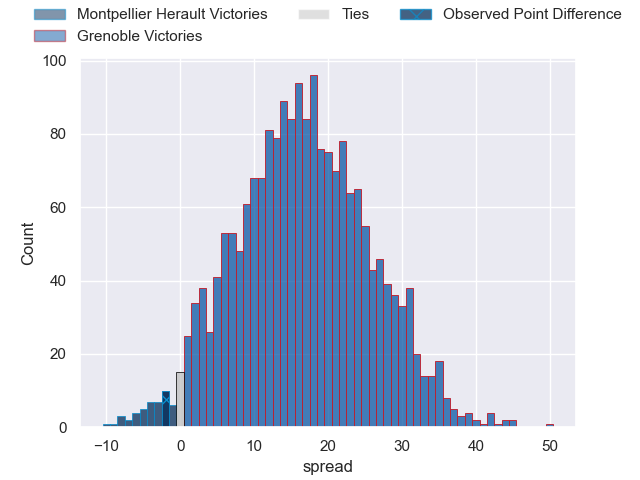
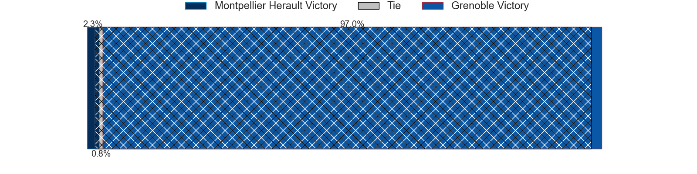

---  
layout: page  
title: Montpellier Herault at Grenoble; 20-18  
date: 2024-06-16 18:00:00 -0500  
categories: "Top 14 Orange 2023" match review  
---
# Montpellier Herault at Grenoble; 20-18

# Club Level Predictions

The first set of predictions treats a club as the smallest object, as the club develops its members, organizes a gameplan, and deploys its players as needed for each match. This club model has a prediction of 0.453, which translates to predicting Montpellier Herault to win by 1.7.

Our Over/Under is 56.5 - and combined with the spread above, we have a predicted scoreline of 29 to 27

Each club has a rating and a rating deviation (similar to a Glicko rating), and expected performances can be generated. This allows for simulated matches and spreads like the ones below.
## Projected Performances - Club Model

## Projected Spreads - Club Model

## Projected Results - Club Model

# Player Level Predictions

Treating teams instead as an entity made up of the currently active players, I have ratings for each player in an altogether different system. These can be combined to form team ratings once teamsheets are announced, weighting starters a bit higher than the reserves. After the match is played, players can be weighted by their minutes on the field, allowing for an accurate measure of the team's composition. With these compiled team ratings, we can make predictions, measure inaccuracy, and update the individual player ratings.
## Prediction without Player Minutes: Grenoble by 18.4

Grenoble by 10.4 on a neutral pitch

## Projected Performances - Player Model

## Projected Spreads - Player Model

## Projected Results - Player Model

|   Away Minutes | Away Player                 |   Away Percentile |   Number |   Home Percentile | Home Player         |   Home Minutes |
|---------------:|:----------------------------|------------------:|---------:|------------------:|:--------------------|---------------:|
|             80 | Baptiste Erdocio            |              7.57 |        1 |             75.65 | Zack Gauthier       |             80 |
|             80 | Vano Karkadze               |             86.63 |        2 |             78.58 | Barnabé Massa       |             80 |
|             80 | Luka Japaridze              |             85.1  |        3 |             82.41 | Irakli Aptsiauri    |             80 |
|             80 | Tyler Duguid                |             71.07 |        4 |             48.35 | Thomas Lainault     |             80 |
|             80 | Bastien Chalureau           |             87.19 |        5 |             75.08 | Pierce Phillips     |             80 |
|             80 | Nicolaas Janse van Rensburg |             87.26 |        6 |             59.75 | Thibaut Martel      |             80 |
|             80 | Alexandre Becognee          |             53.28 |        7 |             80.41 | Steeve Blanc-Mappaz |             80 |
|             80 | Lenni Nouchi                |             69.15 |        8 |             69.36 | Pio Muarua          |             80 |
|             80 | Cobus Reinach               |             93.41 |        9 |             91.68 | Eric Escande        |             80 |
|             80 | Louis Carbonel              |             70.84 |       10 |             85.42 | Sam Davies          |             80 |
|             80 | Gabriel Ngandebe            |              4.31 |       11 |             12.75 | Nathan Farissier    |             80 |
|             80 | Jan Serfontein              |             87.55 |       12 |             25.1  | Terrence Hepetema   |             80 |
|             80 | Auguste Cadot               |             22.59 |       13 |             41    | Romain Fusier       |             80 |
|             80 | Ben Lam                     |             97.99 |       14 |             79.19 | Wilfried Hulleu     |             80 |
|             80 | Julien Tisseron             |             71.19 |       15 |             96.87 | Julien Farnoux      |             80 |

