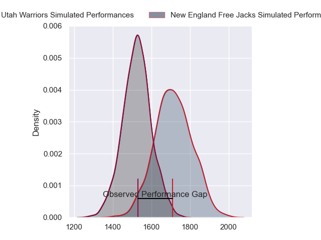
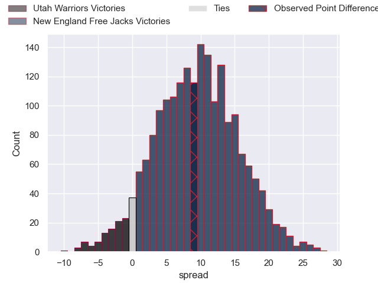
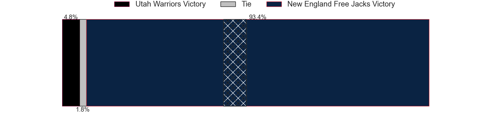
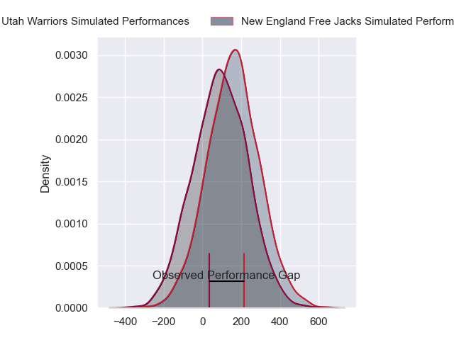
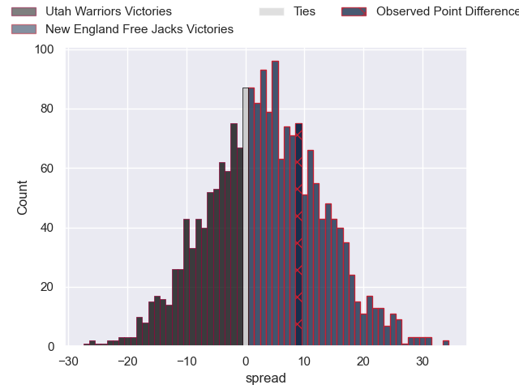

---  
layout: page  
title: Utah Warriors at New England Free Jacks; 27-36  
date: 2024-06-16 18:00:00 -0500  
categories: "Major League Rugby 2024" match review  
---
# Utah Warriors at New England Free Jacks; 27-36

# Club Level Predictions

The first set of predictions treats a club as the smallest object, as the club develops its members, organizes a gameplan, and deploys its players as needed for each match. This club model has a prediction of 0.741, which translates to predicting New England Free Jacks to win by 9.4.

Our Over/Under is 52.5 - and combined with the spread above, we have a predicted scoreline of 21 to 31

Each club has a rating and a rating deviation (similar to a Glicko rating), and expected performances can be generated. This allows for simulated matches and spreads like the ones below.
## Projected Performances - Club Model

## Projected Spreads - Club Model

## Projected Results - Club Model

# Player Level Predictions

Treating teams instead as an entity made up of the currently active players, I have ratings for each player in an altogether different system. These can be combined to form team ratings once teamsheets are announced, weighting starters a bit higher than the reserves. After the match is played, players can be weighted by their minutes on the field, allowing for an accurate measure of the team's composition. With these compiled team ratings, we can make predictions, measure inaccuracy, and update the individual player ratings.
## Prediction without Player Minutes: New England Free Jacks by 3.9

New England Free Jacks by 1.4 on a neutral pitch

## Projected Performances - Player Model

## Projected Spreads - Player Model

## Projected Results - Player Model

|   Away Minutes | Away Player         |   Away Percentile |   Number |   Home Percentile | Home Player             |   Home Minutes |
|---------------:|:--------------------|------------------:|---------:|------------------:|:------------------------|---------------:|
|             80 | Emerson Prior       |             27.49 |        1 |             36.62 | Kyle Ciquera            |             80 |
|             80 | Ratu Vere Vugakoto  |             19    |        2 |             30.27 | Andrew Quattrin         |             80 |
|             80 | Paul Mullen         |             40.54 |        3 |             52.61 | John-Roy Jenkinson      |             80 |
|             80 | Saia Uhila          |             31.46 |        4 |             42.59 | Kyle Baillie            |             80 |
|             80 | Frank Lochore       |             17.43 |        5 |             73.85 | Conor Keys              |             80 |
|             80 | Bailey Wilson       |             23.23 |        6 |             35.62 | Piers Von Dadelszen     |             80 |
|             80 | Kalisi Moli         |             34.75 |        7 |             51.11 | Jed Melvin              |             80 |
|             80 | Thomas Tu'avao      |             30.64 |        8 |             64.47 | Martin Sigren           |             80 |
|             80 | Kieran Mcclea       |             27.78 |        9 |             53.65 | Holden Yungert          |             80 |
|             80 | Joel Hodgson        |             14.99 |       10 |             49.69 | Jayson Potroz           |             80 |
|             80 | Jesse Hamilton      |             23.27 |       11 |             35.67 | Paula Balekana          |             80 |
|             80 | Paul Lasike         |             33.4  |       12 |             51.31 | Wayne Van Der Bank      |             80 |
|             80 | Zion Going          |             20.1  |       13 |             76.23 | Ben LeSage              |             80 |
|             80 | Michael Manson      |             19.13 |       14 |             44.04 | Toby Fricker            |             80 |
|             80 | Caleb Makene        |             22.55 |       15 |             56.99 | Reece Macdonald         |             80 |
|              0 | Nic Souchon         |             33.82 |       16 |            nan    | Foster Dewitt           |              0 |
|              0 | Franco Van Den Berg |            nan    |       17 |             46.98 | Malakai Hala            |              0 |
|              0 | Tonga Kofe          |            nan    |       18 |             38.99 | Cole Keith              |              0 |
|              0 | Louis Conradie      |             27.96 |       19 |             57.41 | Jackson Thiebes         |              0 |
|              0 | Onehunga Havili     |             36.17 |       20 |             58.18 | Mitch Jacobson          |              0 |
|              0 | Lopeti Aisea        |             18.32 |       21 |             40.45 | Cameron Nordli-Kelemeti |              0 |
|              0 | John Dupree         |             23.14 |       22 |             86.91 | Le Roux Malan           |              0 |
|              0 | Robbie Povey        |             69.4  |       23 |             33.3  | Seta Baker              |              0 |

