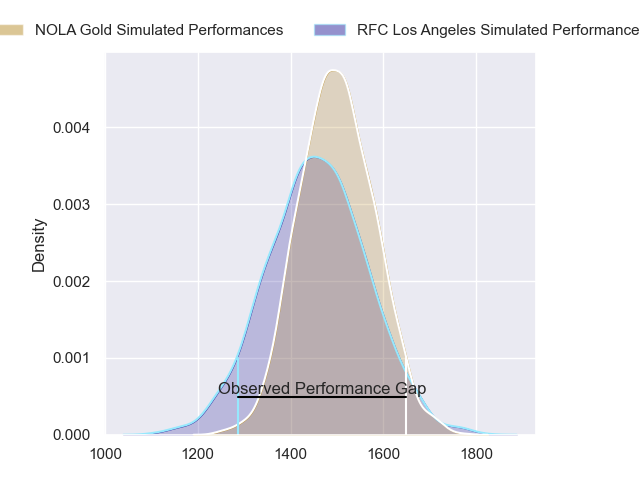
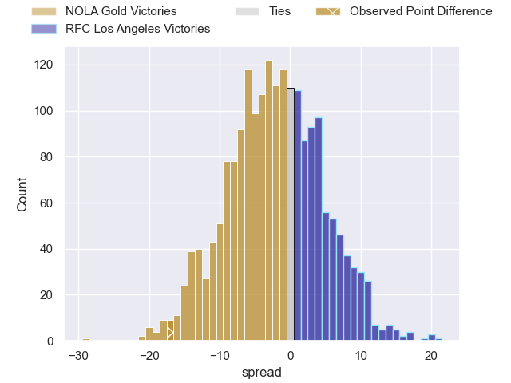
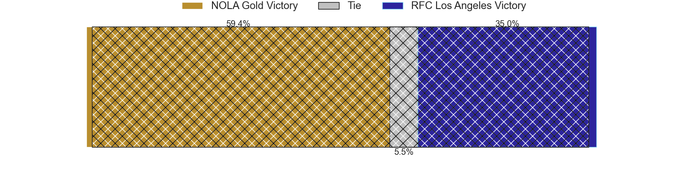
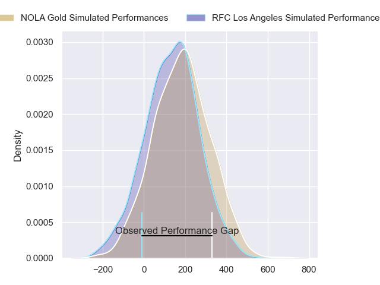
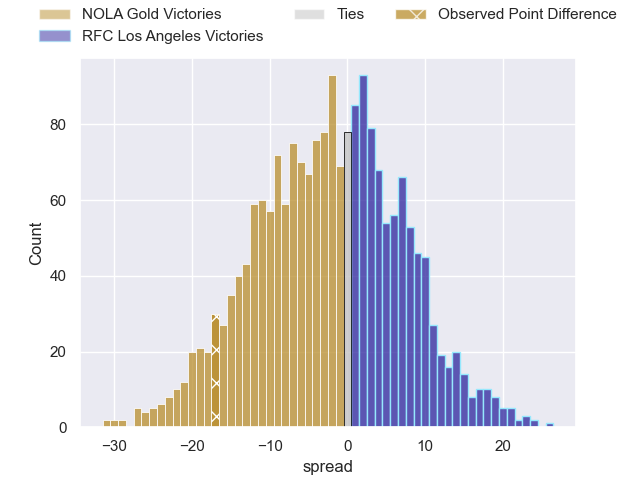
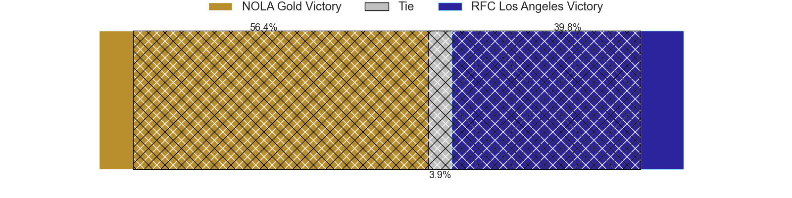

---  
layout: page  
title: NOLA Gold at RFC Los Angeles; 38-21  
date: 2024-06-16 18:00:00 -0500  
categories: "Major League Rugby 2024" match review  
---
# NOLA Gold at RFC Los Angeles; 38-21

# Club Level Predictions

The first set of predictions treats a club as the smallest object, as the club develops its members, organizes a gameplan, and deploys its players as needed for each match. This club model has a prediction of 0.437, which translates to predicting NOLA Gold to win by 2.3.

Our Over/Under is 45.5 - and combined with the spread above, we have a predicted scoreline of 24 to 22

Each club has a rating and a rating deviation (similar to a Glicko rating), and expected performances can be generated. This allows for simulated matches and spreads like the ones below.
## Projected Performances - Club Model

## Projected Spreads - Club Model

## Projected Results - Club Model

# Player Level Predictions

Treating teams instead as an entity made up of the currently active players, I have ratings for each player in an altogether different system. These can be combined to form team ratings once teamsheets are announced, weighting starters a bit higher than the reserves. After the match is played, players can be weighted by their minutes on the field, allowing for an accurate measure of the team's composition. With these compiled team ratings, we can make predictions, measure inaccuracy, and update the individual player ratings.
## Prediction without Player Minutes: NOLA Gold by 2.0

NOLA Gold by 4.2 on a neutral pitch

## Projected Performances - Player Model

## Projected Spreads - Player Model

## Projected Results - Player Model

|   Away Minutes | Away Player         |   Away Percentile |   Number |   Home Percentile | Home Player       |   Home Minutes |
|---------------:|:--------------------|------------------:|---------:|------------------:|:------------------|---------------:|
|             80 | Matt Harmon         |             75.24 |        1 |              4.4  | Wilton Rebolo     |             80 |
|             80 | Ale Lopeti          |             71.5  |        2 |             39.61 | Alex Maughan      |             80 |
|             80 | Isaac Salmon        |             80.05 |        3 |             18.89 | Conor Young       |             80 |
|             80 | Callum Botchar      |             81.68 |        4 |             28.23 | Max Katjijeko     |             80 |
|             80 | William Waguespack  |             74.17 |        5 |             32.33 | Jason Damm        |             80 |
|             80 | Tom Florence        |             59.27 |        6 |             24.71 | Bruce Yun         |             80 |
|             80 | Moni Tonga'Uiha     |             84.65 |        7 |             28.19 | Matt Heaton       |             80 |
|             80 | Cam Dolan           |             69.79 |        8 |             18.72 | Semi Kunatani     |             80 |
|             80 | Damian Stevens      |              9.19 |        9 |             18.89 | Tas Smith         |             80 |
|             80 | Reece Botha         |             75.77 |       10 |             28.34 | Sean Nolan        |             80 |
|             80 | Taniela Filimone    |             85.52 |       11 |             22.91 | Henry Speight     |             80 |
|             80 | Rodney Iona         |             71.86 |       12 |             30.23 | Jason Emery       |             80 |
|             80 | Jp Du Plessis       |             72.38 |       13 |             27.41 | Will Leonard      |             80 |
|             80 | Harley Wheeler      |             63.09 |       14 |             69.99 | Andrew Coe        |             80 |
|             80 | Jordan Jackson-Hope |             69.94 |       15 |             22.76 | Rory Van Vugt     |             80 |
|              0 | Diego Fortuny       |            nan    |       16 |             54.27 | Ben Strang        |              0 |
|              0 | Jarred Adams        |             82.08 |       17 |            nan    | Alessandro Heaney |              0 |
|              0 | Sean Paranihi       |             54.48 |       18 |             66.61 | Dane Zander       |              0 |
|              0 | Malcolm May         |             79.44 |       19 |            nan    | Liam Antrobus     |              0 |
|              0 | Osaiasi Tonga'Uiha  |            nan    |       20 |             50    | James Stokes      |              0 |
|              0 | Sebastiano Villani  |            nan    |       21 |             58.06 | Niall Saunders    |              0 |
|              0 | Ross Depperschmidt  |             64.85 |       22 |             47.36 | Jack Shaw         |              0 |
|              0 | Jack Webster        |            nan    |       23 |             33.19 | Austin White      |              0 |

