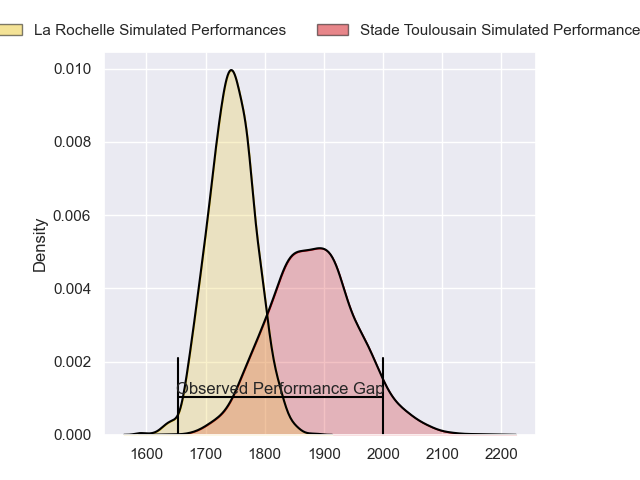
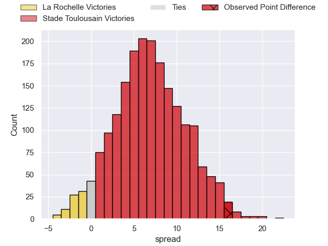
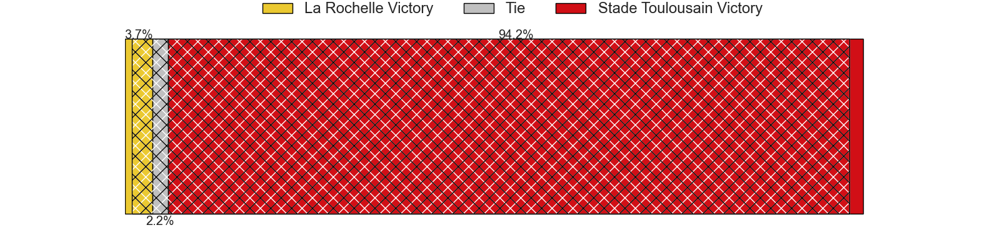
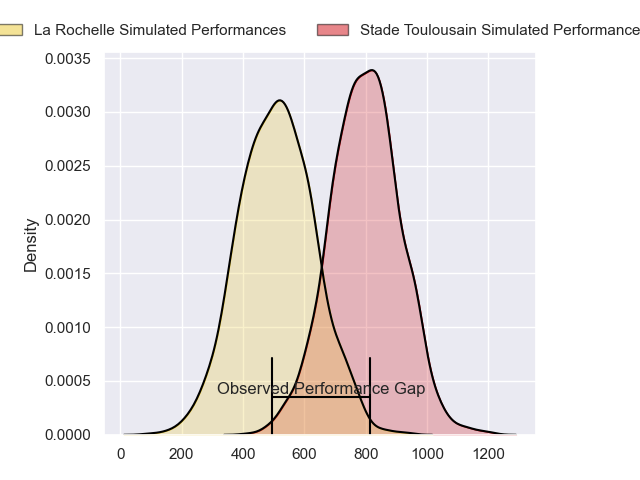
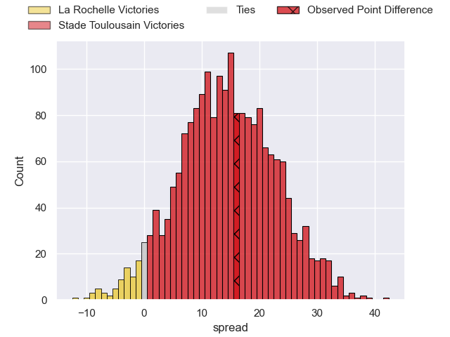
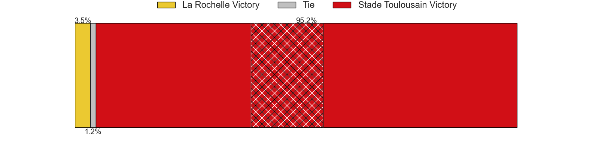

---  
layout: page  
title: La Rochelle at Stade Toulousain; 23-39  
date: 2024-06-21 18:00:00 -0500  
categories: "Top 14 Orange 2023" match review  
---
# La Rochelle at Stade Toulousain; 23-39

# Club Level Predictions

The first set of predictions treats a club as the smallest object, as the club develops its members, organizes a gameplan, and deploys its players as needed for each match. This club model has a prediction of 0.69, which translates to predicting Stade Toulousain to win by 7.0.

Our Over/Under is 61.5 - and combined with the spread above, we have a predicted scoreline of 27 to 34

Each club has a rating and a rating deviation (similar to a Glicko rating), and expected performances can be generated. This allows for simulated matches and spreads like the ones below.
## Projected Performances - Club Model

## Projected Spreads - Club Model

## Projected Results - Club Model

# Player Level Predictions

Treating teams instead as an entity made up of the currently active players, I have ratings for each player in an altogether different system. These can be combined to form team ratings once teamsheets are announced, weighting starters a bit higher than the reserves. After the match is played, players can be weighted by their minutes on the field, allowing for an accurate measure of the team's composition. With these compiled team ratings, we can make predictions, measure inaccuracy, and update the individual player ratings.
## Prediction without Player Minutes: Stade Toulousain by 17.4

Stade Toulousain by 9.9 on a neutral pitch

## Projected Performances - Player Model

## Projected Spreads - Player Model

## Projected Results - Player Model

|   Away Minutes | Away Player           |   Away Percentile |   Number |   Home Percentile | Home Player         |   Home Minutes |
|---------------:|:----------------------|------------------:|---------:|------------------:|:--------------------|---------------:|
|             81 | Reda Wardi            |             96.42 |        1 |             96.18 | Cyril Baille        |             49 |
|             51 | Tolu Latu             |             90.72 |        2 |             95.68 | Peato Mauvaka       |             60 |
|             81 | Uini Atonio           |             99.51 |        3 |             96.34 | Dorian Aldegheri    |             50 |
|             48 | Remi Picquette        |             62.08 |        4 |             84.23 | Richie Arnold       |             49 |
|             77 | Will Skelton          |             98.4  |        5 |             94.31 | Thibaud Flament     |             81 |
|             81 | Judicael Cancoriet    |             25.97 |        6 |             98.07 | Francois Cros       |             81 |
|             64 | Oscar Jegou           |             31.47 |        7 |             95.95 | Jack Willis         |             62 |
|             72 | Gregory Alldritt      |             98.29 |        8 |             95.74 | Alexandre Roumat    |             74 |
|             63 | Tawera Kerr-Barlow    |             97.91 |        9 |             99.65 | Antoine Dupont      |             79 |
|             81 | Antoine Hastoy        |             61.43 |       10 |             96.53 | Romain Ntamack      |             81 |
|             81 | Dillyn Leyds          |             98.75 |       11 |             99.9  | Blair Kinghorn      |             77 |
|             49 | Jules Favre           |             82.04 |       12 |             66.6  | Pita Ahki           |             77 |
|             81 | Ulupano Seuteni       |             67.44 |       13 |             29.1  | Santiago Chocobares |             81 |
|             72 | Jack Nowell           |             97.31 |       14 |             99.04 | Juan Cruz Mallia    |             81 |
|             65 | Brice Dulin           |            100    |       15 |             97.26 | Thomas Ramos        |             81 |
|             30 | Quentin Lespiaucq     |             74.24 |       16 |             99.2  | Julien Marchand     |             28 |
|             16 | Joel Sclavi           |             88.04 |       17 |             63.95 | Rodrigue Neti       |             32 |
|             17 | Matthias Haddad       |             44.69 |       18 |             81.85 | Joshua Brennan      |             19 |
|              9 | Yoan Tanga            |             73.13 |       19 |             72.36 | Piula Fa'asalele    |             32 |
|             18 | Thomas Berjon         |             82.37 |       20 |             42.76 | Paul Graou          |              2 |
|              9 | Ihaia West            |             35.92 |       21 |             98.56 | Matthis Lebel       |              4 |
|             32 | Jonathan Danty        |             92.23 |       22 |             70.38 | Paul Costes         |              4 |
|             37 | Georges-Henri Colombe |              3.74 |       23 |             93.73 | David Ainu'u        |             31 |

