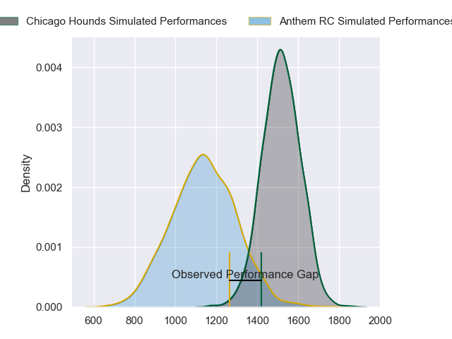
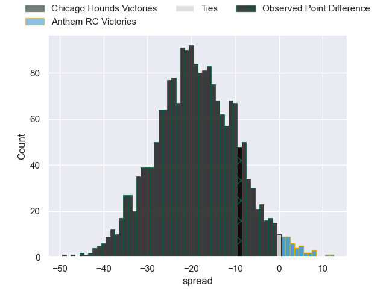
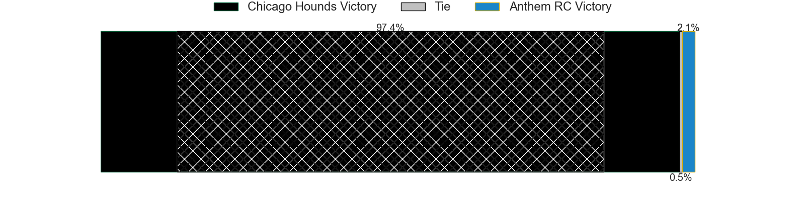
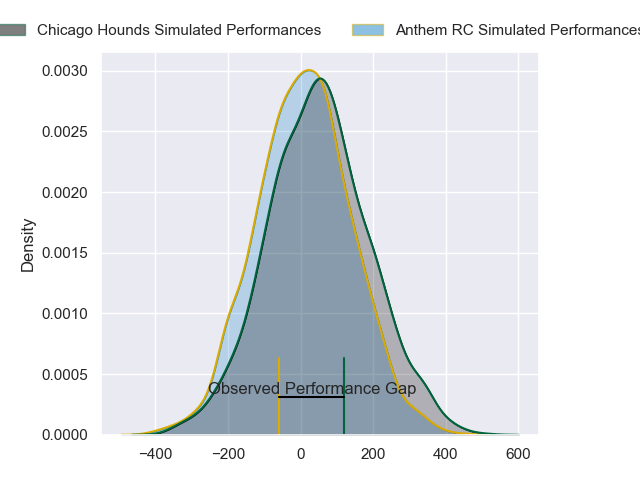
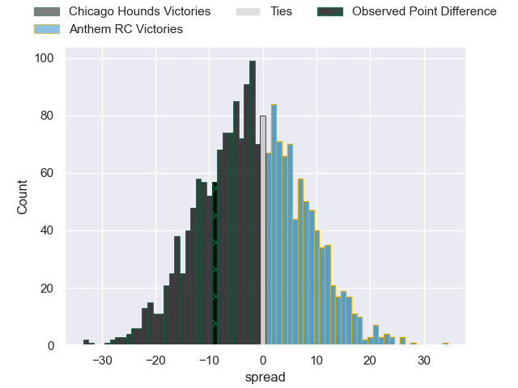

---  
layout: page  
title: Chicago Hounds at Anthem RC; 38-29  
date: 2024-06-22 18:00:00 -0500  
categories: "Major League Rugby 2024" match review  
---
# Chicago Hounds at Anthem RC; 38-29

# Club Level Predictions

The first set of predictions treats a club as the smallest object, as the club develops its members, organizes a gameplan, and deploys its players as needed for each match. This club model has a prediction of 0.113, which translates to predicting Chicago Hounds to win by 18.6.

Our Over/Under is 40.5 - and combined with the spread above, we have a predicted scoreline of 30 to 11

Each club has a rating and a rating deviation (similar to a Glicko rating), and expected performances can be generated. This allows for simulated matches and spreads like the ones below.
## Projected Performances - Club Model

## Projected Spreads - Club Model

## Projected Results - Club Model

# Player Level Predictions

Treating teams instead as an entity made up of the currently active players, I have ratings for each player in an altogether different system. These can be combined to form team ratings once teamsheets are announced, weighting starters a bit higher than the reserves. After the match is played, players can be weighted by their minutes on the field, allowing for an accurate measure of the team's composition. With these compiled team ratings, we can make predictions, measure inaccuracy, and update the individual player ratings.
## Prediction without Player Minutes: Chicago Hounds by 2.1

Chicago Hounds by 4.3 on a neutral pitch

## Projected Performances - Player Model

## Projected Spreads - Player Model

## Projected Results - Player Model

|   Away Minutes | Away Player             |   Away Percentile |   Number |   Home Percentile | Home Player           |   Home Minutes |
|---------------:|:------------------------|------------------:|---------:|------------------:|:----------------------|---------------:|
|             80 | Nico Revol              |             56.14 |        1 |             17.25 | Jake Turnbull         |             80 |
|             80 | Janus Venter            |             58.4  |        2 |              3.84 | Connor Robinson       |             80 |
|             80 | Paddy Ryan              |             25.31 |        3 |              2.93 | Joe Apikotoa          |             80 |
|             80 | George Merrick          |             43.61 |        4 |              9.08 | Lucas Gramlick        |             80 |
|             80 | James Scott             |             65.57 |        5 |              9.98 | James Rivers          |             80 |
|             80 | Mike Matarazzo          |             53.96 |        6 |             13.13 | Joe Basser            |             80 |
|             80 | Maclean Jones           |             27.99 |        7 |             11.58 | Albert O'Shannessey   |             80 |
|             80 | Luke White              |              8.32 |        8 |             13.22 | Michael Ma'Afu        |             80 |
|             80 | Nick McCarthy           |             68.76 |        9 |             22.16 | Sean Yacoubian        |             80 |
|             80 | Luke Carty              |             28.78 |       10 |             10.82 | Cliven Loubser        |             80 |
|             80 | Julián Dominguez Widmer |             28.21 |       11 |              9.5  | Tomasi Alosio         |             80 |
|             80 | Bill Meakes             |             44.85 |       12 |             22.27 | Oscar Koller          |             80 |
|             80 | Mark O'Keeffe           |             33.4  |       13 |              5.25 | Junior Gafa           |             80 |
|             80 | Noah Brown              |             66.31 |       14 |              6.33 | Te Rangatira Waitokia |             80 |
|             80 | Dave Kearney            |             36    |       15 |             21.26 | Steffan Crimp         |             80 |
|              0 | Dylan Fawsitt           |             98.72 |       16 |             40    | Jack Manzo            |              0 |
|              0 | Fred Apulu              |            nan    |       17 |             16.84 | Dan Hanson            |              0 |
|              0 | Charlie Abel            |             18.39 |       18 |            nan    | Stephan Bernal-Wendt  |              0 |
|              0 | Brad Tucker             |            nan    |       19 |             39.52 | Logan Weidner         |              0 |
|              0 | Lucas Rumball           |              2.8  |       20 |             41.8  | Sione Latu            |              0 |
|              0 | Jason Higgins           |             55.5  |       21 |            nan    | Shane Barry           |              0 |
|              0 | Adriaan Carelse         |             21.63 |       22 |             30.78 | Sebastian Zaridze     |              0 |
|              0 | Cassh Maluia            |             29.62 |       23 |             23.7  | Tyren Al-Jiboori      |              0 |

