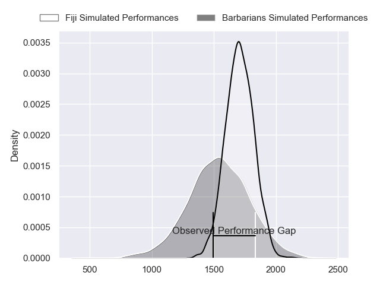
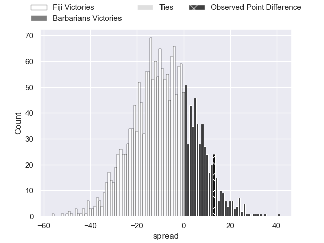
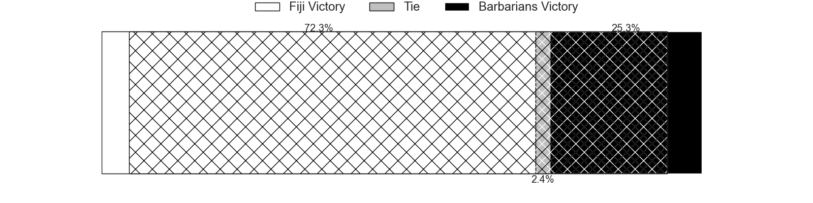
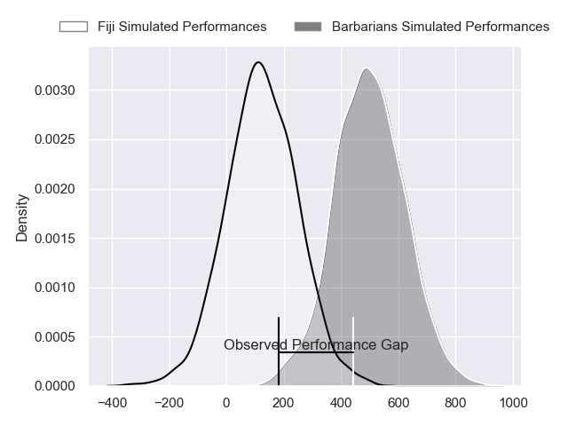
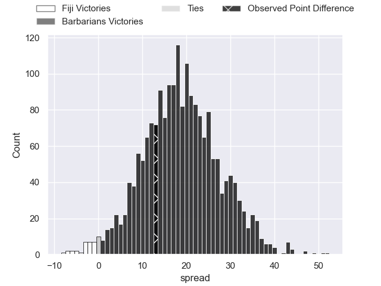

---  
layout: page  
title: Fiji at Barbarians; 32-45  
date: 2024-06-22 18:00:00 -0500  
categories: "Tests Matchs 2023" match review  
---
# Fiji at Barbarians; 32-45

# Club Level Predictions

The first set of predictions treats a club as the smallest object, as the club develops its members, organizes a gameplan, and deploys its players as needed for each match. This club model has a prediction of 0.284, which translates to predicting Fiji to win by 8.6.

Our Over/Under is 42.5 - and combined with the spread above, we have a predicted scoreline of 25 to 17

Each club has a rating and a rating deviation (similar to a Glicko rating), and expected performances can be generated. This allows for simulated matches and spreads like the ones below.
## Projected Performances - Club Model

## Projected Spreads - Club Model

## Projected Results - Club Model

# Player Level Predictions

Treating teams instead as an entity made up of the currently active players, I have ratings for each player in an altogether different system. These can be combined to form team ratings once teamsheets are announced, weighting starters a bit higher than the reserves. After the match is played, players can be weighted by their minutes on the field, allowing for an accurate measure of the team's composition. With these compiled team ratings, we can make predictions, measure inaccuracy, and update the individual player ratings.
## Prediction without Player Minutes: Barbarians by 22.1

Barbarians by 19.9 on a neutral pitch

## Projected Performances - Player Model

## Projected Spreads - Player Model

## Projected Results - Player Model

|   Away Minutes | Away Player             |   Away Percentile |   Number |   Home Percentile | Home Player            |   Home Minutes |
|---------------:|:------------------------|------------------:|---------:|------------------:|:-----------------------|---------------:|
|             51 | Livai Natave            |             54.68 |        1 |             98.45 | Scott Sio              |             53 |
|             50 | Zuriel Togiatama        |             31.52 |        2 |             88    | Harry Thacker          |             66 |
|             59 | Samu Tawake             |             44.59 |        3 |             94.06 | Kyle Sinckler          |             53 |
|             80 | Mesake Vocevoce         |             76.75 |        4 |             90.62 | David Ribbans          |             58 |
|             71 | Ratu Rotuisolia         |             55.09 |        5 |             99.4  | Samuel Whitelock       |             68 |
|             80 | Meli Derenalagi         |             48.36 |        6 |             98.36 | Jack Cornelsen         |             58 |
|             58 | Motikiai Murray         |             46.33 |        7 |             38.32 | Lachlan Boshier        |             80 |
|             80 | Elia Canakaivata        |             71.22 |        8 |             44.78 | Zach Mercer            |             80 |
|             60 | Peni Matawalu           |             58.29 |        9 |             99.3  | Danny Care             |             68 |
|             80 | Caleb Muntz             |             69.18 |       10 |             41.63 | Fergus Burke           |             80 |
|             80 | Taniela Rakuro          |             29.85 |       11 |             54.61 | Jonny May              |             58 |
|             80 | Apisalome Vota          |             67.65 |       12 |             97.48 | Gael Fickou            |             80 |
|             40 | Waqa Nalaga             |             56.41 |       13 |             95.06 | Virimi Vakatawa        |             80 |
|             80 | Epeli Momo              |             23.32 |       14 |             91.84 | Leicester Fainga'anuku |             80 |
|             80 | Vilimoni Botitu         |             62.32 |       15 |             19.58 | Chay Fihaki            |             80 |
|             30 | Mesu Dolokoto           |             39.52 |       16 |             97.44 | Shota Horie            |             14 |
|             22 | Emosi Tuqiri            |            nan    |       17 |             72.9  | Craig Millar           |             27 |
|             28 | Meli Tuni               |            nan    |       18 |             30.92 | Kieran Brookes         |             27 |
|              9 | Isoa Nasilasila         |             66.17 |       19 |             83.23 | Fabian Holland         |             22 |
|             22 | Kitione Salawa          |              9.94 |       20 |            nan    | Liam Mitchell          |             12 |
|             20 | Moses Sorovi            |            nan    |       21 |             81.5  | Ben Youngs             |             12 |
|             40 | Kemu Valetini           |             46.01 |       22 |             31.57 | Jonathan Joseph        |             22 |
|              0 | Isaiah Armstrong-Ravula |             33.06 |       23 |             92.32 | Cameron Woki           |             22 |

