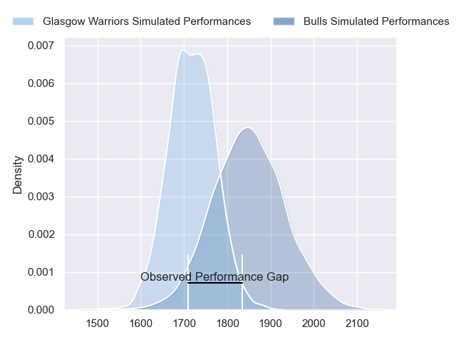
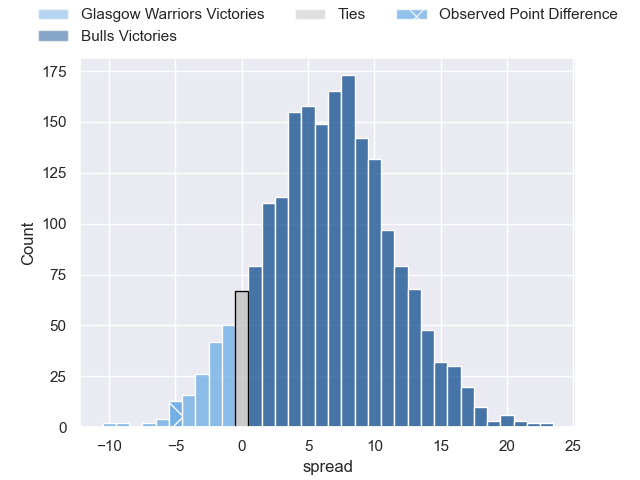
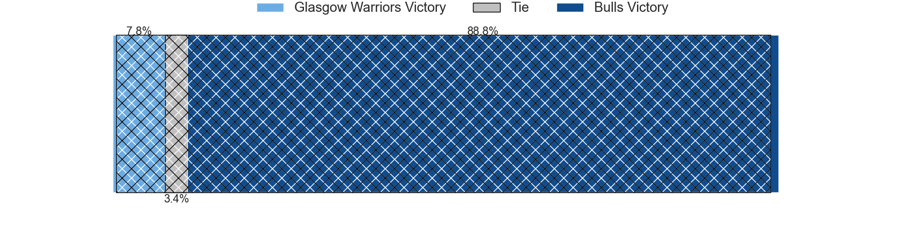
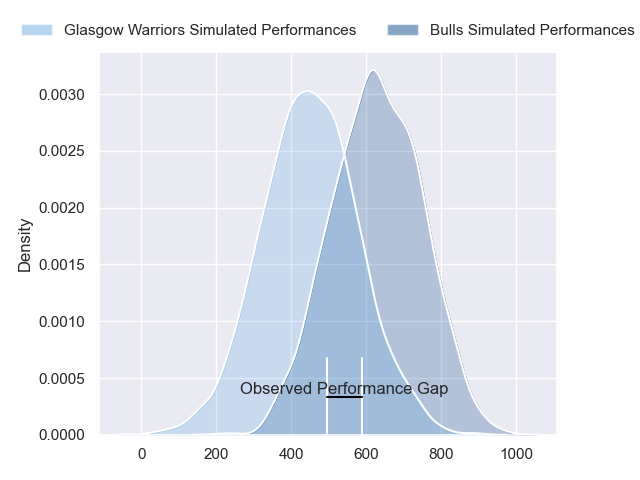
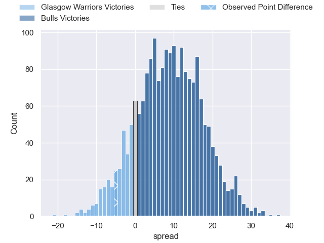
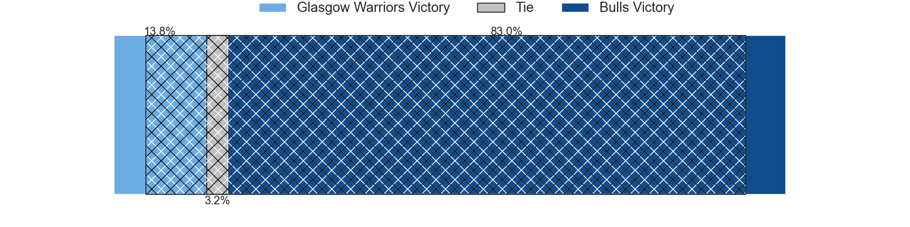

---  
layout: page  
title: Glasgow Warriors at Bulls; 21-16  
date: 2024-06-22 18:00:00 -0500  
categories: "United Rugby Championship 2023" match review  
---
# Glasgow Warriors at Bulls; 21-16

# Club Level Predictions

The first set of predictions treats a club as the smallest object, as the club develops its members, organizes a gameplan, and deploys its players as needed for each match. This club model has a prediction of 0.676, which translates to predicting Bulls to win by 6.5.

Our Over/Under is 74.5 - and combined with the spread above, we have a predicted scoreline of 34 to 41

Each club has a rating and a rating deviation (similar to a Glicko rating), and expected performances can be generated. This allows for simulated matches and spreads like the ones below.
## Projected Performances - Club Model

## Projected Spreads - Club Model

## Projected Results - Club Model

# Player Level Predictions

Treating teams instead as an entity made up of the currently active players, I have ratings for each player in an altogether different system. These can be combined to form team ratings once teamsheets are announced, weighting starters a bit higher than the reserves. After the match is played, players can be weighted by their minutes on the field, allowing for an accurate measure of the team's composition. With these compiled team ratings, we can make predictions, measure inaccuracy, and update the individual player ratings.
## Prediction without Player Minutes: Bulls by 10.3

Bulls by 5.7 on a neutral pitch

## Projected Performances - Player Model

## Projected Spreads - Player Model

## Projected Results - Player Model

|   Away Minutes | Away Player           |   Away Percentile |   Number |   Home Percentile | Home Player         |   Home Minutes |
|---------------:|:----------------------|------------------:|---------:|------------------:|:--------------------|---------------:|
|             46 | Jamie Bhatti          |             97.15 |        1 |             92.03 | Gerhard Steenekamp  |             74 |
|             46 | Johnny Matthews       |             45.44 |        2 |             95.36 | Johan Grobbelaar    |             51 |
|             80 | Zander Fagerson       |             99.84 |        3 |             99.19 | Wilco Louw          |             74 |
|             80 | Scott Cummings        |             98.5  |        4 |              9.48 | Ruan Vermaak        |             68 |
|             60 | Richie Gray           |             89.42 |        5 |             86.43 | Ruan Nortje         |             80 |
|             80 | Matt Fagerson         |             98.17 |        6 |             89.86 | Marco van Staden    |             80 |
|             60 | Rory Darge            |             88.71 |        7 |             89.77 | Elrigh Louw         |             80 |
|             80 | Jack Dempsey          |             68.23 |        8 |             63.97 | Cameron Hanekom     |             48 |
|             80 | George Horne          |             99.83 |        9 |             93.54 | Embrose Papier      |             80 |
|             80 | Tom Jordan            |             73.88 |       10 |             82.24 | Johan Goosen        |             80 |
|             80 | Kyle Steyn            |             98.66 |       11 |             97.41 | Kurt-Lee Arendse    |             80 |
|             80 | Sione Tuipulotu       |             79.62 |       12 |             95.59 | Harold Vorster      |             80 |
|             80 | Huw Jones             |             73.42 |       13 |             93.8  | David Kriel         |             80 |
|             60 | Sebastian Cancelliere |             99.62 |       14 |             91.94 | Sergeal Petersen    |             80 |
|             80 | Josh McKay            |             78.53 |       15 |             82.11 | Devon Williams      |             80 |
|             34 | George Turner         |             99.68 |       16 |             99.36 | Akker van der Merwe |             29 |
|             34 | Nathan McBeth         |             49.06 |       17 |             79.25 | Simphiwe Matanzima  |              6 |
|              0 | Oli Kebble            |             96.66 |       18 |            nan    | Francois Klopper    |              6 |
|             20 | Gregor Brown          |             48.7  |       19 |             81.04 | Reinhardt Ludwig    |             12 |
|              0 | Euan Ferrie           |             44.79 |       20 |             92.95 | Nizaam Carr         |             32 |
|             20 | Henco Venter          |             95.1  |       21 |             88.13 | Zak Burger          |              0 |
|             20 | Jamie Dobie           |             72.6  |       22 |             31.02 | Chris William Smith |              0 |
|              0 | Duncan Weir           |             78.78 |       23 |            nan    | Cornel Smit         |              0 |

