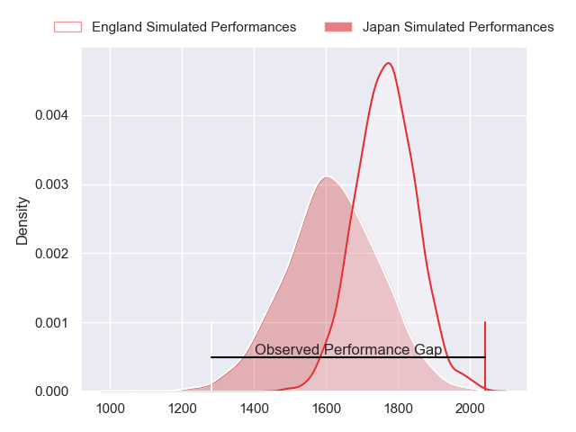
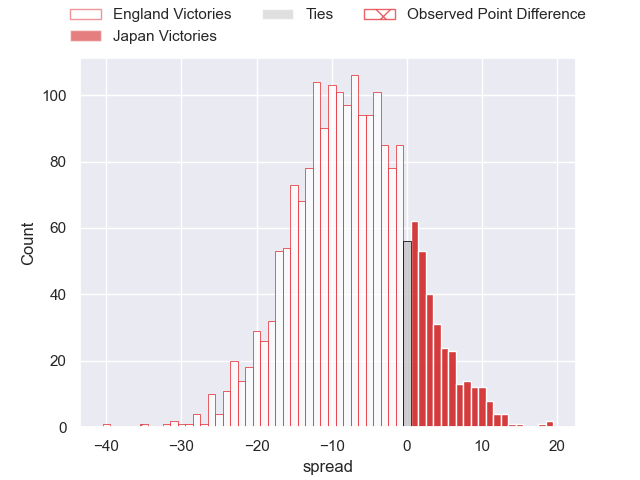
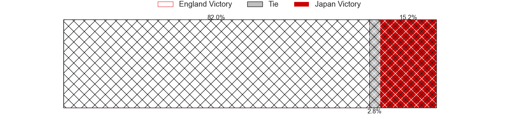
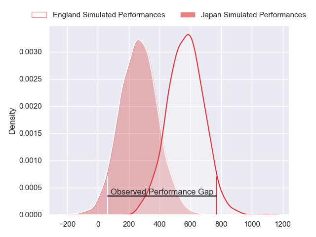
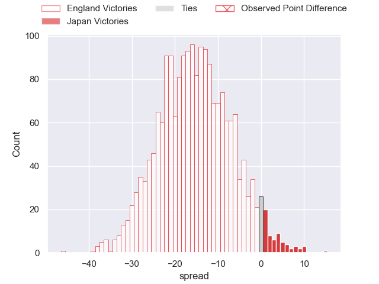
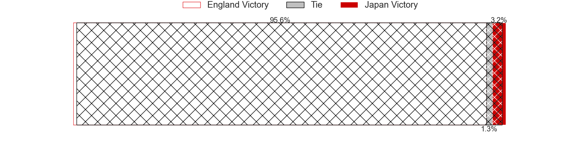

---  
layout: page  
title: England at Japan; 52-17  
date: 2024-06-22 18:00:00 -0500  
categories: "International Test Match 2024" match review  
---
# England at Japan; 52-17

# Club Level Predictions

The first set of predictions treats a club as the smallest object, as the club develops its members, organizes a gameplan, and deploys its players as needed for each match. This club model has a prediction of 0.304, which translates to predicting England to win by 7.4.

Our Over/Under is 45.5 - and combined with the spread above, we have a predicted scoreline of 27 to 19

Each club has a rating and a rating deviation (similar to a Glicko rating), and expected performances can be generated. This allows for simulated matches and spreads like the ones below.
## Projected Performances - Club Model

## Projected Spreads - Club Model

## Projected Results - Club Model

# Player Level Predictions

Treating teams instead as an entity made up of the currently active players, I have ratings for each player in an altogether different system. These can be combined to form team ratings once teamsheets are announced, weighting starters a bit higher than the reserves. After the match is played, players can be weighted by their minutes on the field, allowing for an accurate measure of the team's composition. With these compiled team ratings, we can make predictions, measure inaccuracy, and update the individual player ratings.
## Prediction without Player Minutes: England by 15.8

England by 18.7 on a neutral pitch

## Projected Performances - Player Model

## Projected Spreads - Player Model

## Projected Results - Player Model

|   Away Minutes | Away Player               |   Away Percentile |   Number |   Home Percentile | Home Player      |   Home Minutes |
|---------------:|:--------------------------|------------------:|---------:|------------------:|:-----------------|---------------:|
|             44 | Bevan Rodd                |             95.61 |        1 |             37.51 | Takayoshi Mohara |             63 |
|             44 | Jamie George              |             99.04 |        2 |             38.4  | Mamoru Harada    |             49 |
|             57 | Dan Cole                  |             54.84 |        3 |             39.3  | Shuhei Takeuchi  |             47 |
|             80 | Maro Itoje                |             95.81 |        4 |             39.32 | Sanaila Waqa     |             55 |
|             80 | George Martin             |             93.81 |        5 |             93.31 | Warner Dearns    |             80 |
|             57 | Chandler Cunningham-South |             74.13 |        6 |             97.68 | Michael Leitch   |             80 |
|             74 | Sam Underhill             |             94.59 |        7 |             34.46 | Tiennan Costley  |             60 |
|             80 | Ben Earl                  |             95.52 |        8 |             32.84 | Faulua Makisi    |             80 |
|             51 | Alex Mitchell             |             95.99 |        9 |              9.95 | Naoto Saito      |             55 |
|             66 | Marcus Smith              |             83.27 |       10 |              6.33 | Seungsin Lee     |             60 |
|             66 | Tommy Freeman             |             98.18 |       11 |             35.6  | Koga Nezuka      |             80 |
|             80 | Ollie Lawrence            |             89.18 |       12 |             68.38 | Tomoki Osada     |             80 |
|             80 | Henry Slade               |             98.32 |       13 |             33.19 | Samisoni Tua     |             80 |
|             60 | Immanuel Feyi-Waboso      |             90.02 |       14 |             72.84 | Jone Naikabula   |             80 |
|             80 | George Furbank            |             97.89 |       15 |             33.68 | Yoshitaka Yazaki |             55 |
|             36 | Theo Dan                  |             50.24 |       16 |             91.84 | Atsushi Sakate   |             31 |
|             36 | Joe Marler                |             97.64 |       17 |            nan    | Shogo Miura      |             17 |
|             23 | Will Stuart               |             34.66 |       18 |            nan    | Keijiro Tamefusa |             33 |
|             14 | Charlie Ewels             |             76.05 |       19 |             71.14 | Amanaki Saumaki  |             25 |
|             29 | Tom Curry                 |             83.59 |       20 |            nan    | Kai Yamamoto     |             20 |
|             29 | Harry Randall             |             95.46 |       21 |            nan    | Shinobu Fujiwara |             25 |
|             14 | Fin Smith                 |             86.53 |       22 |             98.78 | Rikiya Matsuda   |             20 |
|             20 | Tom Roebuck               |             86.47 |       23 |            nan    | Takuya Yamasawa  |             25 |

