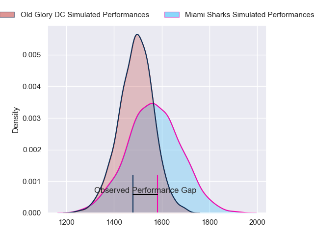
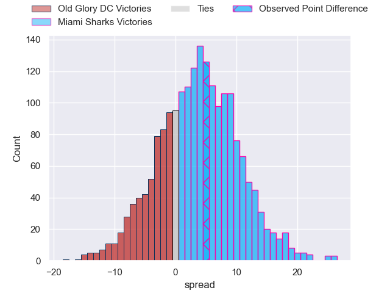
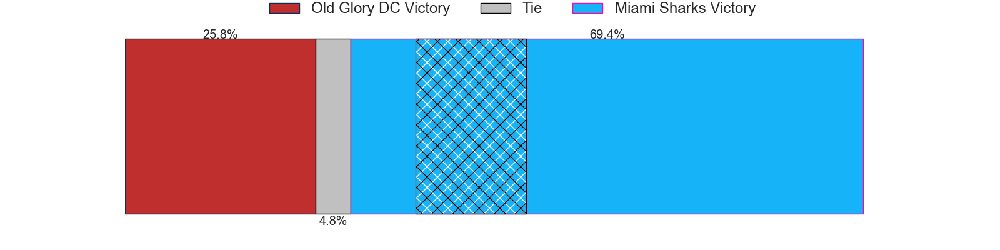
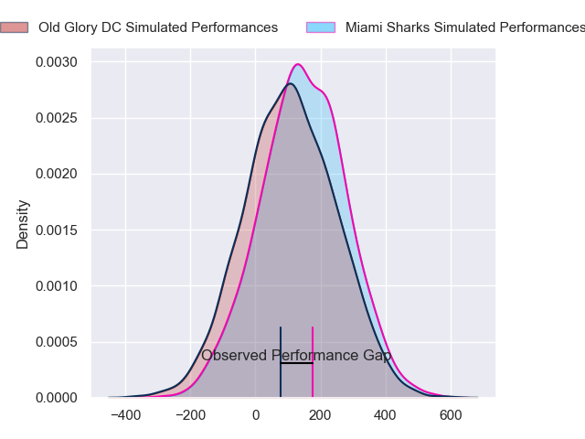
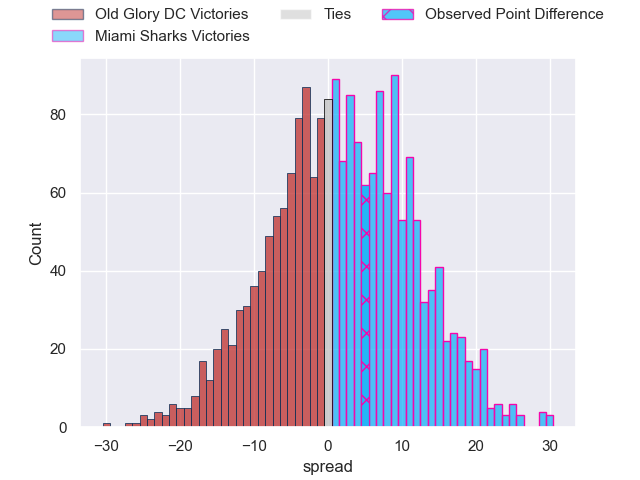

---  
layout: page  
title: Old Glory DC at Miami Sharks; 12-17  
date: 2024-06-22 18:00:00 -0500  
categories: "Major League Rugby 2024" match review  
---
# Old Glory DC at Miami Sharks; 12-17

# Club Level Predictions

The first set of predictions treats a club as the smallest object, as the club develops its members, organizes a gameplan, and deploys its players as needed for each match. This club model has a prediction of 0.599, which translates to predicting Miami Sharks to win by 3.6.

Our Over/Under is 51.5 - and combined with the spread above, we have a predicted scoreline of 24 to 28

Each club has a rating and a rating deviation (similar to a Glicko rating), and expected performances can be generated. This allows for simulated matches and spreads like the ones below.
## Projected Performances - Club Model

## Projected Spreads - Club Model

## Projected Results - Club Model

# Player Level Predictions

Treating teams instead as an entity made up of the currently active players, I have ratings for each player in an altogether different system. These can be combined to form team ratings once teamsheets are announced, weighting starters a bit higher than the reserves. After the match is played, players can be weighted by their minutes on the field, allowing for an accurate measure of the team's composition. With these compiled team ratings, we can make predictions, measure inaccuracy, and update the individual player ratings.
## Prediction without Player Minutes: Miami Sharks by 1.9

Old Glory DC by 0.3 on a neutral pitch

## Projected Performances - Player Model

## Projected Spreads - Player Model

## Projected Results - Player Model

|   Away Minutes | Away Player              |   Away Percentile |   Number |   Home Percentile | Home Player         |   Home Minutes |
|---------------:|:-------------------------|------------------:|---------:|------------------:|:--------------------|---------------:|
|             80 | Jack Iscaro              |             25.96 |        1 |             80.39 | Tau Koloamatangi    |             80 |
|             80 | Facundo Gattas           |             61.44 |        2 |             50.4  | Kirby Myhill        |             80 |
|             80 | Stevie Longwell          |             77.46 |        3 |             59.4  | Alec Mcdonnell      |             80 |
|             80 | Rob Harley               |             60.58 |        4 |             56.79 | Rick Rose           |             80 |
|             80 | Tevita Naqali            |             61.68 |        5 |             59.28 | Stan Van Den Hoven  |             80 |
|             80 | Jamason Fa'Anana-Schultz |             59.65 |        6 |             61.2  | Benjamin Bonasso    |             80 |
|             80 | Cory Gilliland-Daniel    |             58.78 |        7 |             39.38 | Dan Pryor           |             80 |
|             80 | Lautaro Bavaro           |             53.09 |        8 |             85.71 | Manuel Ardao        |             80 |
|             80 | Connor Buckley           |             48.17 |        9 |             25.48 | Tomas Cubelli       |             80 |
|             80 | Jason Robertson          |             43.06 |       10 |             27.35 | Santiago Videla     |             80 |
|             80 | John Rizzo               |             46.74 |       11 |             49.81 | Eric Naposki        |             80 |
|             80 | Tommaso Boni             |              3.26 |       12 |             18.8  | Matias Orlando      |             80 |
|             80 | Willie Talataina-Mu      |             42.86 |       13 |             37.82 | Tomas Inciarte      |             80 |
|             80 | Ishmail Shabazz          |             45.87 |       14 |             37.33 | Marcos Young        |             80 |
|             80 | Damien Hoyland           |             49.26 |       15 |             42.53 | Matías Freyre       |             80 |
|              0 | Koikoi Nelligan          |            nan    |       16 |             55.36 | Sean Mcnulty        |              0 |
|              0 | Cali Martinez            |            nan    |       17 |             29.05 | Jonas Petrakopoulos |              0 |
|              0 | Tyler Rowland            |            nan    |       18 |             64.28 | Reinaldo Piussi     |              0 |
|              0 | Ignacio Dotti Uria       |             14.27 |       19 |            nan    | Chase Schor-Haskin  |              0 |
|              0 | Collin Grosse            |             44.16 |       20 |             25.74 | Guiseppe Du Toit    |              0 |
|              0 | Ethan Mcveigh            |             58.99 |       21 |            nan    | Nicolás Elewaut     |              0 |
|              0 | Gradyn Bowd              |             56.33 |       22 |             48.27 | Michael Hand        |              0 |
|              0 | John Powers              |             56.09 |       23 |            nan    | Shane O'Leary       |              0 |

