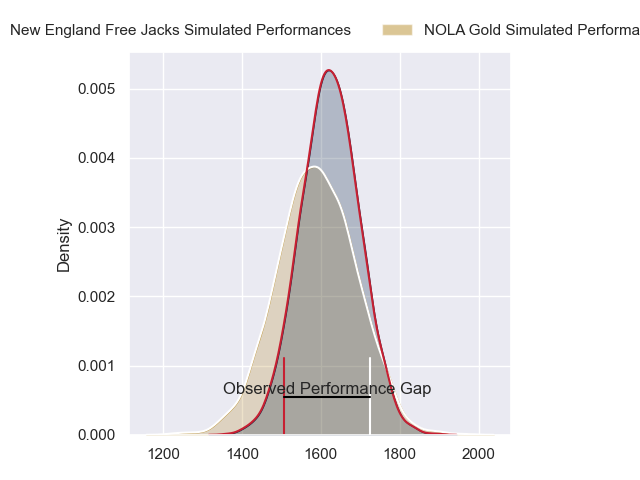
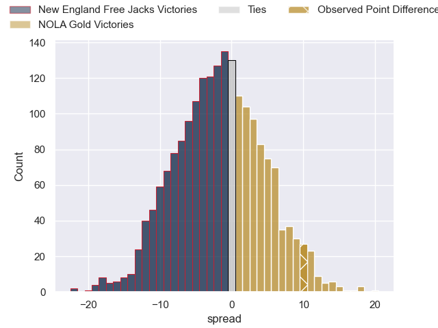
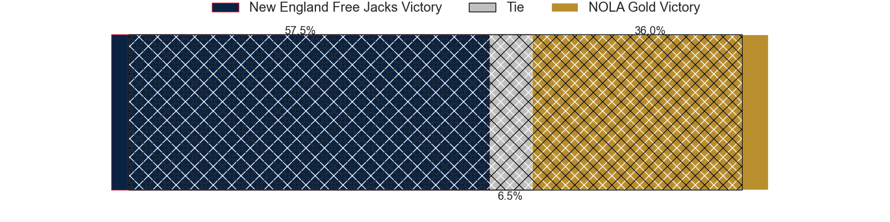
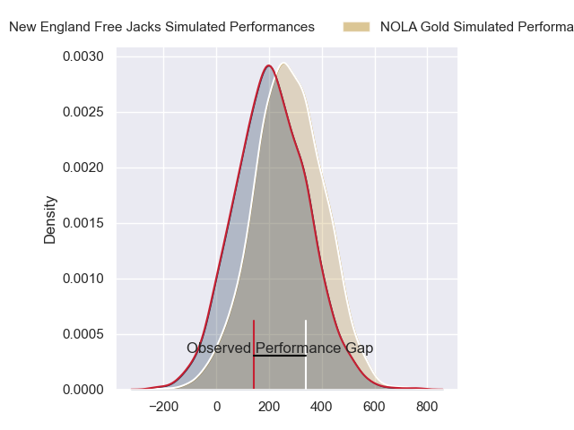
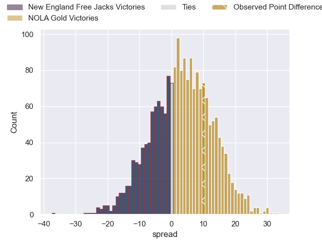
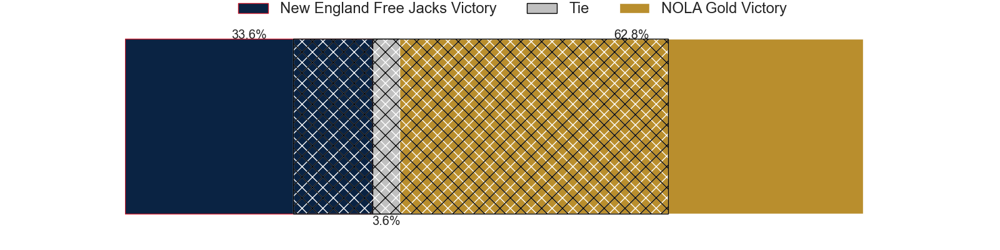

---  
layout: page  
title: New England Free Jacks at NOLA Gold; 17-27  
date: 2024-06-22 18:00:00 -0500  
categories: "Major League Rugby 2024" match review  
---
# New England Free Jacks at NOLA Gold; 17-27

# Club Level Predictions

The first set of predictions treats a club as the smallest object, as the club develops its members, organizes a gameplan, and deploys its players as needed for each match. This club model has a prediction of 0.456, which translates to predicting New England Free Jacks to win by 1.6.

Our Over/Under is 50.5 - and combined with the spread above, we have a predicted scoreline of 26 to 24

Each club has a rating and a rating deviation (similar to a Glicko rating), and expected performances can be generated. This allows for simulated matches and spreads like the ones below.
## Projected Performances - Club Model

## Projected Spreads - Club Model

## Projected Results - Club Model

# Player Level Predictions

Treating teams instead as an entity made up of the currently active players, I have ratings for each player in an altogether different system. These can be combined to form team ratings once teamsheets are announced, weighting starters a bit higher than the reserves. After the match is played, players can be weighted by their minutes on the field, allowing for an accurate measure of the team's composition. With these compiled team ratings, we can make predictions, measure inaccuracy, and update the individual player ratings.
## Prediction without Player Minutes: NOLA Gold by 5.0

NOLA Gold by 2.3 on a neutral pitch

## Projected Performances - Player Model

## Projected Spreads - Player Model

## Projected Results - Player Model

|   Away Minutes | Away Player             |   Away Percentile |   Number |   Home Percentile | Home Player         |   Home Minutes |
|---------------:|:------------------------|------------------:|---------:|------------------:|:--------------------|---------------:|
|             80 | Kyle Ciquera            |             28.56 |        1 |             84.38 | Jarred Adams        |             80 |
|             80 | Foster Dewitt           |             52.8  |        2 |             76.32 | Pat O'Toole         |             80 |
|             80 | John-Roy Jenkinson      |             45.97 |        3 |             82.42 | Isaac Salmon        |             80 |
|             80 | Conor Keys              |             70.76 |        4 |             84.93 | Malcolm May         |             80 |
|             80 | Jackson Thiebes         |             51.8  |        5 |             78.14 | Cam Dolan           |             80 |
|             80 | Ethan Fryer             |             21.81 |        6 |             86.2  | Moni Tonga'Uiha     |             80 |
|             80 | Jed Melvin              |             45.46 |        7 |             71.04 | Jonah Mau'U         |             80 |
|             80 | Mitch Jacobson          |             48.83 |        8 |             60.34 | Tom Florence        |             80 |
|             80 | Holden Yungert          |             49.74 |        9 |             78.01 | Luke Campbell       |             80 |
|             80 | Reece Macdonald         |             55.51 |       10 |             77.76 | Rodney Iona         |             80 |
|             80 | Toby Fricker            |             36.28 |       11 |             86.85 | Taniela Filimone    |             80 |
|             80 | Le Roux Malan           |             85.08 |       12 |             74.58 | Jordan Jackson-Hope |             80 |
|             80 | Ben LeSage              |             73.32 |       13 |             75.74 | Jp Du Plessis       |             80 |
|             80 | Mitch Wilson            |             94.72 |       14 |             68.52 | Harley Wheeler      |             80 |
|             80 | Danyon Morgan-Puterangi |             22.95 |       15 |             79.58 | Dougie Fife         |             80 |
|              0 | Sean Ralph              |             48.16 |       16 |             71.68 | Ale Lopeti          |              0 |
|              0 | Malakai Hala            |             47.19 |       17 |             74.94 | Matt Harmon         |              0 |
|              0 | Cole Keith              |             39.14 |       18 |            nan    | Doc Irey            |              0 |
|              0 | Piers Von Dadelszen     |             35.81 |       19 |             81.84 | Callum Botchar      |              0 |
|              0 | Seta Baker              |             33.3  |       20 |             73.85 | William Waguespack  |              0 |
|              0 | Oscar Lennon            |             10.65 |       21 |            nan    | Osaiasi Tonga'Uiha  |              0 |
|              0 | Killian Coghlan         |            nan    |       22 |             75.1  | Reece Botha         |              0 |
|              0 | Cam Davidowicz          |             27.08 |       23 |             54.32 | Julian Roberts      |              0 |

