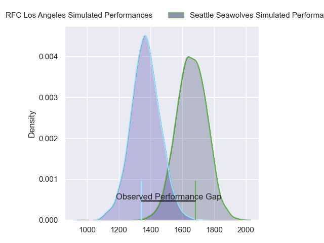
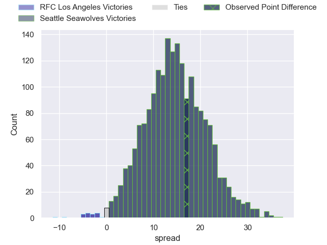
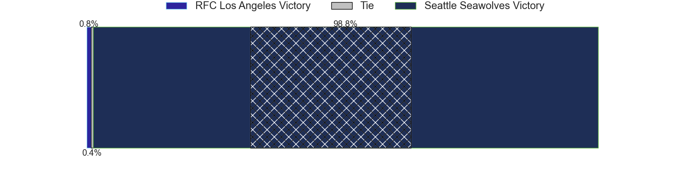
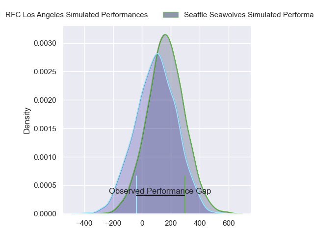
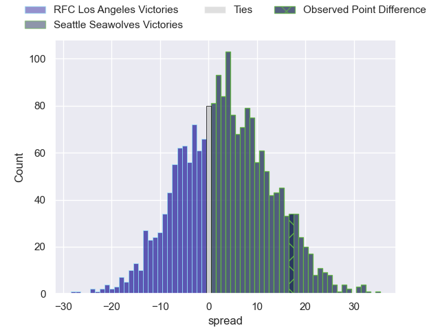
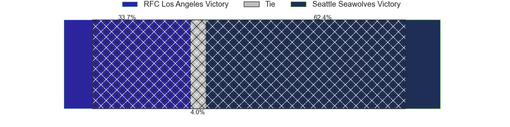

---  
layout: page  
title: RFC Los Angeles at Seattle Seawolves; 12-29  
date: 2024-06-22 18:00:00 -0500  
categories: "Major League Rugby 2024" match review  
---
# RFC Los Angeles at Seattle Seawolves; 12-29

# Club Level Predictions

The first set of predictions treats a club as the smallest object, as the club develops its members, organizes a gameplan, and deploys its players as needed for each match. This club model has a prediction of 0.835, which translates to predicting Seattle Seawolves to win by 14.7.

Our Over/Under is 63.5 - and combined with the spread above, we have a predicted scoreline of 24 to 39

Each club has a rating and a rating deviation (similar to a Glicko rating), and expected performances can be generated. This allows for simulated matches and spreads like the ones below.
## Projected Performances - Club Model

## Projected Spreads - Club Model

## Projected Results - Club Model

# Player Level Predictions

Treating teams instead as an entity made up of the currently active players, I have ratings for each player in an altogether different system. These can be combined to form team ratings once teamsheets are announced, weighting starters a bit higher than the reserves. After the match is played, players can be weighted by their minutes on the field, allowing for an accurate measure of the team's composition. With these compiled team ratings, we can make predictions, measure inaccuracy, and update the individual player ratings.
## Prediction without Player Minutes: Seattle Seawolves by 4.2

Seattle Seawolves by 1.5 on a neutral pitch

## Projected Performances - Player Model

## Projected Spreads - Player Model

## Projected Results - Player Model

|   Away Minutes | Away Player       |   Away Percentile |   Number |   Home Percentile | Home Player       |   Home Minutes |
|---------------:|:------------------|------------------:|---------:|------------------:|:------------------|---------------:|
|             80 | Wilton Rebolo     |              2.36 |        1 |             82.91 | Cameron Orr       |             80 |
|             80 | Ben Strang        |             40.16 |        2 |             61.12 | Jackson Zabierek  |             80 |
|             80 | Alex Maughan      |             24.33 |        3 |             79.66 | Sam Matenga       |             80 |
|             80 | Max Katjijeko     |             19.76 |        4 |             77.64 | Rhyno Herbst      |             80 |
|             80 | Reegan O'Gorman   |             41.22 |        5 |             74.85 | Jean Droste       |             80 |
|             80 | Bruce Yun         |             18.05 |        6 |             74.23 | Devin Short       |             80 |
|             80 | Matt Heaton       |             19.5  |        7 |             74.61 | Monate Akuei      |             80 |
|             80 | Semi Kunatani     |             12.79 |        8 |             75.48 | Huw Taylor        |             80 |
|             80 | Tas Smith         |             12.04 |        9 |             75.92 | Jp Smith          |             80 |
|             80 | Sean Nolan        |             18.78 |       10 |             74.9  | Mack Mason        |             80 |
|             80 | Jack Shaw         |             34.17 |       11 |             65.55 | Lauina Futi       |             80 |
|             80 | James Stokes      |             40.23 |       12 |             72.16 | Dan Kriel         |             80 |
|             80 | Seth Purdey       |             36.13 |       13 |             44.22 | Divan Rossouw     |             80 |
|             80 | Henry Speight     |             15.83 |       14 |             61.8  | Conner Mooneyham  |             80 |
|             80 | Rory Van Vugt     |             17.05 |       15 |             58.32 | Duncan Matthews   |             80 |
|              0 | Dane Zander       |             66.4  |       16 |             54.56 | Daquan Perry      |              0 |
|              0 | Alessandro Heaney |            nan    |       17 |            nan    | Chance Wenglewski |              0 |
|              0 | Conor Young       |             18.88 |       18 |            nan    | Koby Baker        |              0 |
|              0 | Liam Antrobus     |            nan    |       19 |             51.7  | Taylor Krumrei    |              0 |
|              0 | Will Leonard      |             27.31 |       20 |             42    | Pago Haini        |              0 |
|              0 | Matt Anticev      |             27.55 |       21 |             50.96 | Ryan Rees         |              0 |
|              0 | Sam Walsh         |            nan    |       22 |             50.61 | Sam Windsor       |              0 |
|              0 | Brooklyn Hardaker |             33.78 |       23 |             93.38 | Tavite Lopeti     |              0 |

