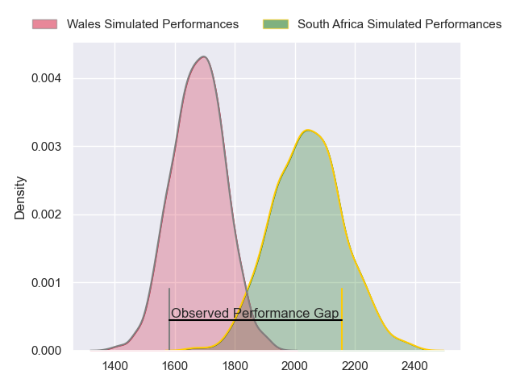
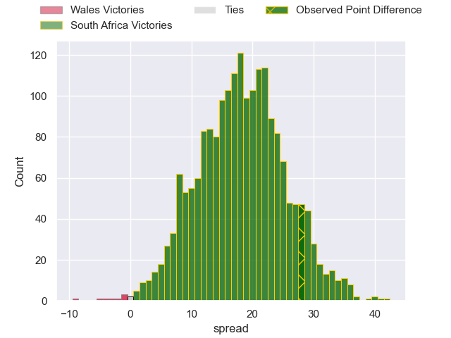
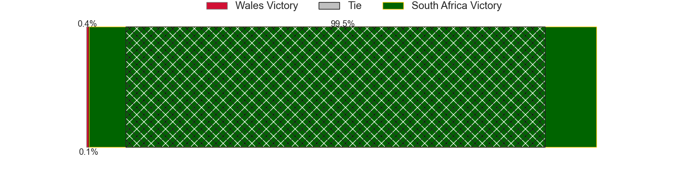
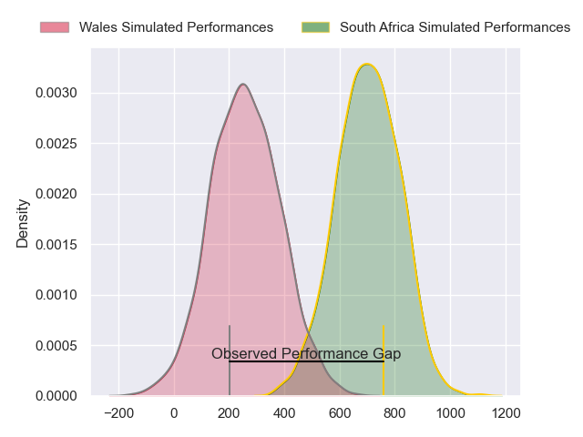
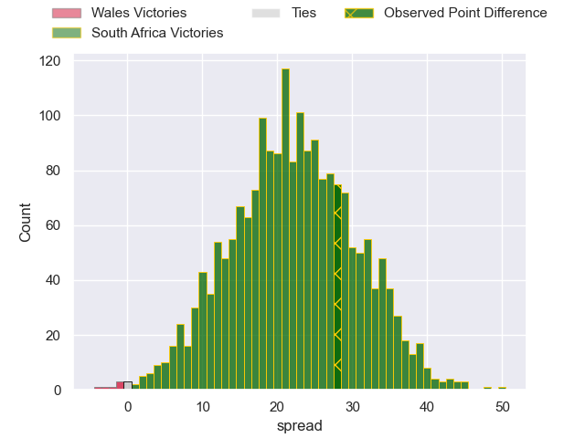
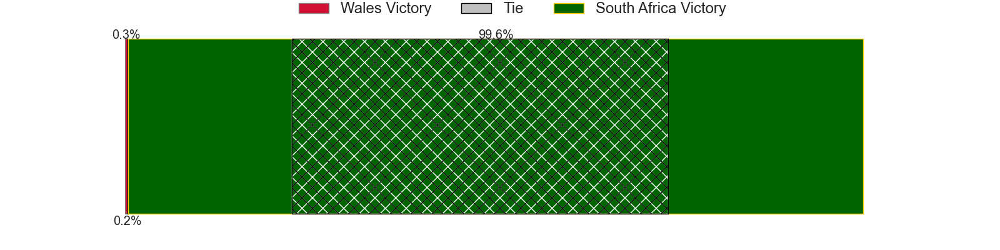

---  
layout: page  
title: Wales at South Africa; 13-41  
date: 2024-06-22 18:00:00 -0500  
categories: "International Test Match 2024" match review  
---
# Wales at South Africa; 13-41

# Club Level Predictions

The first set of predictions treats a club as the smallest object, as the club develops its members, organizes a gameplan, and deploys its players as needed for each match. This club model has a prediction of 0.882, which translates to predicting South Africa to win by 18.1.

Our Over/Under is 52.5 - and combined with the spread above, we have a predicted scoreline of 17 to 35

Each club has a rating and a rating deviation (similar to a Glicko rating), and expected performances can be generated. This allows for simulated matches and spreads like the ones below.
## Projected Performances - Club Model

## Projected Spreads - Club Model

## Projected Results - Club Model

# Player Level Predictions

Treating teams instead as an entity made up of the currently active players, I have ratings for each player in an altogether different system. These can be combined to form team ratings once teamsheets are announced, weighting starters a bit higher than the reserves. After the match is played, players can be weighted by their minutes on the field, allowing for an accurate measure of the team's composition. With these compiled team ratings, we can make predictions, measure inaccuracy, and update the individual player ratings.
## Prediction without Player Minutes: South Africa by 27.2

South Africa by 23.8 on a neutral pitch

## Projected Performances - Player Model

## Projected Spreads - Player Model

## Projected Results - Player Model

|   Away Minutes | Away Player      |   Away Percentile |   Number |   Home Percentile | Home Player          |   Home Minutes |
|---------------:|:-----------------|------------------:|---------:|------------------:|:---------------------|---------------:|
|             62 | Gareth Thomas    |             66.31 |        1 |             99.67 | Ox Nche              |             68 |
|             67 | Dewi Lake        |             62.88 |        2 |            100    | Malcolm Marx         |             46 |
|             40 | Keiron Assiratti |             31.16 |        3 |             68.43 | Vincent Koch         |             46 |
|             61 | Matthew Screech  |              0.6  |        4 |             98.9  | Eben Etzebeth        |             62 |
|             80 | Ben Carter       |             22.85 |        5 |             91.32 | Franco Mostert       |             80 |
|             74 | Taine Plumtree   |             78.19 |        6 |             89.19 | Kwagga Smith         |             80 |
|             80 | James Botham     |             82.05 |        7 |             94.02 | Pieter-Steph du Toit |             80 |
|             80 | Aaron Wainwright |             88.27 |        8 |             88.06 | Evan Roos            |             54 |
|             58 | Ellis Bevan      |             63    |        9 |             94.76 | Faf de Klerk         |             53 |
|             70 | Sam Costelow     |             58.57 |       10 |             79.59 | Jordan Hendrikse     |             60 |
|             80 | Rio Dyer         |             25.72 |       11 |             99.71 | Makazole Mapimpi     |             80 |
|             70 | Mason Grady      |             81.3  |       12 |             98.42 | Andre Esterhuizen    |             58 |
|             80 | Owen Watkin      |             99.16 |       13 |             98.21 | Jesse Kriel          |             80 |
|             80 | Liam Williams    |             99.23 |       14 |             95.2  | Edwill van der Merwe |             80 |
|             80 | Cameron Winnett  |             26.11 |       15 |             91.79 | Aphelele Fassi       |             80 |
|             13 | Evan Lloyd       |             39.2  |       16 |             97.92 | Bongi Mbonambi       |             34 |
|             18 | Kemsley Mathias  |             75.35 |       17 |             47.68 | Ntuthuko Mchunu      |             12 |
|             40 | Harri O'Connor   |             10.58 |       18 |             87.71 | Frans Malherbe       |             34 |
|             19 | James Ratti      |             84.73 |       19 |             77.45 | Salmaan Moerat       |             18 |
|              6 | Mackenzie Martin |             40.51 |       20 |             68.24 | Ben-Jason Dixon      |             26 |
|             22 | Gareth Davies    |             50.09 |       21 |             68.06 | Grant Williams       |             27 |
|             10 | Eddie James      |             41.91 |       22 |             74.05 | Sacha Mngomezulu     |             20 |
|             10 | Jacob Beetham    |             14.11 |       23 |             99.37 | Damian de Allende    |             22 |

