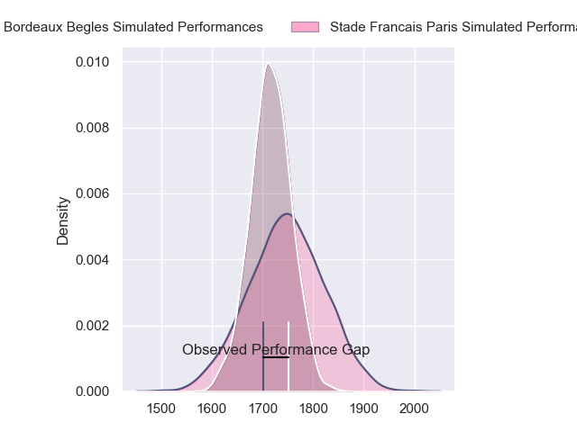
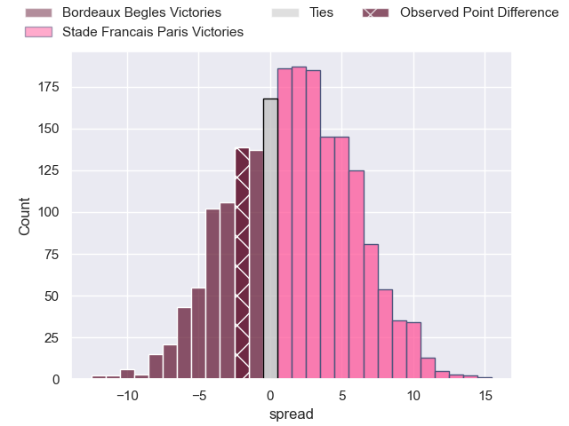
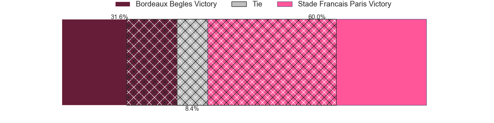
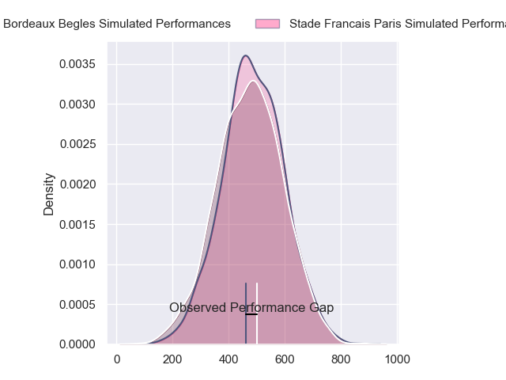
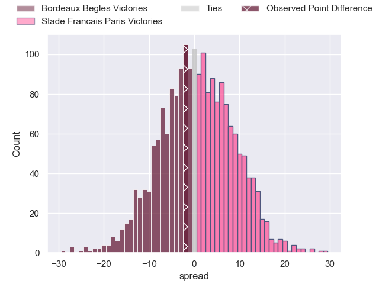

---  
layout: page  
title: Bordeaux Begles at Stade Francais Paris; 22-20  
date: 2024-06-22 18:00:00 -0500  
categories: "Top 14 Orange 2023" match review  
---
# Bordeaux Begles at Stade Francais Paris; 22-20

# Club Level Predictions

The first set of predictions treats a club as the smallest object, as the club develops its members, organizes a gameplan, and deploys its players as needed for each match. This club model has a prediction of 0.541, which translates to predicting Stade Francais Paris to win by 1.4.

Our Over/Under is 48.5 - and combined with the spread above, we have a predicted scoreline of 24 to 25

Each club has a rating and a rating deviation (similar to a Glicko rating), and expected performances can be generated. This allows for simulated matches and spreads like the ones below.
## Projected Performances - Club Model

## Projected Spreads - Club Model

## Projected Results - Club Model

# Player Level Predictions

Treating teams instead as an entity made up of the currently active players, I have ratings for each player in an altogether different system. These can be combined to form team ratings once teamsheets are announced, weighting starters a bit higher than the reserves. After the match is played, players can be weighted by their minutes on the field, allowing for an accurate measure of the team's composition. With these compiled team ratings, we can make predictions, measure inaccuracy, and update the individual player ratings.
## Prediction without Player Minutes: Stade Francais Paris by 3.6

Bordeaux Begles by 4.6 on a neutral pitch

## Projected Performances - Player Model

## Projected Spreads - Player Model

## Projected Results - Player Model

|   Away Minutes | Away Player               |   Away Percentile |   Number |   Home Percentile | Home Player             |   Home Minutes |
|---------------:|:--------------------------|------------------:|---------:|------------------:|:------------------------|---------------:|
|             49 | Jefferson Poirot          |             77.22 |        1 |             69.41 | Sergo Abramishvili      |             44 |
|             60 | Maxime Lamothe            |             72.48 |        2 |             95.2  | Mickael Ivaldi          |             49 |
|             52 | Carlu Sadie               |             46.05 |        3 |             89.42 | Paul Alo-Emile          |             60 |
|             86 | Cyril Cazeaux             |             93.41 |        4 |             27.74 | Paul Gabrillagues       |             78 |
|             51 | Adam Coleman              |             99    |        5 |             75.95 | Baptiste Pesenti        |             52 |
|             61 | Bastien Vergnes Taillefer |             83.3  |        6 |             95.46 | Sekou Macalou           |             68 |
|             74 | Pierre Bochaton           |             86.49 |        7 |             49.23 | Romain Briatte          |             78 |
|             60 | Tevita Tatafu             |             90.19 |        8 |             88.49 | Giovanni Habel-Kueffner |             70 |
|             86 | Maxime Lucu               |             99.48 |        9 |             98.6  | Rory Kockott            |             59 |
|             66 | Mateo Garcia              |             40.2  |       10 |             76.73 | Joris Segonds           |             86 |
|             86 | Louis Bielle-Biarrey      |             85.12 |       11 |             85.89 | Lester Etien            |             86 |
|             86 | Yoram Moefana             |             84.35 |       12 |             81.09 | Jeremy Ward             |             86 |
|             85 | Nicolas Depoortere        |             87.92 |       13 |             85.29 | Joe Marchant            |             86 |
|             86 | Damian Penaud             |             97.5  |       14 |             55.09 | Kylan Hamdaoui          |             68 |
|             60 | Romain Buros              |             98.53 |       15 |             61.89 | Leo Barre               |             86 |
|             26 | Romain Latterrade         |             13.92 |       16 |             17.76 | Lucas Peyresblanques    |             37 |
|             37 | Ugo Boniface              |             92.35 |       17 |             72.99 | Moses Alo-Emile         |             42 |
|             36 | Guido Petti               |             90.52 |       18 |             75.25 | Pierre-Henri Azagoh     |             16 |
|             37 | Mahamadou Diaby           |             82.53 |       19 |             13.03 | Tanginoa Halaifonua     |             34 |
|             26 | Pete Samu                 |             90.62 |       20 |             97.21 | Brad Weber              |             27 |
|             20 | Yann Lesgourgues          |              5.58 |       21 |              2.99 | Mathieu Hirigoyen       |             34 |
|             26 | Pablo Uberti              |              9.87 |       22 |             85.61 | Julien Delbouis         |             18 |
|             34 | Lekso Kaulashvili         |             89.5  |       23 |             92.76 | Giorgi Melikidze        |             26 |

