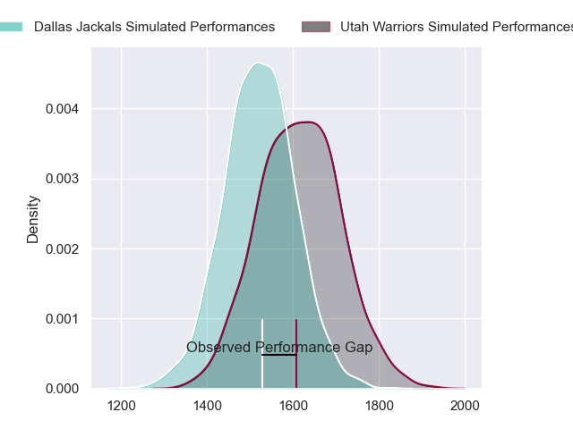
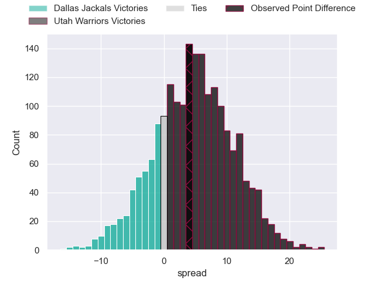
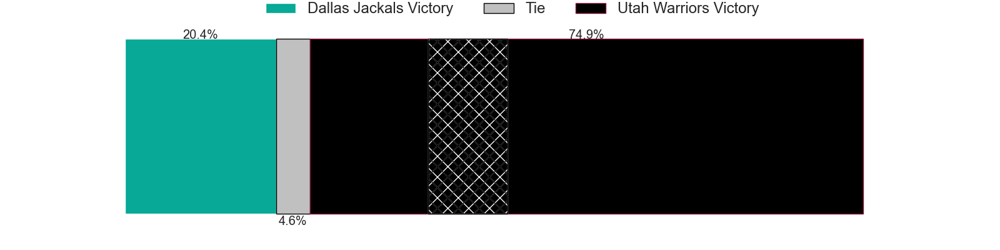
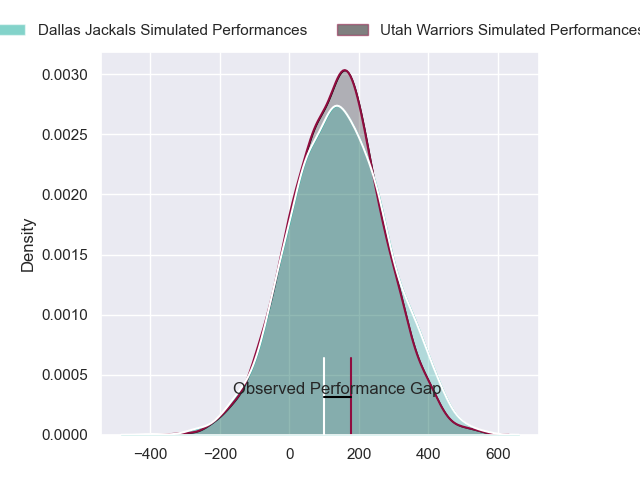
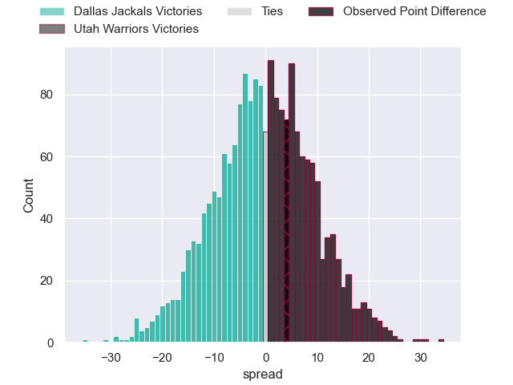

---  
layout: page  
title: Dallas Jackals at Utah Warriors; 46-50  
date: 2024-06-22 18:00:00 -0500  
categories: "Major League Rugby 2024" match review  
---
# Dallas Jackals at Utah Warriors; 46-50

# Club Level Predictions

The first set of predictions treats a club as the smallest object, as the club develops its members, organizes a gameplan, and deploys its players as needed for each match. This club model has a prediction of 0.629, which translates to predicting Utah Warriors to win by 4.7.

Our Over/Under is 45.5 - and combined with the spread above, we have a predicted scoreline of 20 to 25

Each club has a rating and a rating deviation (similar to a Glicko rating), and expected performances can be generated. This allows for simulated matches and spreads like the ones below.
## Projected Performances - Club Model

## Projected Spreads - Club Model

## Projected Results - Club Model

# Player Level Predictions

Treating teams instead as an entity made up of the currently active players, I have ratings for each player in an altogether different system. These can be combined to form team ratings once teamsheets are announced, weighting starters a bit higher than the reserves. After the match is played, players can be weighted by their minutes on the field, allowing for an accurate measure of the team's composition. With these compiled team ratings, we can make predictions, measure inaccuracy, and update the individual player ratings.
## Prediction without Player Minutes: Utah Warriors by 1.1

Dallas Jackals by 1.6 on a neutral pitch

## Projected Performances - Player Model

## Projected Spreads - Player Model

## Projected Results - Player Model

|   Away Minutes | Away Player           |   Away Percentile |   Number |   Home Percentile | Home Player         |   Home Minutes |
|---------------:|:----------------------|------------------:|---------:|------------------:|:--------------------|---------------:|
|             80 | Connor Grindal        |             41.66 |        1 |             36.53 | Emerson Prior       |             80 |
|             80 | Dewald Kotze          |             44.8  |        2 |             23.04 | Ratu Vere Vugakoto  |             80 |
|             80 | Juan Pablo Zeiss      |             41.58 |        3 |             48.41 | Angus Maclellan     |             80 |
|             80 | Sam Golla             |             81.74 |        4 |             19.66 | Frank Lochore       |             80 |
|             80 | Javon Camp-Villalovos |             41.42 |        5 |             37.62 | Saia Uhila          |             80 |
|             80 | Ronan Foley           |             56.85 |        6 |             28.19 | Bailey Wilson       |             80 |
|             80 | Ben Fry               |             35.33 |        7 |             42.76 | Kalisi Moli         |             80 |
|             80 | Sam Tuifua            |             47.33 |        8 |             43.28 | Onehunga Havili     |             80 |
|             80 | Pit Imhoff            |             38.22 |        9 |             34.55 | Kieran Mcclea       |             80 |
|             80 | Connor Winchester     |             38.98 |       10 |             17.55 | Joel Hodgson        |             80 |
|             80 | Tomás Cubilla         |             35.32 |       11 |             65.74 | Joe Mano            |             80 |
|             80 | Manuel Covella        |             36.34 |       12 |             39.39 | Paul Lasike         |             80 |
|             80 | Mitchell Richardson   |             54.62 |       13 |             22.16 | Lopeti Aisea        |             80 |
|             80 | Marcell Muller        |             40.31 |       14 |             22.65 | Michael Manson      |             80 |
|             80 | Nazareno Valentini    |             40    |       15 |             29.68 | Caleb Makene        |             80 |
|              0 | Liam Murray           |              0.08 |       16 |             37.44 | Phil Bradford       |              0 |
|              0 | Tomás Bekerman        |             49.92 |       17 |            nan    | Franco Van Den Berg |              0 |
|              0 | Kyle Steeves          |             54.03 |       18 |            nan    | Tonga Kofe          |              0 |
|              0 | Kyle Breytenbach      |             43.91 |       19 |             27.94 | Louis Conradie      |              0 |
|              0 | Daemon Torres         |             36.13 |       20 |             23.17 | John Dupree         |              0 |
|              0 | Brock Gallagher       |            nan    |       21 |            nan    | Sam Reimer          |              0 |
|              0 | Marques Fuala'Au      |            nan    |       22 |             22.94 | Jesse Hamilton      |              0 |
|              0 | Jason Tidwell         |             60.17 |       23 |             68.78 | Robbie Povey        |              0 |

