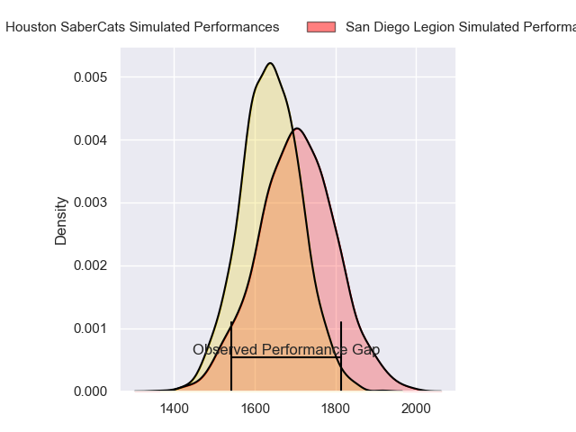
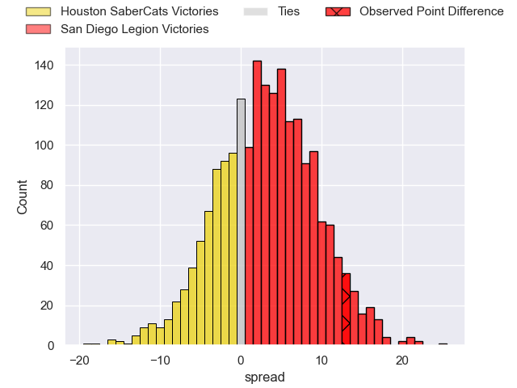
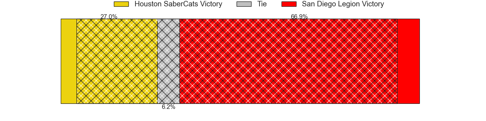
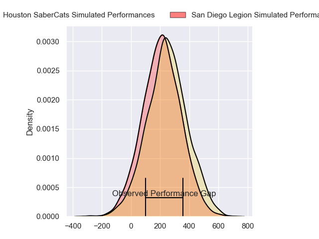
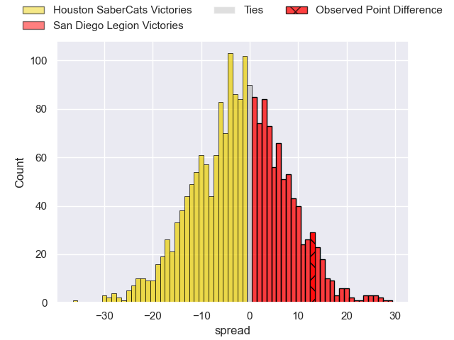
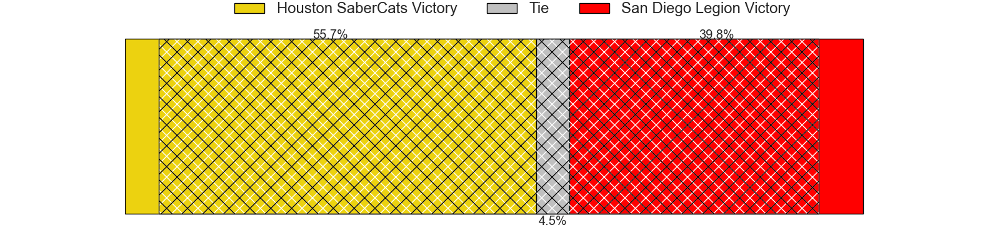

---  
layout: page  
title: Houston SaberCats at San Diego Legion; 24-37  
date: 2024-06-23 18:00:00 -0500  
categories: "Major League Rugby 2024" match review  
---
# Houston SaberCats at San Diego Legion; 24-37

# Club Level Predictions

The first set of predictions treats a club as the smallest object, as the club develops its members, organizes a gameplan, and deploys its players as needed for each match. This club model has a prediction of 0.589, which translates to predicting San Diego Legion to win by 3.2.

Our Over/Under is 55.5 - and combined with the spread above, we have a predicted scoreline of 26 to 29

Each club has a rating and a rating deviation (similar to a Glicko rating), and expected performances can be generated. This allows for simulated matches and spreads like the ones below.
## Projected Performances - Club Model

## Projected Spreads - Club Model

## Projected Results - Club Model

# Player Level Predictions

Treating teams instead as an entity made up of the currently active players, I have ratings for each player in an altogether different system. These can be combined to form team ratings once teamsheets are announced, weighting starters a bit higher than the reserves. After the match is played, players can be weighted by their minutes on the field, allowing for an accurate measure of the team's composition. With these compiled team ratings, we can make predictions, measure inaccuracy, and update the individual player ratings.
## Prediction without Player Minutes: Houston SaberCats by 1.5

Houston SaberCats by 4.3 on a neutral pitch

## Projected Performances - Player Model

## Projected Spreads - Player Model

## Projected Results - Player Model

|   Away Minutes | Away Player            |   Away Percentile |   Number |   Home Percentile | Home Player          |   Home Minutes |
|---------------:|:-----------------------|------------------:|---------:|------------------:|:---------------------|---------------:|
|             80 | Ezekiel Lindenmuth     |             69.49 |        1 |             76.73 | Payton Telea-Ilalio  |             80 |
|             80 | Pita Anae Ah-Sue       |             29.76 |        2 |             66.4  | Chris Mickelson      |             80 |
|             80 | Pono Davis             |             24.98 |        3 |             71.36 | Luke Green           |             80 |
|             80 | Justin Basson          |             36.03 |        4 |             62.87 | Brandon Harvey       |             80 |
|             80 | Nathan Den Hoedt       |             62.48 |        5 |             25.65 | Greg Peterson        |             80 |
|             80 | Emmanuel Albert        |             58.3  |        6 |             76.93 | Vili Helu            |             80 |
|             80 | Keni Nasoqeqe          |             41.7  |        7 |             93.82 | Paddy Ryan           |             80 |
|             80 | Gideon Van Wyk         |             43.5  |        8 |             69.08 | Tupou Ma'Afu-Afungia |             80 |
|             80 | Jay Renton             |             51.48 |        9 |             69.63 | Connor Tupai         |             80 |
|             80 | Aj Alatimu             |             60.41 |       10 |             62.24 | Matt Giteau          |             80 |
|             80 | Jeremy Misailegalu     |             50.96 |       11 |             71.35 | Ryan James           |             80 |
|             80 | Sam Hill               |             43.38 |       12 |             64.92 | Ma'A Nonu            |             80 |
|             80 | Louritz Van Der Schyff |             42.33 |       13 |             57.04 | Tiaan Loots          |             80 |
|             80 | Christian Dyer         |             95.49 |       14 |             71.35 | Tomas Aoake          |             80 |
|             80 | Drew Wild              |             56.21 |       15 |             67.16 | Marcel Brache        |             80 |
|              0 | Tiaan Erasmus          |             67.04 |       16 |             57.44 | Cyrille Cama         |              0 |
|              0 | Larome White           |            nan    |       17 |             52.64 | Nathan Sylvia        |              0 |
|              0 | Val Lee-Lo             |            nan    |       18 |             57.53 | Darcy Breen          |              0 |
|              0 | Ronan Murphy           |             72.3  |       19 |            nan    | Charlie Hewitt       |              0 |
|              0 | Asa Carter             |            nan    |       20 |             48.19 | Tevita Tameilau      |              0 |
|              0 | Devereaux Ferris       |            nan    |       21 |             47.47 | Danny Christensen    |              0 |
|              0 | Max Schumacher         |            nan    |       22 |            nan    | Harris Rutherford    |              0 |
|              0 | Seimou Smith           |             66.22 |       23 |             37.29 | Ethan Grayson        |              0 |

