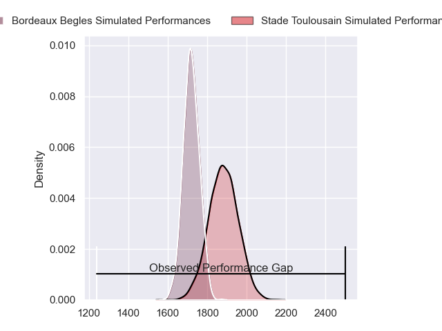
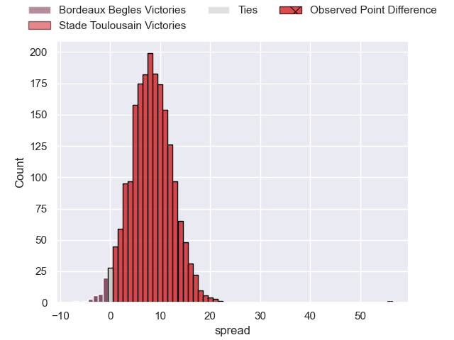
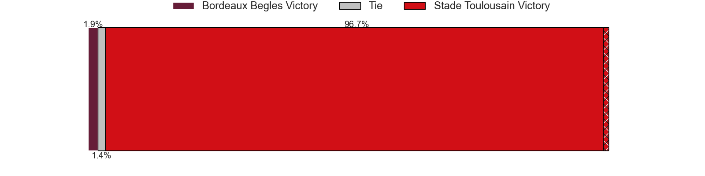
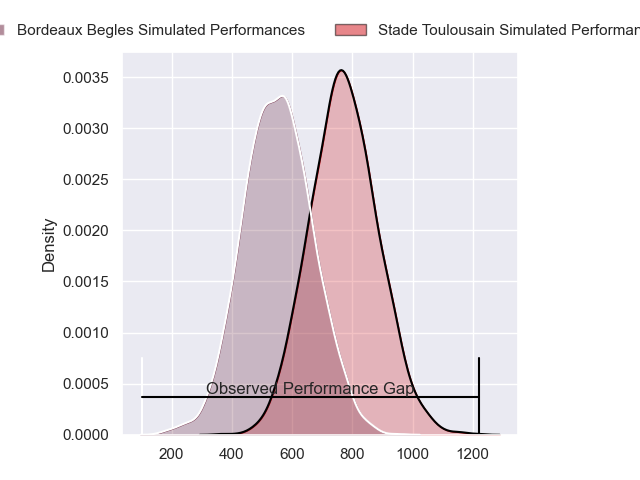
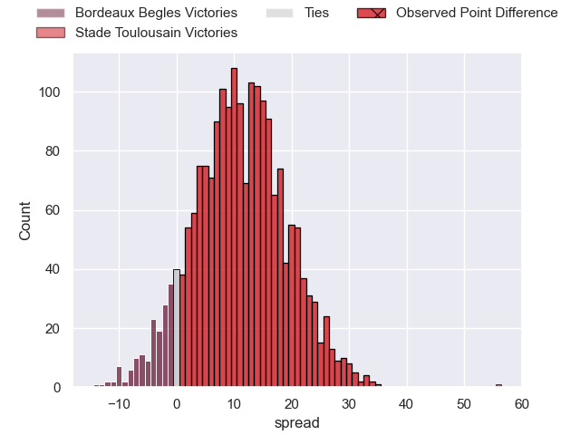
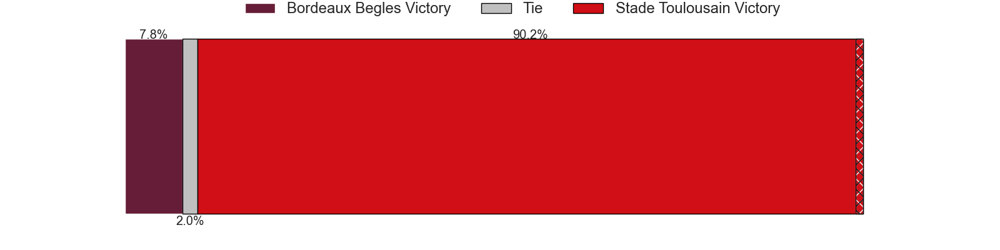

---  
layout: page  
title: Bordeaux Begles at Stade Toulousain; 3-59  
date: 2024-06-28 18:00:00 -0500  
categories: "Top 14 Orange 2023" match review  
---
# Bordeaux Begles at Stade Toulousain; 3-59

# Club Level Predictions

The first set of predictions treats a club as the smallest object, as the club develops its members, organizes a gameplan, and deploys its players as needed for each match. This club model has a prediction of 0.72, which translates to predicting Stade Toulousain to win by 8.3.

Our Over/Under is 51.5 - and combined with the spread above, we have a predicted scoreline of 21 to 30

Each club has a rating and a rating deviation (similar to a Glicko rating), and expected performances can be generated. This allows for simulated matches and spreads like the ones below.
## Projected Performances - Club Model

## Projected Spreads - Club Model

## Projected Results - Club Model

# Player Level Predictions

Treating teams instead as an entity made up of the currently active players, I have ratings for each player in an altogether different system. These can be combined to form team ratings once teamsheets are announced, weighting starters a bit higher than the reserves. After the match is played, players can be weighted by their minutes on the field, allowing for an accurate measure of the team's composition. With these compiled team ratings, we can make predictions, measure inaccuracy, and update the individual player ratings.
## Prediction without Player Minutes: Stade Toulousain by 13.4

Stade Toulousain by 5.8 on a neutral pitch

## Projected Performances - Player Model

## Projected Spreads - Player Model

## Projected Results - Player Model

|   Away Minutes | Away Player               |   Away Percentile |   Number |   Home Percentile | Home Player         |   Home Minutes |
|---------------:|:--------------------------|------------------:|---------:|------------------:|:--------------------|---------------:|
|             46 | Jefferson Poirot          |             75.14 |        1 |             69.51 | Rodrigue Neti       |             55 |
|             59 | Maxime Lamothe            |             68.77 |        2 |             96.06 | Peato Mauvaka       |             60 |
|             47 | Ben Tameifuna             |             97.75 |        3 |             96.78 | Dorian Aldegheri    |             55 |
|             72 | Cyril Cazeaux             |             92.9  |        4 |             86.19 | Richie Arnold       |             61 |
|             65 | Adam Coleman              |             99.01 |        5 |             95.07 | Thibaud Flament     |             82 |
|             59 | Bastien Vergnes Taillefer |             81.51 |        6 |             98.37 | Francois Cros       |             82 |
|             46 | Mahamadou Diaby           |             82.18 |        7 |             96.55 | Jack Willis         |             76 |
|             82 | Tevita Tatafu             |             88.75 |        8 |             96.04 | Alexandre Roumat    |             65 |
|             82 | Maxime Lucu               |             99.48 |        9 |            100    | Antoine Dupont      |             70 |
|             55 | Matthieu Jalibert         |             96.99 |       10 |             96.59 | Romain Ntamack      |             82 |
|             50 | Louis Bielle-Biarrey      |             83.71 |       11 |             99.9  | Blair Kinghorn      |             82 |
|             82 | Yoram Moefana             |             82.52 |       12 |             70.73 | Pita Ahki           |             71 |
|             82 | Nicolas Depoortere        |             86.25 |       13 |             34.95 | Santiago Chocobares |             76 |
|             82 | Damian Penaud             |             97.05 |       14 |             99.24 | Juan Cruz Mallia    |             69 |
|             82 | Romain Buros              |             98.55 |       15 |             97.93 | Thomas Ramos        |             82 |
|             23 | Clement Maynadier         |             92.9  |       16 |             99.21 | Julien Marchand     |             28 |
|             36 | Ugo Boniface              |             92.36 |       17 |             93.81 | David Ainu'u        |             27 |
|             27 | Kane Douglas              |             79.88 |       18 |             68.44 | Clement Verge       |             17 |
|             36 | Pierre Bochaton           |             86.88 |       19 |             81.99 | Joshua Brennan      |             21 |
|             23 | Pete Samu                 |             90.83 |       20 |             43.13 | Paul Graou          |             12 |
|             27 | Paul Abadie               |              2.41 |       21 |             94.81 | Ange Capuozzo       |             13 |
|             32 | Pablo Uberti              |              9.62 |       22 |             70.22 | Paul Costes         |             17 |
|             35 | Toma'akino Taufa          |             40.63 |       23 |             83.99 | Joel Merkler        |             27 |

