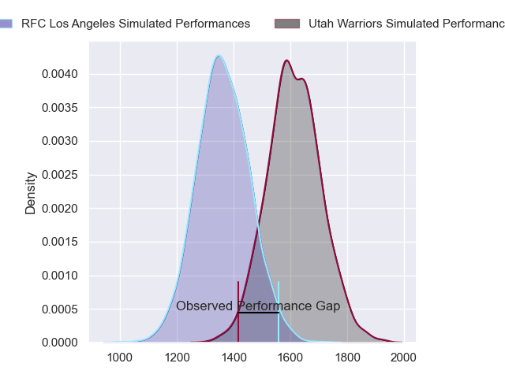
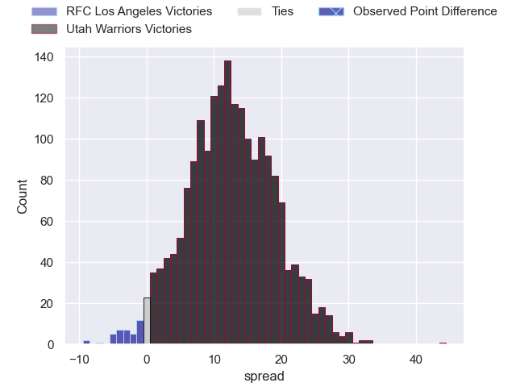
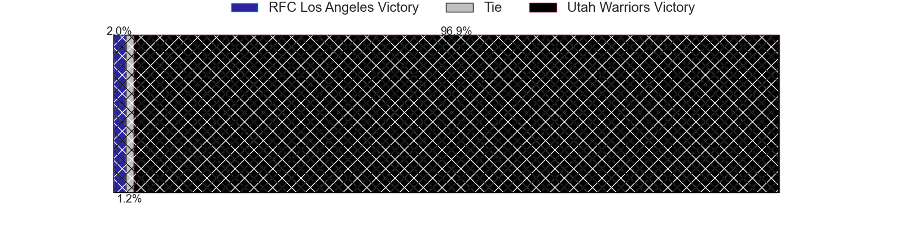
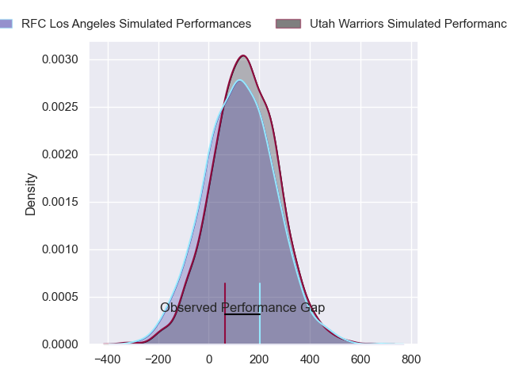
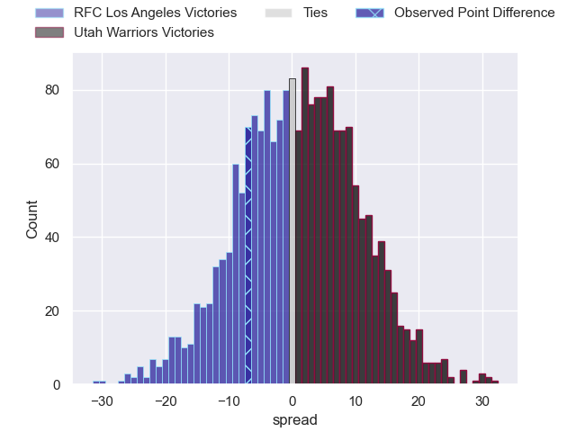

---  
layout: page  
title: RFC Los Angeles at Utah Warriors; 31-24  
date: 2024-06-28 18:00:00 -0500  
categories: "Major League Rugby 2024" match review  
---
# RFC Los Angeles at Utah Warriors; 31-24

# Club Level Predictions

The first set of predictions treats a club as the smallest object, as the club develops its members, organizes a gameplan, and deploys its players as needed for each match. This club model has a prediction of 0.799, which translates to predicting Utah Warriors to win by 12.5.

Our Over/Under is 66.5 - and combined with the spread above, we have a predicted scoreline of 27 to 40

Each club has a rating and a rating deviation (similar to a Glicko rating), and expected performances can be generated. This allows for simulated matches and spreads like the ones below.
## Projected Performances - Club Model

## Projected Spreads - Club Model

## Projected Results - Club Model

# Player Level Predictions

Treating teams instead as an entity made up of the currently active players, I have ratings for each player in an altogether different system. These can be combined to form team ratings once teamsheets are announced, weighting starters a bit higher than the reserves. After the match is played, players can be weighted by their minutes on the field, allowing for an accurate measure of the team's composition. With these compiled team ratings, we can make predictions, measure inaccuracy, and update the individual player ratings.
## Prediction without Player Minutes: Utah Warriors by 1.6

RFC Los Angeles by 1.1 on a neutral pitch

## Projected Performances - Player Model

## Projected Spreads - Player Model

## Projected Results - Player Model

|   Away Minutes | Away Player           |   Away Percentile |   Number |   Home Percentile | Home Player         |   Home Minutes |
|---------------:|:----------------------|------------------:|---------:|------------------:|:--------------------|---------------:|
|             80 | Dane Zander           |             76.29 |        1 |             28.23 | Franco Van Den Berg |             80 |
|             80 | Ben Strang            |             53.72 |        2 |             22.66 | Nic Souchon         |             80 |
|             80 | Alex Maughan          |             39.52 |        3 |             29.92 | Paul Mullen         |             80 |
|             80 | Jason Damm            |             44.41 |        4 |             15.73 | Frank Lochore       |             80 |
|             80 | Reegan O'Gorman       |             53.12 |        5 |             28.88 | Saia Uhila          |             80 |
|             80 | Bruce Kauika-Petersen |             49.04 |        6 |             20.29 | Bailey Wilson       |             80 |
|             80 | Max Katjijeko         |             23.75 |        7 |             31.15 | Kalisi Moli         |             80 |
|             80 | Semi Kunatani         |             17.99 |        8 |             23.22 | Dylan Nel           |             80 |
|             80 | Cristian Rodriguez    |             55.94 |        9 |             25.13 | Kieran Mcclea       |             80 |
|             80 | Tas Smith             |             18.47 |       10 |             13.45 | Joel Hodgson        |             80 |
|             80 | Brooklyn Hardaker     |             46.27 |       11 |             58.41 | Joe Mano            |             80 |
|             80 | Seth Purdey           |             46.37 |       12 |             30.81 | Paul Lasike         |             80 |
|             80 | Will Leonard          |             36.51 |       13 |             17.32 | Lopeti Aisea        |             80 |
|             80 | Andrew Coe            |             75.62 |       14 |             17.4  | Michael Manson      |             80 |
|             80 | Rory Van Vugt         |             23.96 |       15 |             21.67 | Caleb Makene        |             80 |
|              0 | Alessandro Heaney     |            nan    |       16 |             37.08 | Phil Bradford       |              0 |
|              0 | Sam Buckley           |            nan    |       17 |             48.79 | Angus Maclellan     |              0 |
|              0 | Conor Young           |             18.87 |       18 |            nan    | Tonga Kofe          |              0 |
|              0 | Liam Antrobus         |            nan    |       19 |            nan    | Jonah Dietenberger  |              0 |
|              0 | Derek Adams           |            nan    |       20 |             43.1  | Onehunga Havili     |              0 |
|              0 | Matt Anticev          |             27.91 |       21 |            nan    | Sam Reimer          |              0 |
|              0 | Austin White          |             33.54 |       22 |             30.54 | Thomas Tu'avao      |              0 |
|              0 | Sam Walsh             |            nan    |       23 |             69.08 | Robbie Povey        |              0 |

