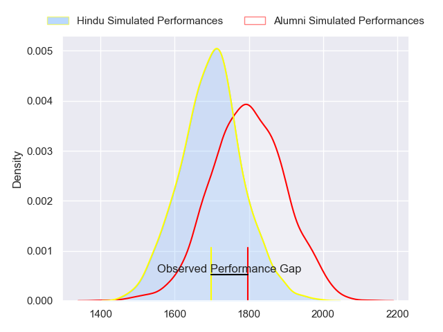
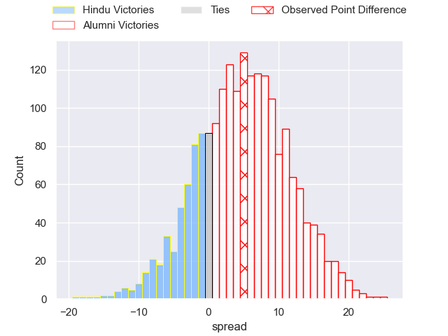
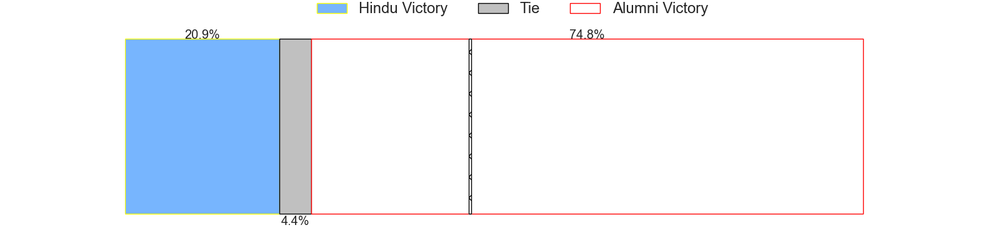
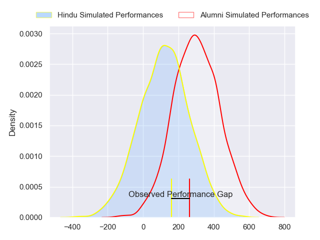
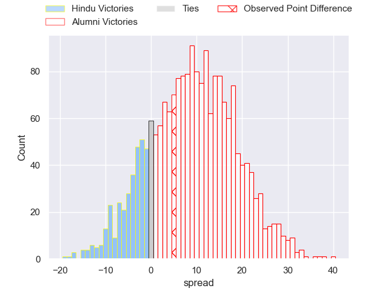
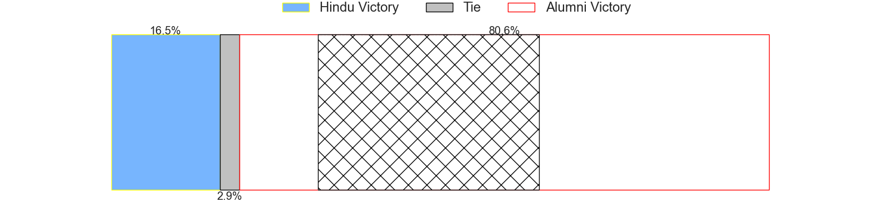

---  
layout: page  
title: Hindu at Alumni; 19-24  
date: 2024-06-29 18:00:00 -0500  
categories: "URBA Top 12 2024" match review  
---
# Hindu at Alumni; 19-24

# Club Level Predictions

The first set of predictions treats a club as the smallest object, as the club develops its members, organizes a gameplan, and deploys its players as needed for each match. This club model has a prediction of 0.635, which translates to predicting Alumni to win by 5.0.

Our Over/Under is 64.5 - and combined with the spread above, we have a predicted scoreline of 30 to 35

Each club has a rating and a rating deviation (similar to a Glicko rating), and expected performances can be generated. This allows for simulated matches and spreads like the ones below.
## Projected Performances - Club Model

## Projected Spreads - Club Model

## Projected Results - Club Model

# Player Level Predictions

Treating teams instead as an entity made up of the currently active players, I have ratings for each player in an altogether different system. These can be combined to form team ratings once teamsheets are announced, weighting starters a bit higher than the reserves. After the match is played, players can be weighted by their minutes on the field, allowing for an accurate measure of the team's composition. With these compiled team ratings, we can make predictions, measure inaccuracy, and update the individual player ratings.
## Prediction without Player Minutes: Alumni by 9.7

Alumni by 5.5 on a neutral pitch

## Projected Performances - Player Model

## Projected Spreads - Player Model

## Projected Results - Player Model

|   Away Minutes | Away Player                |   Away Percentile |   Number |   Home Percentile | Home Player                |   Home Minutes |
|---------------:|:---------------------------|------------------:|---------:|------------------:|:---------------------------|---------------:|
|             80 | Franco Diviesti            |             15.56 |        1 |             66.37 | Federico Lucca             |             80 |
|             80 | Agustin Capurro            |             12.04 |        2 |             66.56 | Tomas Bivort               |             80 |
|             80 | Nicolas Leiva              |             11.29 |        3 |             80    | Bautista Vidal             |             80 |
|             80 | Carlos Repetto             |             36.5  |        4 |             65.48 | Manuel Mora                |             80 |
|             80 | Juan Ignacio Comolli       |             18.69 |        5 |             66.57 | Santiago Alduncin          |             80 |
|             80 | Tomas Scallan              |             30.96 |        6 |             62.88 | Ignacio Cubilla            |             80 |
|             80 | Santino Amayav             |             11.83 |        7 |             76.25 | Juan Anderson              |             80 |
|             80 | Nicolas Amaya              |             29.92 |        8 |             52.93 | Santiago Montagner         |             80 |
|             80 | Lucas Fernandez Miranda    |             30.64 |        9 |             62.31 | Tomas Passerotti           |             80 |
|             80 | Santiago Fernandez         |             95.98 |       10 |             80.72 | Joaquin Luzzi              |             80 |
|             80 | Tomas Amher                |             14.24 |       11 |             66.63 | Ramon Fuentes              |             80 |
|             80 | Bautista Farise            |             13.59 |       12 |             57.88 | Franco Battezzati          |             80 |
|             80 | Federico Graglia           |             44.81 |       13 |             58.82 | Alejo Chavez               |             80 |
|             80 | Belisario Agulla           |             86.9  |       14 |             43.59 | Franco Sabato              |             80 |
|             80 | Fermin Ormaechea           |             44.79 |       15 |             53.75 | Santiago Pernas            |             80 |
|              0 | Benjamin Silveyra          |            nan    |       16 |            nan    | Maximo Lamelas             |              0 |
|              0 | Juan Ignacio Martinez Sosa |             32.34 |       17 |            nan    | Maximo Castillo            |              0 |
|              0 | Mariano Leiva              |            nan    |       18 |             22.58 | Ezequiel Oliva             |              0 |
|              0 | Victor Franco              |            nan    |       19 |             26.61 | Federico Canovas           |              0 |
|              0 | Juan Pacheco               |            nan    |       20 |             17.78 | Juan Cruz Alvarinas        |              0 |
|              0 | Gaspar Jeckeln             |            nan    |       21 |            nan    | Santiago Ambroa            |              0 |
|              0 | Juan Fernandez Miranda     |            nan    |       22 |             37.5  | Santiago Gonzalez Iglesias |              0 |
|              0 | Pedro Miranda              |            nan    |       23 |             73.42 | Luca Sabato                |              0 |

