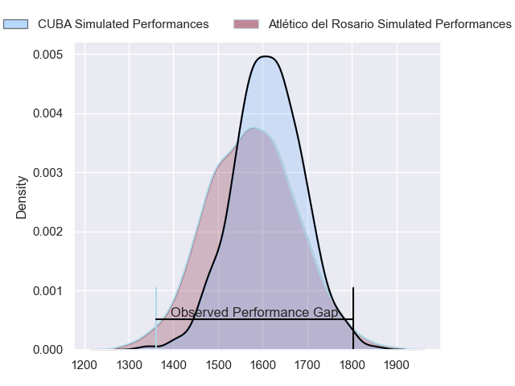
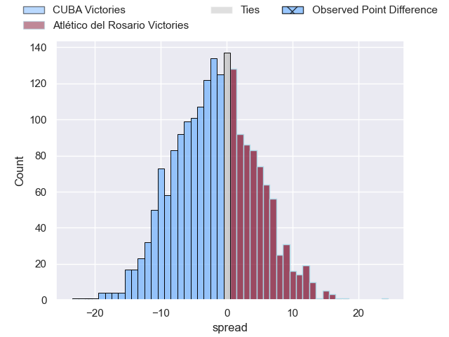
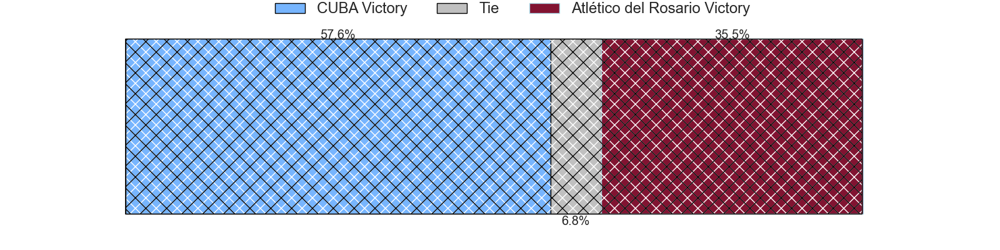
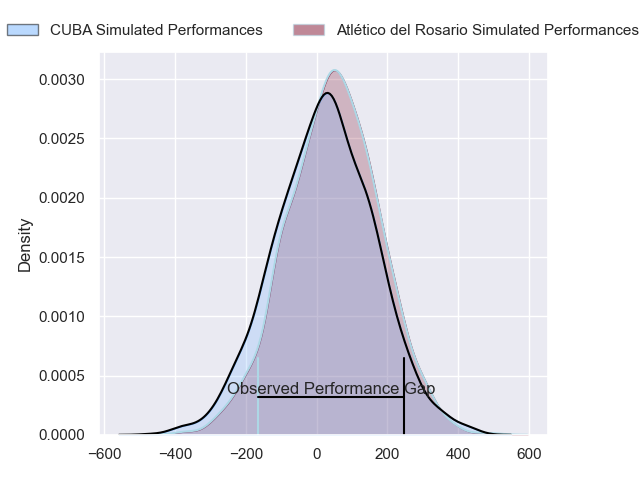
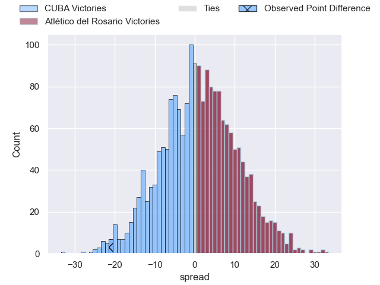
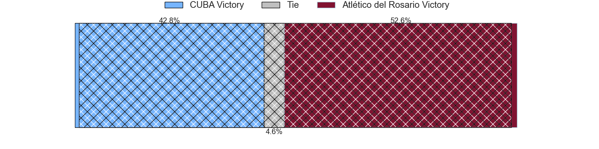

---  
layout: page  
title: CUBA at Atletico del Rosario; 38-17  
date: 2024-06-29 18:00:00 -0500  
categories: "URBA Top 12 2024" match review  
---
# CUBA at Atletico del Rosario; 38-17

# Club Level Predictions

The first set of predictions treats a club as the smallest object, as the club develops its members, organizes a gameplan, and deploys its players as needed for each match. This club model has a prediction of 0.454, which translates to predicting CUBA to win by 1.7.

Our Over/Under is 62.5 - and combined with the spread above, we have a predicted scoreline of 32 to 31

Each club has a rating and a rating deviation (similar to a Glicko rating), and expected performances can be generated. This allows for simulated matches and spreads like the ones below.
## Projected Performances - Club Model

## Projected Spreads - Club Model

## Projected Results - Club Model

# Player Level Predictions

Treating teams instead as an entity made up of the currently active players, I have ratings for each player in an altogether different system. These can be combined to form team ratings once teamsheets are announced, weighting starters a bit higher than the reserves. After the match is played, players can be weighted by their minutes on the field, allowing for an accurate measure of the team's composition. With these compiled team ratings, we can make predictions, measure inaccuracy, and update the individual player ratings.
## Prediction without Player Minutes: Atlético del Rosario by 0.4

CUBA by 3.3 on a neutral pitch

## Projected Performances - Player Model

## Projected Spreads - Player Model

## Projected Results - Player Model

|   Away Minutes | Away Player          |   Away Percentile |   Number |   Home Percentile | Home Player                 |   Home Minutes |
|---------------:|:---------------------|------------------:|---------:|------------------:|:----------------------------|---------------:|
|             80 | Facundo Aguirre      |             85.6  |        1 |             21.16 | Ezequiel Reyes              |             80 |
|             80 | Enrique Devoto       |             90.38 |        2 |             27.13 | Matias Malanos              |             80 |
|             80 | Estanislao Carullo   |             80.45 |        3 |              2.98 | Agustin Fernandez           |             80 |
|             80 | Santiago Uriarte     |             83.93 |        4 |              6.11 | Matias Kremer               |             80 |
|             80 | Santiago Landau      |             83.43 |        5 |              5.72 | Octavio Capella             |             80 |
|             80 | Francisco Sied       |             82.76 |        6 |             22.17 | Jose Ignacio Ferrer         |             80 |
|             80 | Segundo Pisani       |             79.89 |        7 |             22.17 | Jose Leon Caceres Musso     |             80 |
|             80 | Lucas Campion        |             46.88 |        8 |              3.96 | Lucas Malanos               |             80 |
|             80 | Rafael Iriarte       |             73.88 |        9 |             29.38 | Felipe Nogues               |             80 |
|             80 | Valentin Mastroizi   |             84.34 |       10 |             22.29 | Manuel Nogues               |             80 |
|             80 | Bautista Casaurang   |             88.38 |       11 |              9.52 | Maximiliano Nicoli Fiscella |             80 |
|             80 | Felipe de la Vega    |             67.74 |       12 |             22.85 | Ramiro Musio                |             80 |
|             80 | Felipe Perdomo       |             77.77 |       13 |              4.34 | Pedro de Aro                |             80 |
|             80 | Francisco Patrono    |             83.33 |       14 |              8.1  | Facundo Gerosa              |             80 |
|             80 | Marcos Moroni        |             79.88 |       15 |              4.36 | Pedro Bisio                 |             80 |
|              0 | Esteban Iribarne     |            nan    |       16 |            nan    | Ramiro Rubio                |              0 |
|              0 | Francisco Garoby     |             79.08 |       17 |              7.48 | Lisandro Dipierri           |              0 |
|              0 | Away Team 18         |            nan    |       18 |            nan    | Blas Jabornisky             |              0 |
|              0 | Tomas Anderlic       |             21.45 |       19 |              7.18 | Santiago Casals             |              0 |
|              0 | Jeronimo Conte Grand |            nan    |       20 |              7.34 | Guido Vidalle               |              0 |
|              0 | Simon Benitez Cruz   |            nan    |       21 |             28.35 | Martin Del Pazo             |              0 |
|              0 | Away Team 22         |            nan    |       22 |            nan    | Home Team 22                |              0 |
|              0 | Marcos Elicagaray    |             56.57 |       23 |             40.33 | Federico Mayol              |              0 |

