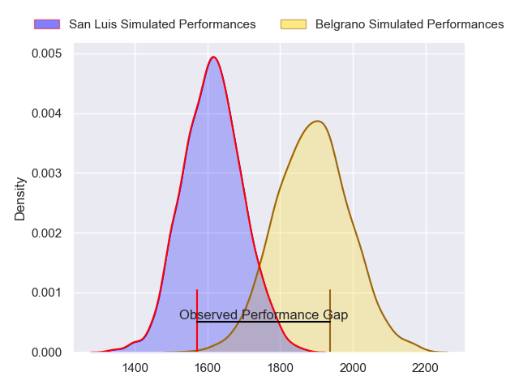
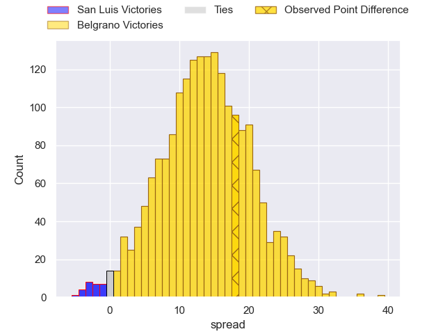
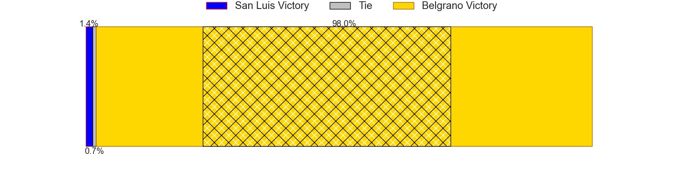
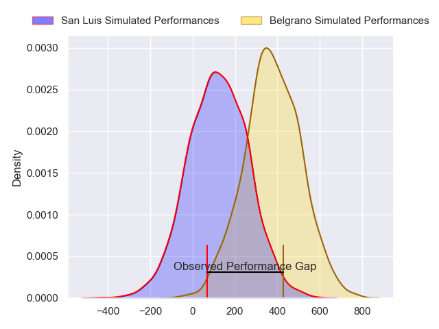
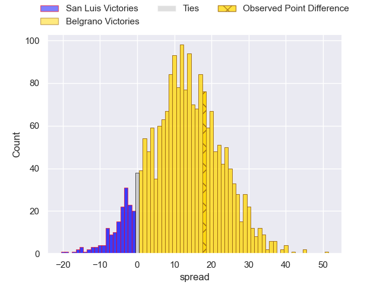

---  
layout: page  
title: San Luis at Belgrano; 22-40  
date: 2024-06-29 18:00:00 -0500  
categories: "URBA Top 12 2024" match review  
---
# San Luis at Belgrano; 22-40

# Club Level Predictions

The first set of predictions treats a club as the smallest object, as the club develops its members, organizes a gameplan, and deploys its players as needed for each match. This club model has a prediction of 0.819, which translates to predicting Belgrano to win by 13.5.

Our Over/Under is 49.5 - and combined with the spread above, we have a predicted scoreline of 18 to 32

Each club has a rating and a rating deviation (similar to a Glicko rating), and expected performances can be generated. This allows for simulated matches and spreads like the ones below.
## Projected Performances - Club Model

## Projected Spreads - Club Model

## Projected Results - Club Model

# Player Level Predictions

Treating teams instead as an entity made up of the currently active players, I have ratings for each player in an altogether different system. These can be combined to form team ratings once teamsheets are announced, weighting starters a bit higher than the reserves. After the match is played, players can be weighted by their minutes on the field, allowing for an accurate measure of the team's composition. With these compiled team ratings, we can make predictions, measure inaccuracy, and update the individual player ratings.
## Prediction without Player Minutes: Belgrano by 14.3

Belgrano by 10.3 on a neutral pitch

## Projected Performances - Player Model

## Projected Spreads - Player Model

## Projected Results - Player Model

|   Away Minutes | Away Player                |   Away Percentile |   Number |   Home Percentile | Home Player              |   Home Minutes |
|---------------:|:---------------------------|------------------:|---------:|------------------:|:-------------------------|---------------:|
|             82 | Santiago Bonavento         |             24.92 |        1 |             88.87 | Francisco Ferronato      |             82 |
|             82 | Agustin Fitzsimons Herrera |             22.03 |        2 |             89.54 | Francisco Lusarreta      |             82 |
|             82 | Alexis Uvieda              |             64.35 |        3 |             83.23 | Lisandro Garcia Dragui   |             82 |
|             82 | Ramiro Bruni               |             34.82 |        4 |             89.42 | Luciano Tecca            |             82 |
|             82 | Santiago Canal             |             35.71 |        5 |             68.05 | Ramon Duggan             |             82 |
|             82 | Nahuel Curti               |             20.96 |        6 |             86.15 | Joaquin de la Serna      |             82 |
|             82 | Facundo Alvarez Amado      |             22.5  |        7 |             78.85 | Augusto Vaccarino        |             82 |
|             82 | Agustin Torello            |             28.66 |        8 |             83.05 | Franco Vega              |             82 |
|             82 | Martin Aereboe             |             24.27 |        9 |             76.94 | Ignacio Marino           |             82 |
|             82 | Felipe Campodonico         |             40.96 |       10 |             70.28 | Juan Aparicio            |             82 |
|             82 | Wilmer Ramirez             |             39.01 |       11 |             37.28 | Pedro Arana              |             82 |
|             82 | Segundo Fresco             |             48.03 |       12 |             43.98 | Fermin Martinez          |             82 |
|             82 | Benjamin Marban            |             32.68 |       13 |             81.74 | Tomas Etchepare          |             82 |
|             82 | Eduardo Ruesta             |             35.47 |       14 |             85.37 | Ignacio Diaz             |             82 |
|             82 | Valentino Quattrocchi      |             18.75 |       15 |             81.67 | Juan Lando               |             82 |
|              0 | Mateo Caffaro              |            nan    |       16 |            nan    | Jose Saporitti           |              0 |
|              0 | Alejo Garcia               |             28.31 |       17 |             61.85 | Justo Duranona           |              0 |
|              0 | Mateo Calistro             |             36.45 |       18 |            nan    | Santiago Garcia Botta    |              0 |
|              0 | Lautaro Grys Arana         |            nan    |       19 |             69.24 | Mateo Gasparotti         |              0 |
|              0 | Franco Gnecco              |             42.79 |       20 |            nan    | Rodrigo Fernandez Criado |              0 |
|              0 | Juan Vaca                  |             56.45 |       21 |             68.07 | Joaquin Mihura           |              0 |
|              0 | Santiago Gibert            |            nan    |       22 |             64.03 | Theo Blaksley            |              0 |
|              0 | Felipe Crispo              |             53.12 |       23 |             81.17 | Tobias Bernabe           |              0 |

