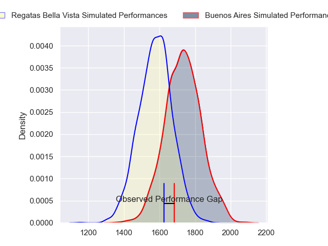
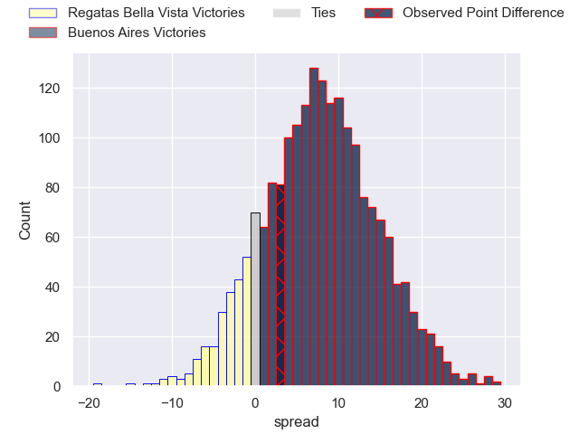
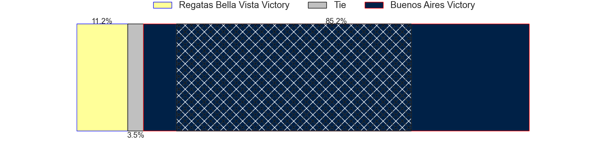
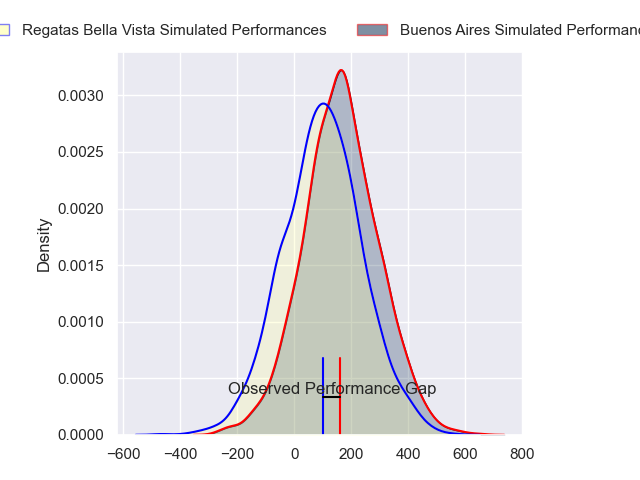
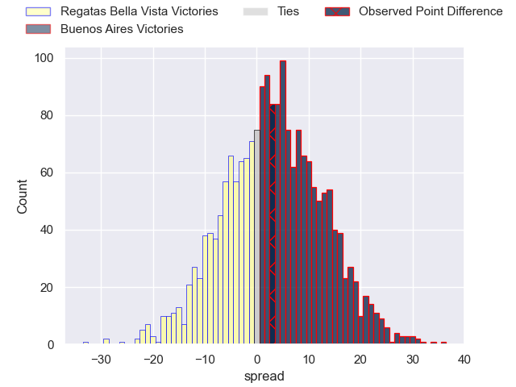
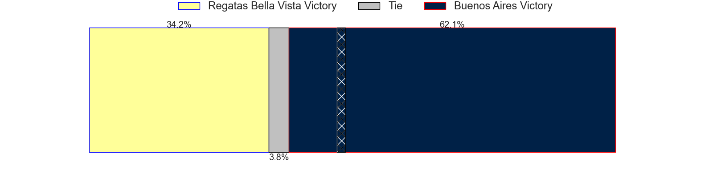

---  
layout: page  
title: Regatas Bella Vista at Buenos Aires; 17-20  
date: 2024-06-29 18:00:00 -0500  
categories: "URBA Top 12 2024" match review  
---
# Regatas Bella Vista at Buenos Aires; 17-20

# Club Level Predictions

The first set of predictions treats a club as the smallest object, as the club develops its members, organizes a gameplan, and deploys its players as needed for each match. This club model has a prediction of 0.703, which translates to predicting Buenos Aires to win by 7.8.

Our Over/Under is 40.5 - and combined with the spread above, we have a predicted scoreline of 16 to 24

Each club has a rating and a rating deviation (similar to a Glicko rating), and expected performances can be generated. This allows for simulated matches and spreads like the ones below.
## Projected Performances - Club Model

## Projected Spreads - Club Model

## Projected Results - Club Model

# Player Level Predictions

Treating teams instead as an entity made up of the currently active players, I have ratings for each player in an altogether different system. These can be combined to form team ratings once teamsheets are announced, weighting starters a bit higher than the reserves. After the match is played, players can be weighted by their minutes on the field, allowing for an accurate measure of the team's composition. With these compiled team ratings, we can make predictions, measure inaccuracy, and update the individual player ratings.
## Prediction without Player Minutes: Buenos Aires by 3.4

Buenos Aires by 0.6 on a neutral pitch

## Projected Performances - Player Model

## Projected Spreads - Player Model

## Projected Results - Player Model

|   Away Minutes | Away Player          |   Away Percentile |   Number |   Home Percentile | Home Player            |   Home Minutes |
|---------------:|:---------------------|------------------:|---------:|------------------:|:-----------------------|---------------:|
|             80 | Tomas Barbaccia      |             17.38 |        1 |             78.04 | Pablo Gaston Vaca      |             80 |
|             80 | Beltran Landivar     |             46.53 |        2 |             73.03 | Tomas Rosasco          |             80 |
|             80 | Mateo Trimarco       |             46.5  |        3 |             62.27 | Tomas Gallo            |             80 |
|             80 | Marcelo Toledo       |             45.96 |        4 |             68.05 | Francisco Jose Sluga   |             80 |
|             80 | Valentin Sanguinetti |             30.67 |        5 |             65.09 | Bautista Duranona      |             80 |
|             80 | Marcos Ferro         |             44.06 |        6 |             54.12 | Valentin Arauz         |             80 |
|             80 | Tomas Sanguinetti    |             23.37 |        7 |             63.79 | Matias Espina          |             80 |
|             80 | Felipe Camerlinckx   |             22.92 |        8 |             29.79 | Tomas Etcheverry       |             80 |
|             80 | Marcos Joseph        |             20.27 |        9 |             51.03 | Mateo Freire           |             80 |
|             80 | Mateo Camerlinckx    |             20.08 |       10 |             58.03 | Mateo Capalbo          |             80 |
|             80 | Francisco Pisani     |             19.43 |       11 |             46.86 | Benjamin Handley       |             80 |
|             80 | Juan Corso           |             43.95 |       12 |             60.91 | Agustin Lamensa Sanudo |             80 |
|             80 | Alejo Barrera        |             20.27 |       13 |             58.22 | Ramiro Costa           |             80 |
|             80 | Rafael Santana       |             30.38 |       14 |             65.71 | Alfonso Latorre        |             80 |
|             80 | Enrique Camerlinckx  |             16.39 |       15 |             61.62 | Julian Quetglas Bojar  |             80 |
|              0 | Pedro Colinas        |             20.82 |       16 |             43.38 | Valentino Minoyetti    |              0 |
|              0 | Juan Gobet           |             26.23 |       17 |            nan    | Home Team 17           |              0 |
|              0 | Diego Aguero         |            nan    |       18 |             30.41 | Tomas Herrador         |              0 |
|              0 | Lucas Gobet          |             15.8  |       19 |            nan    | Athos Touzet           |              0 |
|              0 | Francisco Ploder     |             48.62 |       20 |             47.29 | Tomas Alvarez Bayon    |              0 |
|              0 | Gonzalo Deluca       |            nan    |       21 |             62.37 | Juan Monasterio        |              0 |
|              0 | Justo Camerlinckx    |             37.35 |       22 |             49    | Tomas Bunge            |              0 |
|              0 | Ramiro Moadeb        |             19.54 |       23 |            nan    | Simon Mimessi          |              0 |

