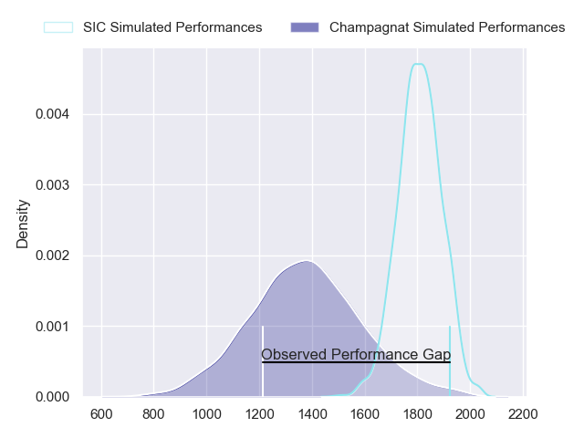
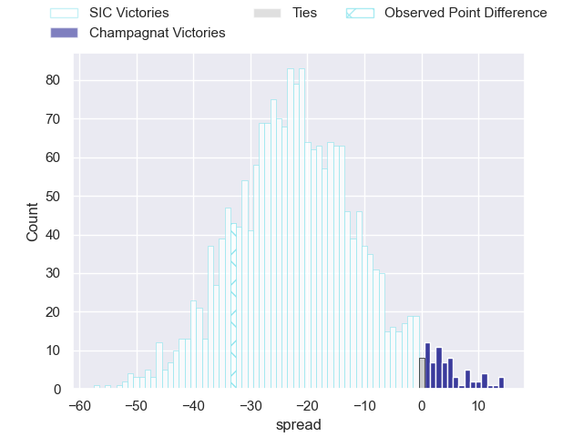
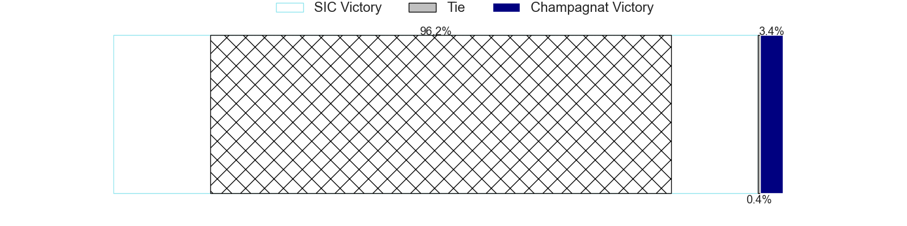
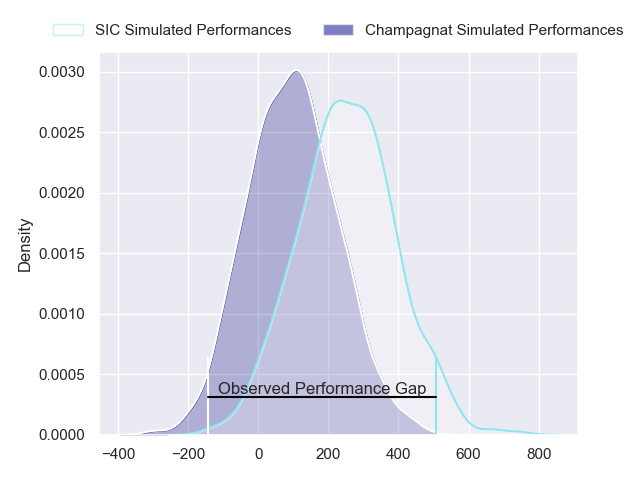
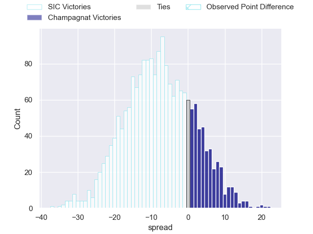
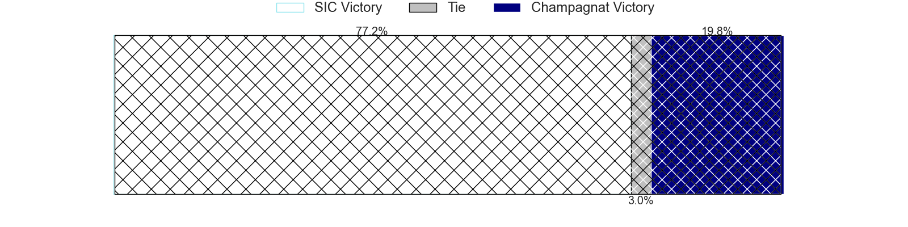

---  
layout: page  
title: SIC at Champagnat; 39-6  
date: 2024-06-29 18:00:00 -0500  
categories: "URBA Top 12 2024" match review  
---
# SIC at Champagnat; 39-6

# Club Level Predictions

The first set of predictions treats a club as the smallest object, as the club develops its members, organizes a gameplan, and deploys its players as needed for each match. This club model has a prediction of 0.083, which translates to predicting SIC to win by 21.6.

Our Over/Under is 56.5 - and combined with the spread above, we have a predicted scoreline of 39 to 17

Each club has a rating and a rating deviation (similar to a Glicko rating), and expected performances can be generated. This allows for simulated matches and spreads like the ones below.
## Projected Performances - Club Model

## Projected Spreads - Club Model

## Projected Results - Club Model

# Player Level Predictions

Treating teams instead as an entity made up of the currently active players, I have ratings for each player in an altogether different system. These can be combined to form team ratings once teamsheets are announced, weighting starters a bit higher than the reserves. After the match is played, players can be weighted by their minutes on the field, allowing for an accurate measure of the team's composition. With these compiled team ratings, we can make predictions, measure inaccuracy, and update the individual player ratings.
## Prediction without Player Minutes: SIC by 7.2

SIC by 9.7 on a neutral pitch

## Projected Performances - Player Model

## Projected Spreads - Player Model

## Projected Results - Player Model

|   Away Minutes | Away Player             |   Away Percentile |   Number |   Home Percentile | Home Player                |   Home Minutes |
|---------------:|:------------------------|------------------:|---------:|------------------:|:---------------------------|---------------:|
|             82 | Marcos Piccinini        |             72.34 |        1 |             27.34 | Martin Rinaldelli          |             82 |
|             82 | Ignacio Bottazzini      |             61.81 |        2 |             14.42 | Joaquin Guerra             |             82 |
|             82 | Benjamin Chiappe        |             65.4  |        3 |             17.74 | Marcos Magaro              |             82 |
|             82 | Tomas Borghi            |             73    |        4 |             22.95 | Tobias Rivas Orozco        |             82 |
|             82 | Bautista Viero          |             68.45 |        5 |             10.19 | Inaki Ustariz              |             82 |
|             82 | Andrea Panzarini        |             59.33 |        6 |             12.79 | Matias Alonso Boto         |             82 |
|             82 | Alejo Daireaux          |             31.73 |        7 |             18.85 | Lucas Moresco              |             82 |
|             82 | Tomas Meyrelles         |             69.87 |        8 |             12.55 | Matias Muniagurria         |             82 |
|             82 | Felipe Sascaro          |             66.61 |        9 |              9.47 | Martin Graciarena          |             82 |
|             82 | Santiago Pavlovsky      |             62.65 |       10 |             12.05 | Santos Panela              |             82 |
|             82 | Nicanor Acosta          |             50.48 |       11 |             11.09 | Tomas Baca Castex          |             82 |
|             82 | Santos Rubio            |             61.51 |       12 |             10.58 | Tobias Imbrosciano         |             82 |
|             82 | Carlos Piran            |             48.13 |       13 |             28.84 | Marcos Lafuente            |             82 |
|             82 | Franco Moneta           |             67.59 |       14 |             18.26 | Facundo Rufino             |             82 |
|             82 | Bernabe Lopez Fleming   |             37.71 |       15 |             11.04 | Geronimo Tomasella         |             82 |
|              0 | Franco Presta           |            nan    |       16 |             22.26 | Tomas Distel               |              0 |
|              0 | Lucas Rocha             |             66.09 |       17 |             19.44 | Alberto Adissi             |              0 |
|              0 | Juan Pedro Olcese       |             40.89 |       18 |            nan    | Gonzalo Costaguta          |              0 |
|              0 | Pedro Georgalo          |            nan    |       19 |            nan    | Federico Dominguez         |              0 |
|              0 | Ciro Ploruti            |             24.23 |       20 |            nan    | Felipe Rojo Bas            |              0 |
|              0 | Lucas Albanese          |             24.47 |       21 |             33.85 | Tomas Alonso Boto          |              0 |
|              0 | Agustin Sascaro         |            nan    |       22 |            nan    | Pedro Del Piano            |              0 |
|              0 | Ramon Martinez Tomietto |            nan    |       23 |            nan    | Bautista Rodrigues-Navarro |              0 |

