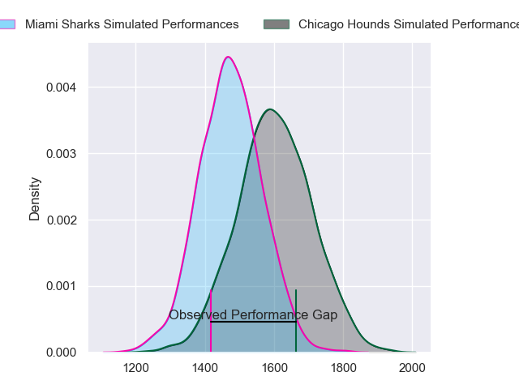
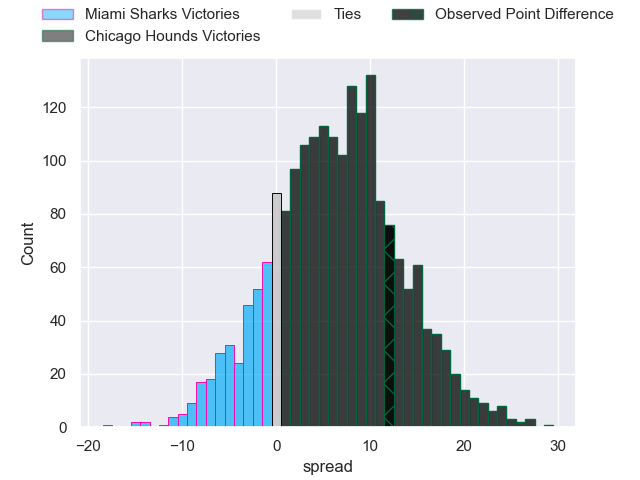
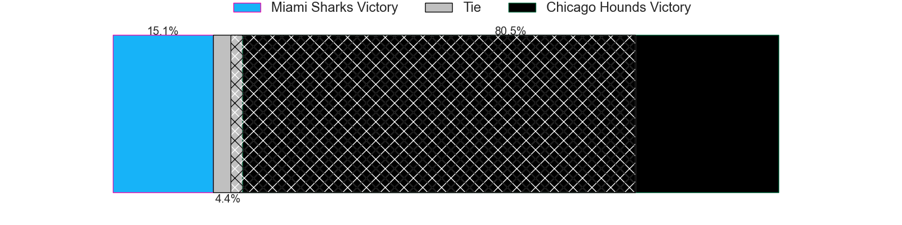
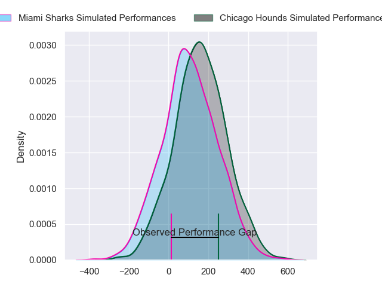
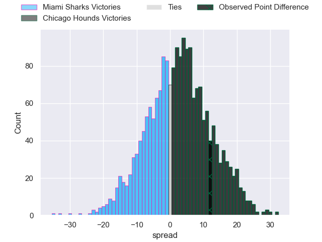
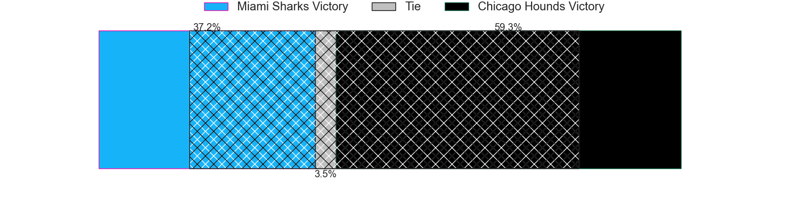

---  
layout: page  
title: Miami Sharks at Chicago Hounds; 26-38  
date: 2024-06-29 18:00:00 -0500  
categories: "Major League Rugby 2024" match review  
---
# Miami Sharks at Chicago Hounds; 26-38

# Club Level Predictions

The first set of predictions treats a club as the smallest object, as the club develops its members, organizes a gameplan, and deploys its players as needed for each match. This club model has a prediction of 0.672, which translates to predicting Chicago Hounds to win by 6.5.

Our Over/Under is 46.5 - and combined with the spread above, we have a predicted scoreline of 20 to 26

Each club has a rating and a rating deviation (similar to a Glicko rating), and expected performances can be generated. This allows for simulated matches and spreads like the ones below.
## Projected Performances - Club Model

## Projected Spreads - Club Model

## Projected Results - Club Model

# Player Level Predictions

Treating teams instead as an entity made up of the currently active players, I have ratings for each player in an altogether different system. These can be combined to form team ratings once teamsheets are announced, weighting starters a bit higher than the reserves. After the match is played, players can be weighted by their minutes on the field, allowing for an accurate measure of the team's composition. With these compiled team ratings, we can make predictions, measure inaccuracy, and update the individual player ratings.
## Prediction without Player Minutes: Chicago Hounds by 2.2

Miami Sharks by 0.1 on a neutral pitch

## Projected Performances - Player Model

## Projected Spreads - Player Model

## Projected Results - Player Model

|   Away Minutes | Away Player         |   Away Percentile |   Number |   Home Percentile | Home Player             |   Home Minutes |
|---------------:|:--------------------|------------------:|---------:|------------------:|:------------------------|---------------:|
|             80 | Rob Evans           |             37.73 |        1 |             68.14 | Nico Revol              |             80 |
|             80 | Kirby Myhill        |             38.49 |        2 |             99.05 | Dylan Fawsitt           |             80 |
|             80 | Reinaldo Piussi     |             54.47 |        3 |             29.12 | Charlie Abel            |             80 |
|             80 | Rick Rose           |             46.84 |        4 |             56.11 | George Merrick          |             80 |
|             80 | Stan Van Den Hoven  |             50.49 |        5 |             73.77 | James Scott             |             80 |
|             80 | Benjamin Bonasso    |             53.07 |        6 |              4.79 | Mason Flesch            |             80 |
|             80 | Dan Pryor           |             29.02 |        7 |             41.19 | Maclean Jones           |             80 |
|             80 | Manuel Ardao        |             84.17 |        8 |             11.25 | Luke White              |             80 |
|             80 | Tomas Cubelli       |             17.7  |        9 |             74.05 | Nick McCarthy           |             80 |
|             80 | Shane O'Leary       |             32.33 |       10 |             39.36 | Luke Carty              |             80 |
|             80 | Eric Naposki        |             39.33 |       11 |             39.71 | Julián Dominguez Widmer |             80 |
|             80 | Nick Grigg          |             39.71 |       12 |             53.98 | Bill Meakes             |             80 |
|             80 | Tomas Inciarte      |             30.61 |       13 |             43.85 | Mark O'Keeffe           |             80 |
|             80 | Marcos Young        |             28.48 |       14 |             99.33 | Nate Augspurger         |             80 |
|             80 | Matías Freyre       |             32.16 |       15 |             28.42 | Adriaan Carelse         |             80 |
|              0 | Sean Mcnulty        |             55.21 |       16 |             58.2  | Janus Venter            |              0 |
|              0 | Jonas Petrakopoulos |             28.56 |       17 |            nan    | Fred Apulu              |              0 |
|              0 | Alec Mcdonnell      |             59.37 |       18 |             24.94 | Paddy Ryan              |              0 |
|              0 | Chase Schor-Haskin  |            nan    |       19 |            nan    | Brad Tucker             |              0 |
|              0 | Alex Glover         |            nan    |       20 |              2.78 | Lucas Rumball           |              0 |
|              0 | Damian Morley       |            nan    |       21 |             54.98 | Jason Higgins           |              0 |
|              0 | Guiseppe Du Toit    |             25.75 |       22 |             23.06 | Bryce Campbell          |              0 |
|              0 | Felipe Etcheverry   |             69.29 |       23 |             66.76 | Noah Brown              |              0 |

