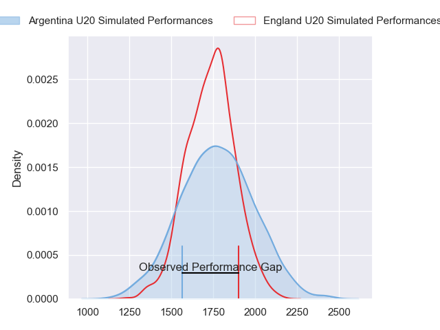
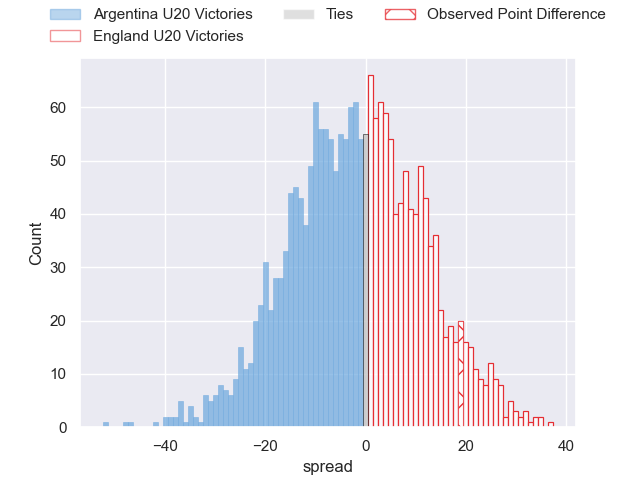
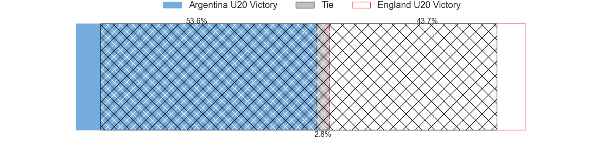
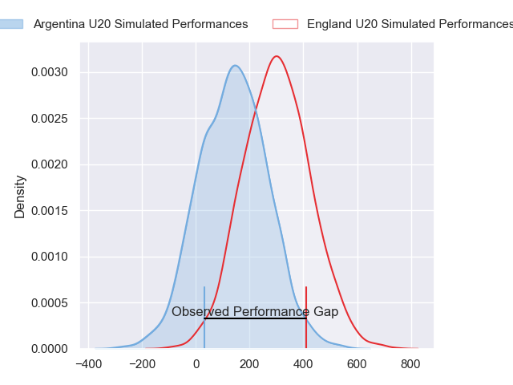
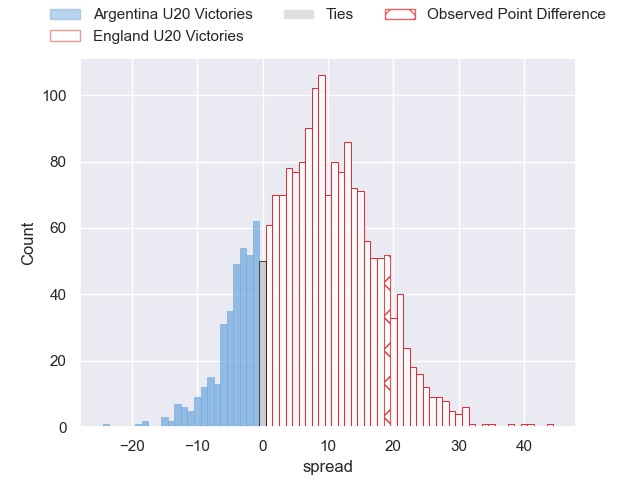
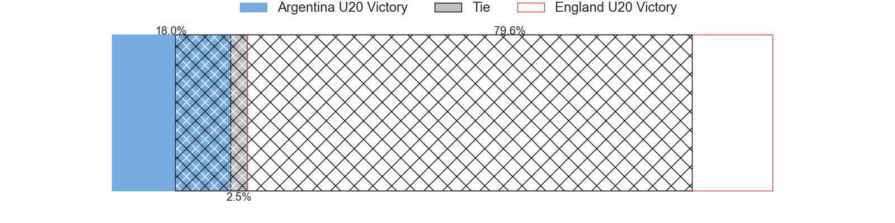

---  
layout: page  
title: Argentina U20 at England U20; 21-40  
date: 2024-06-29 18:00:00 -0500  
categories: "World Rugby U20 Championship 2024" match review  
---
# Argentina U20 at England U20; 21-40

# Club Level Predictions

The first set of predictions treats a club as the smallest object, as the club develops its members, organizes a gameplan, and deploys its players as needed for each match. This club model has a prediction of 0.44, which translates to predicting Argentina U20 to win by 2.5.

Our Over/Under is 58.5 - and combined with the spread above, we have a predicted scoreline of 30 to 28

Each club has a rating and a rating deviation (similar to a Glicko rating), and expected performances can be generated. This allows for simulated matches and spreads like the ones below.
## Projected Performances - Club Model

## Projected Spreads - Club Model

## Projected Results - Club Model

# Player Level Predictions

Treating teams instead as an entity made up of the currently active players, I have ratings for each player in an altogether different system. These can be combined to form team ratings once teamsheets are announced, weighting starters a bit higher than the reserves. After the match is played, players can be weighted by their minutes on the field, allowing for an accurate measure of the team's composition. With these compiled team ratings, we can make predictions, measure inaccuracy, and update the individual player ratings.
## Prediction without Player Minutes: England U20 by 9.0

England U20 by 6.7 on a neutral pitch

## Projected Performances - Player Model

## Projected Spreads - Player Model

## Projected Results - Player Model

|   Away Minutes | Away Player                  |   Away Percentile |   Number |   Home Percentile | Home Player          |   Home Minutes |
|---------------:|:-----------------------------|------------------:|---------:|------------------:|:---------------------|---------------:|
|             80 | Diego Correa                 |             45.13 |        1 |             85.92 | Asher Opoku-Fordjour |             68 |
|             62 | Juan Manuel Vivas            |             42.27 |        2 |             84.86 | Craig Wright         |             80 |
|             69 | Tomás Rapetti                |             48.83 |        3 |             83.75 | Billy Sela           |             68 |
|             80 | Efraín Elías                 |             27.02 |        4 |             86.39 | Joe Bailey           |             56 |
|             52 | Álvaro García Iandolino      |             57.59 |        5 |             82.64 | Junior Kpoku         |             80 |
|             80 | Juan Penoucos                |             54.31 |        6 |             86.49 | Finn Carnduff        |             80 |
|             62 | Santos Fernández De Oliveira |             61.49 |        7 |             81.8  | Henry Pollock        |             62 |
|             80 | Juan Pedro Bernasconi        |             40.62 |        8 |             66.88 | Nathan Michelow      |             80 |
|             52 | Genaro Podestá               |             41.24 |        9 |             45.53 | Ollie Allan          |             62 |
|             52 | Santino Di Lucca             |             51    |       10 |             61.45 | Josh Bellamy         |             62 |
|             48 | Franco Rossetto              |             61.62 |       11 |             84.57 | Alex Wills           |             80 |
|             80 | Faustino Sánchez Valarolo    |             54.81 |       12 |             77.15 | Sean Kerr            |             80 |
|             80 | Tomás Bocco                  |             39.61 |       13 |             73.22 | Oliver Spencer       |             80 |
|             80 | Timoteo Silva                |             25.05 |       14 |             53.14 | Jack Bracken         |             80 |
|             80 | Benjamín Elizalde            |             43.36 |       15 |             83.61 | Ben Redshaw          |             80 |
|             18 | Juan Ignacio Greising Revol  |             45.11 |       16 |             54.42 | James Isaacs         |              0 |
|              0 |                              |             41.35 |       17 |            nan    | Cameron Miell        |             12 |
|             11 | Gael Galván                  |             41.51 |       18 |            nan    | Afolabi Fasogbon     |             12 |
|             28 | Ignacio Torrado              |             33.75 |       19 |             65.58 | Olamide Sodeke       |             24 |
|             18 | Agustín Sarelli              |             23.95 |       20 |            nan    | Kane James           |             18 |
|             28 | Tomás Di Biase               |             50.86 |       21 |            nan    | Lucas Friday         |             18 |
|             28 | Facundo Rodríguez            |             37.55 |       22 |            nan    | Ben Coen             |             18 |
|             32 | Gregorio Pérez Pardo         |             27.9  |       23 |             74.69 | Ioan Jones           |              0 |

